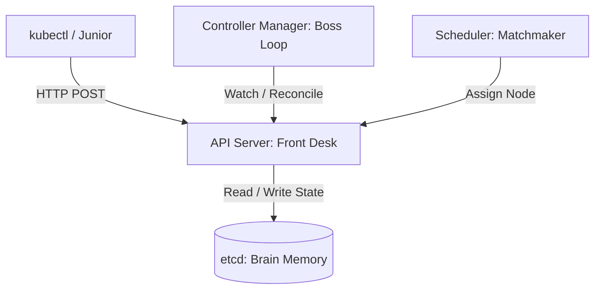
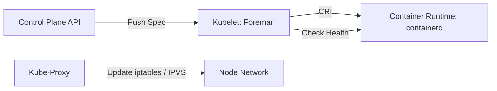
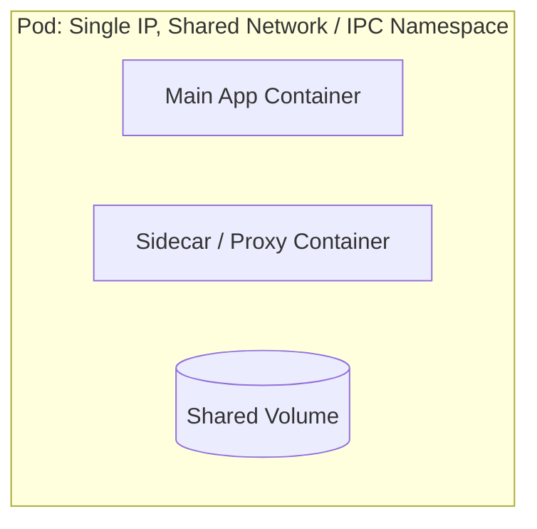
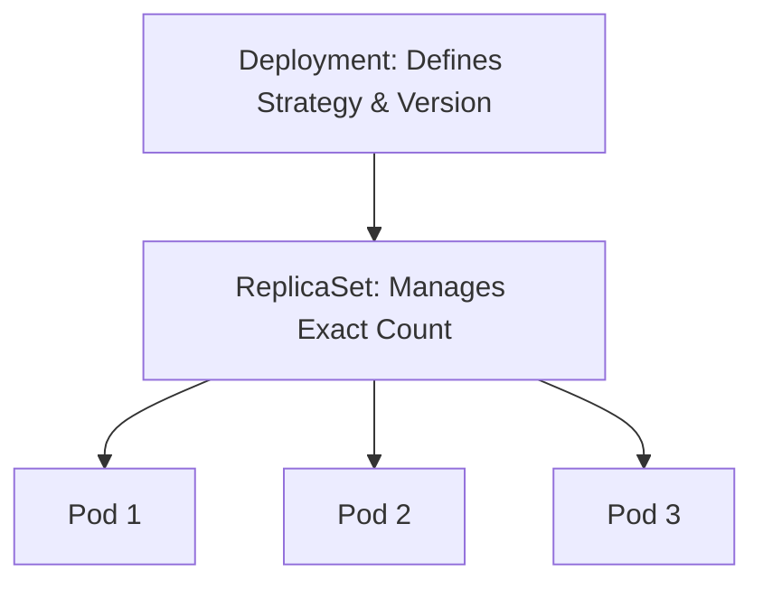
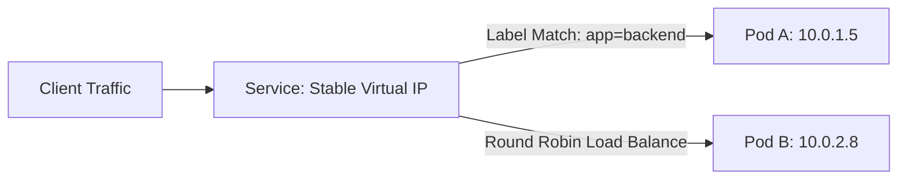
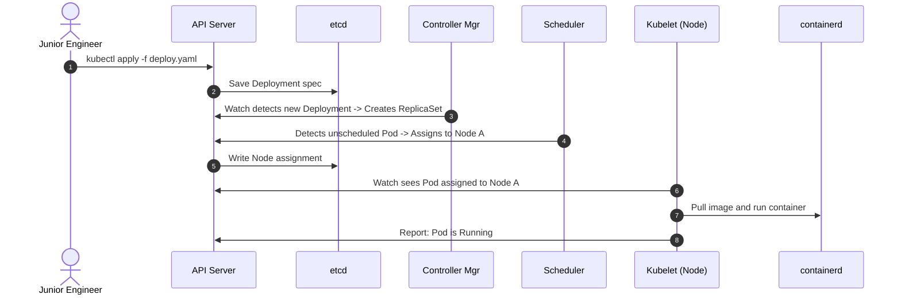

## Let me take you through as if you are a junior engineer onboarding - my team as cloud architect:

Welcome to the cluster, junior. At Google, Borg ran everything. Then we open-sourced it as Kubernetes.

  

### 1. Control Plane: The Brain

Four components run the show. They never touch user traffic.

  

Code snippet

- **API Server:** Only door into cluster. Validates token, checks RBAC, writes to etcd. Does zero actual work itself.
    
      
    
- **etcd:** Consistent, distributed key-value store. Stores cluster truth, not application data. If etcd dies without backup, cluster is dead.
    
      
    
- **Controller Manager:** Infinite loop. Checks desired state versus actual state. You ask for 3 pods, only 2 exist: it fires an alert to fix it.
    
      
    
- **Scheduler:** Matchmaker. Looks at pod CPU/memory requirements, checks node capacity, picks best node. Never starts the container. Only places the sticky note on the node.
    
      
    

### 2. Worker Nodes: The Muscle

Nodes run workload containers.

  

- **Kubelet:** The site foreman. Takes pod specs from API server. Tells runtime to start containers. Reports node health back. If Kubelet dies, node goes `NotReady`.
    
      
    
- **Container Runtime (containerd):** Pulls images, sets up cgroups and namespaces, starts container processes.
    
      
    
- **Kube-Proxy:** Network plumber. Programs IP translation rules (iptables or IPVS) on host kernel so traffic hits the right pod IP.
    
      
    

### 3. Pods: The Atomic Unit

Kubernetes does not run containers directly. It runs Pods.

  

- One Pod = One IP address.
    
      
    
- Containers inside same pod share localhost, IPC, and storage volumes.
    
      
    
- Pods are ephemeral. They crash, get deleted, get evicted. Never attach production traffic directly to a raw Pod IP.
    
      
    

### 4. Deployments: The Desired State Engine

Never create standalone Pods in production. Always declare a Deployment.

  

- **Job:** Keep desired count alive and handle updates.
    
      
    
- **Auto-healing:** Node bursts into flames, Pod dies, Controller notices missing replica, spawns replacement pod on surviving node.
    
      
    
- **Rolling updates:** Spins up new ReplicaSet with Version 2, waits for readiness probe, terminates Version 1 pods one by one. Zero downtime.
    
      
    

### 5. Services: The Stable Front Door

Pods die and get new IPs every minute. Clients cannot track changing IPs. Service gives a permanent virtual IP and DNS name.

  

- **ClusterIP (Default):** Internal only. DBs and private APIs. Only accessible inside cluster network.
    
      
    
- **NodePort:** Opens dedicated high port (30000-32767) on every node IP. Good for bare metal testing, noisy in cloud.
    
      
    
- **LoadBalancer:** Tells cloud provider (like Google Cloud) to provision external network load balancer targeting worker nodes.
    
      
    
- **EndpointSlice / Labels:** Service finds pods using key-value selectors (e.g., `app: payment`). If label matches and pod passes readiness probe, it gets traffic.
    
      
    

### How The Whole Machine Works Together

Code snippet

1. You declare desired state in YAML.
    
      
    
2. Control plane reconciles reality to match YAML.
    
      
    
3. Node executes runtime work.
    
      
    
4. Service shields clients from pod terminating.

[www.baseten.co](https://www.baseten.co/inference-engineering/)
