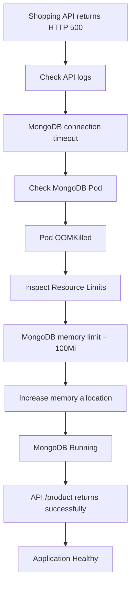
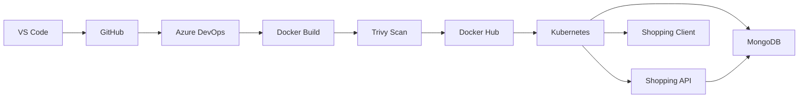

> [!abstract] Objective  
> Reduce unnecessary infrastructure cost while keeping the CI/CD pipeline and Kubernetes workloads reliable for a small-scale deployment.

---

## 1. Container Registry Migration

### Problem

The initial pipeline used **Azure Container Registry (ACR)** for Docker image storage.

For this project scale, ACR introduced an additional recurring cloud cost that was not justified by the workload.

```text
Azure DevOps
     │
     ▼
Docker Build
     │
     ▼
Azure Container Registry
     │
     ▼
Kubernetes
```

### Decision

Migrate container images from **ACR → Docker Hub**.

```text
Azure DevOps
     │
     ▼
Docker Build
     │
     ├── Trivy Scan
     │
     ▼
Docker Hub
     │
     ▼
Kubernetes
```

### Docker Hub Integration

Configured an **Azure DevOps Service Connection** for Docker Hub.

```text
Azure DevOps
     │
     ▼
Docker Hub Service Connection
     │
     ├── Authentication
     └── Registry Access
              │
              ▼
        Docker Hub
```

Pipeline responsibilities:

```text
Build
  ↓
Local Docker Image
  ↓
Trivy Security Scan
  ↓
Publish Scan Artifact
  ↓
Docker Push
  ↓
Docker Hub
```

### Result

- Removed unnecessary ACR dependency
    
- Reduced recurring registry cost
    
- Kept Docker image publishing automated
    
- Preserved CI/CD security scanning
    
- Simplified the registry setup for a small project
    

> [!tip] Engineering principle  
> **Use managed infrastructure where it provides value, not simply because it is available.**
> 
> For a small portfolio/lab deployment, Docker Hub provides sufficient registry functionality without maintaining an additional paid Azure registry resource.

---

# 2. Kubernetes Resource Optimization

The Kubernetes cluster is intentionally small, so the original resource configuration was too aggressive for the available node capacity.

### Cluster Constraint

```text
Node
├── CPU:    ~1 vCPU
└── Memory: ~1.85 GiB allocatable
```

Running:

```text
MongoDB
Shopping API
Shopping Client
```

on the same small node required tighter resource allocation.

---

## Before

Some workloads were configured with unnecessarily large requests/limits relative to the cluster.

Example:

```yaml
resources:
  requests:
    memory: "64Mi"
    cpu: "100m"

  limits:
    memory: "100Mi"
    cpu: "250m"
```

MongoDB in particular was constrained by an excessively low memory limit.

```text
MongoDB
   │
   └── 100Mi memory limit
             │
             ▼
         OOMKilled
             │
             ▼
       mongo-service
          unavailable
             │
             ▼
       Shopping API
          HTTP 500
```

---

## After

Adjusted resource allocations to provide MongoDB enough memory while remaining appropriate for the small cluster.

```yaml
resources:
  requests:
    memory: "256Mi"
    cpu: "100m"

  limits:
    memory: "512Mi"
    cpu: "250m"
```

### Resource Strategy

```text
Small Cluster
     │
     ├── MongoDB
     │    └── Higher memory requirement
     │
     ├── Shopping API
     │    └── Moderate resources
     │
     └── Shopping Client
          └── Lightweight resources
```

The important distinction is:

```text
requests → scheduling guarantee
limits   → maximum consumption
```

Resource values were therefore tuned according to the workload rather than copied from a generic production-sized configuration.

---

# 3. Failure → Diagnosis → Optimization

The optimization was driven by an actual runtime failure.



---

# 4. Final Architecture



---

# 5. Engineering Outcome

|Area|Before|After|
|---|---|---|
|Container Registry|Azure Container Registry|Docker Hub|
|Registry Cost|Additional Azure cost|Lower-cost setup|
|Authentication|ACR integration|Docker Hub Service Connection|
|Image Security|Trivy|Trivy retained|
|Kubernetes|Small cluster|Small cluster optimized|
|MongoDB|100Mi limit|512Mi limit|
|Failure Mode|MongoDB OOMKilled|MongoDB stable|
|API|MongoDB timeout → 500|Healthy|
|Approach|Generic resource sizing|Workload-based sizing|

> [!success] Final principle  
> **Cost optimization is not simply using the cheapest service.**
> 
> It is matching infrastructure capacity to actual workload requirements.
> 
> **Registry:** Docker Hub was sufficient for the project's scale.  
> **Kubernetes:** Resource requests and limits were tuned to the actual node capacity.  
> **Result:** Lower infrastructure cost without sacrificing the CI/CD workflow or application functionality.