> **Intent:** Build → Scan → Push → Deploy → Scale  
> **Reality:** Many rocks fell. Caveman fixed rocks. App live.

---

## 🎯 What Caveman Wanted

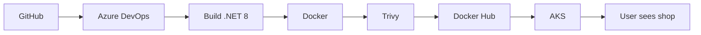

| Want | Tool |
|------|------|
| CI | Azure DevOps YAML |
| Images | Docker Hub (cheap) |
| Cluster | AKS 1 node B2s |
| DB | Mongo |
| Scale | HPA |
| Cost | Low |

**Not want:** Expensive ACR forever. Big cluster. Fancy GitOps yet.

---

## 🗺️ Final Map

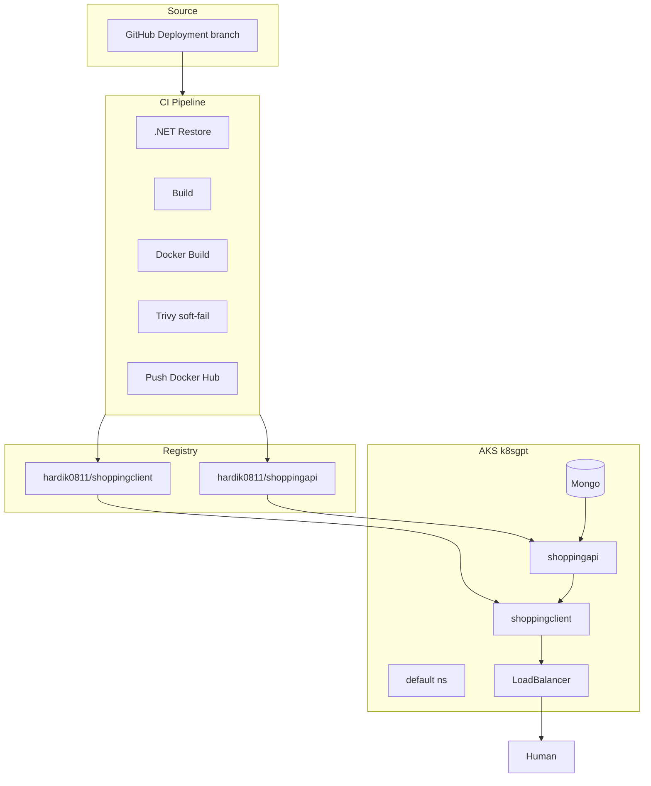

---

## 💀 Failure Timeline

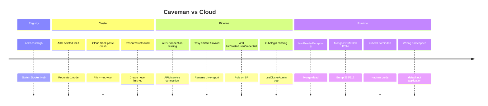

---

## 🔥 Failures → Fixes (Picture Book)

### 1. ACR too expensive

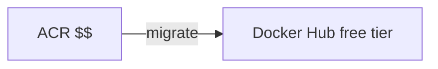

**Fix:** `DockerHub Registry Connection` + `hardik0811/...`

---

### 2. Cloud Shell dies on paste

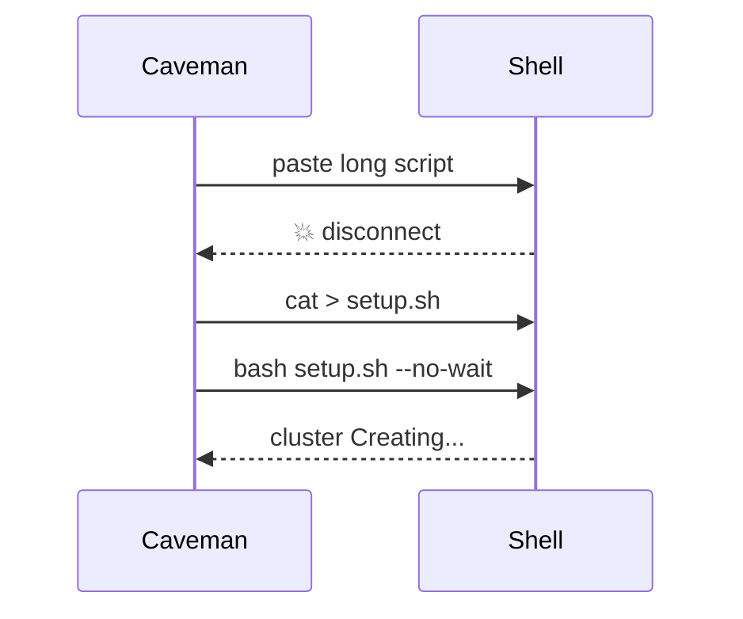

**Fix:** Write file. `--no-wait`. Poll status.

---

### 3. Pipeline invalid — AKS-Connection

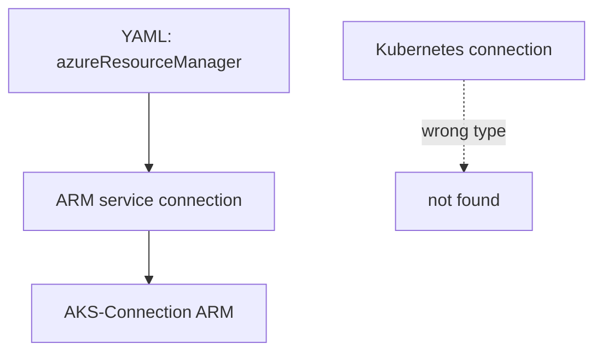

**Fix:** Service connection type = **Azure Resource Manager**, name exact `AKS-Connection`.

---

### 4. Trivy artifact name

```text
BAD:  trivy-hardik0811/shoppingapi   ← slash illegal
GOOD: trivy-report
```

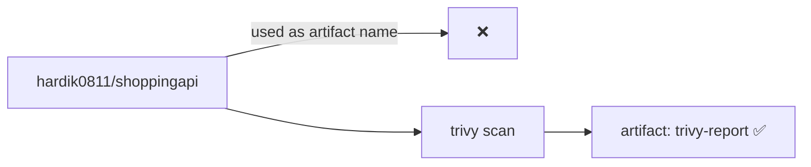

---

### 5. 403 credentials

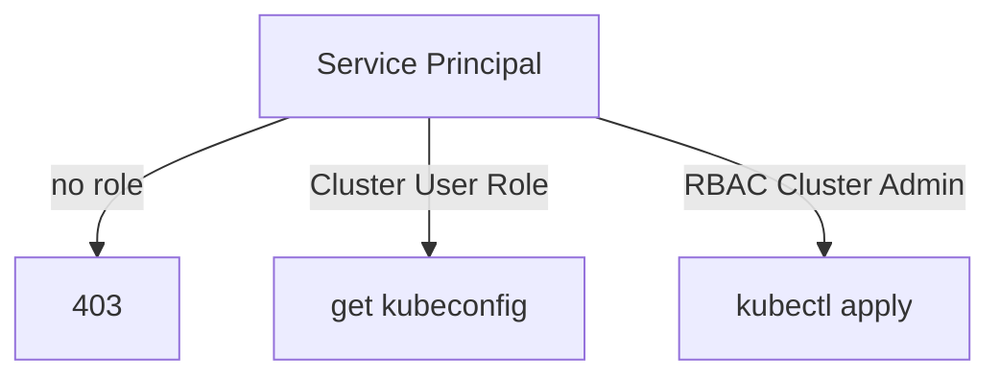

**Fix:**

```bash
# on SP object id from error
Azure Kubernetes Service Cluster User Role
Azure Kubernetes Service RBAC Cluster Admin
Azure Kubernetes Service Cluster Admin Role   # for useClusterAdmin
```

---

### 6. kubelogin missing

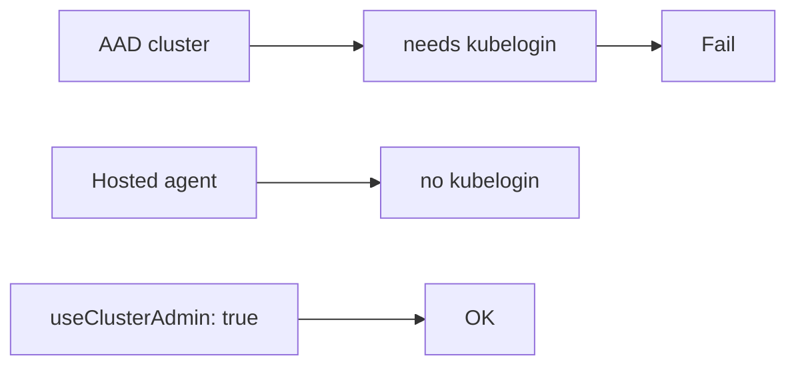

---

### 7. Json error on website

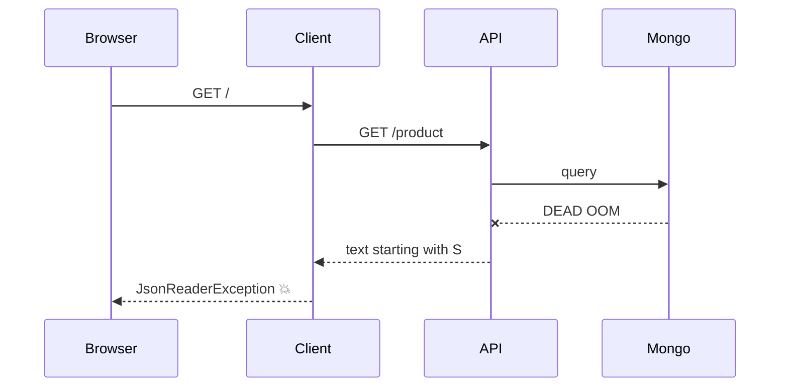

**Root:**

| Thing | Status |
|-------|--------|
| Client | Running |
| API | Running |
| Mongo | **OOMKilled** limit 128Mi |

**Fix:** Mongo `256Mi` request / `512Mi` limit.

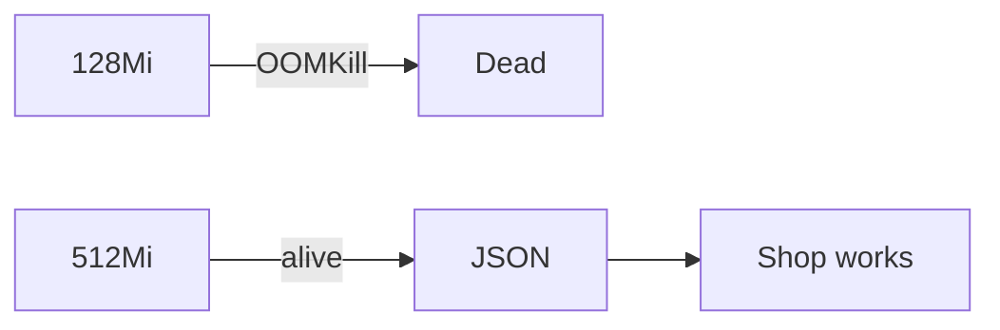

---

### 8. kubectl Forbidden

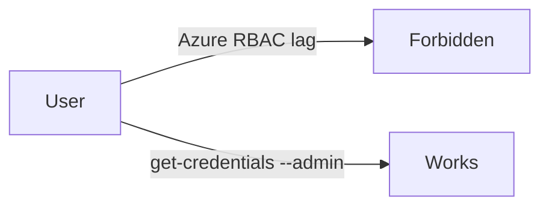

**Fix:** `az aks get-credentials ... --admin`

---

## 🧬 Identity of Images (sacred rule)

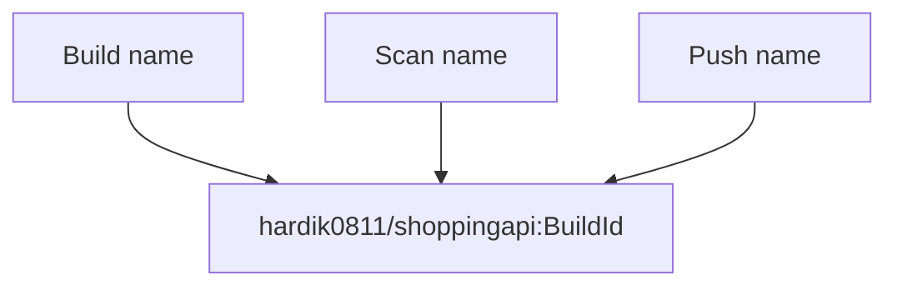

Break one → tag mismatch → push/pull fail.

---

## 📦 Repo Shape

```text
pipelines/
  shoppingapi-pipeline.yaml
  shoppingclient-pipeline.yaml
  templates/
    common/variables.yml
    ci/build-dotnet.yml
    security/trivy-scan.yml
    cd/deploy-infra.yml
    cd/deploy-aks.yml
k8s/   ← what CD deploys
aks/   ← lab manifests / LB / HPA
Shopping/
  Shopping.API/
  Shopping.Client/
```

---

##  variables.yml 

| Key | Value |
|-----|--------|
| dockerHubUsername | hardik0811 |
| dockerRegistryServiceConnection | DockerHub Registry Connection |
| aksServiceConnection | AKS-Connection |
| aksResourceGroup | k8sgpt |
| aksClusterName | ASP-MicroserviceApplication |
| aksNamespace | application *(runtime often default)* |

---

##  Pipeline Stages

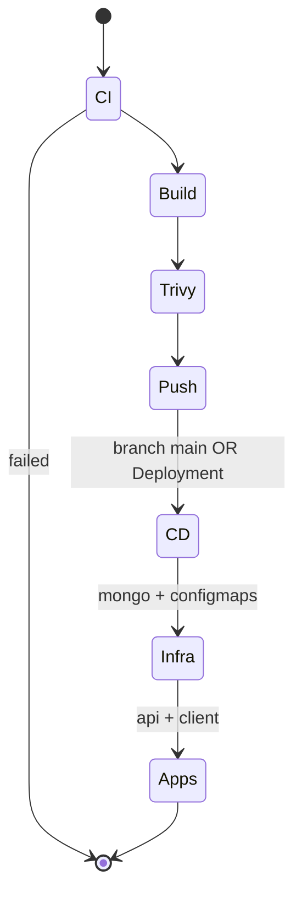

CD skipped when CI fails (`succeeded()` gate).

---

## 🧪 Live Checks (caveman commands)

```bash
# cluster
az aks show -g k8sgpt -n ASP-MicroserviceApplication --query provisioningState -o tsv

# auth that works
az aks get-credentials -g k8sgpt -n ASP-MicroserviceApplication --admin

# health
kubectl get pods
kubectl get svc
kubectl logs deploy/mongo-deployment --tail=30
kubectl logs deploy/shoppingapi-deployment --tail=30

# API from inside
kubectl exec deploy/shoppingclient-deployment -- wget -qO- http://shoppingapi-service:8000/product

# HPA watch
kubectl get hpa,pods -w
```

---

## 📈 HPA Demo Flow

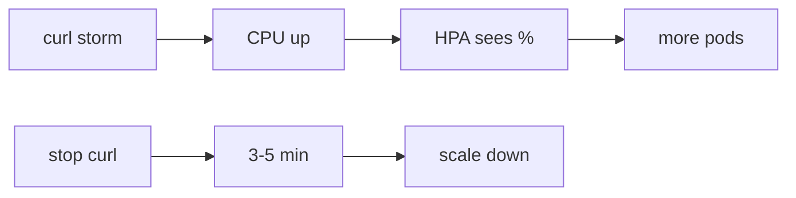

**Warn:** `targetCPU: 2%` = scale always. 1 node + minReplicas 2+3 = tight.

---

## 🧠 Lessons Carved in Stone

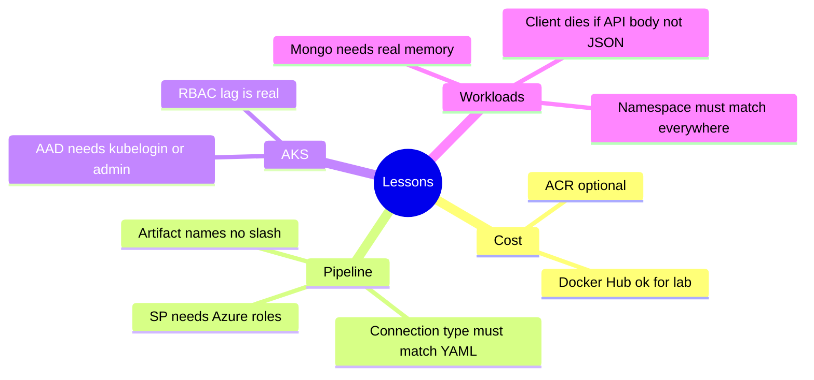

---

## ✅ Done vs Next

| Done | Next |
|------|------|
| CI build + Trivy + push | Hard fail on CRITICAL |
| CD to AKS | Force `application` ns |
| Docker Hub | Optional imagePullSecret |
| Mongo not OOM | Pin `mongo:6` if still heavy |
| LB frontend | Ingress + TLS |
| HPA manifests | Real load test script |
| | Terraform for AKS |

---

## 🏁 One Picture End State

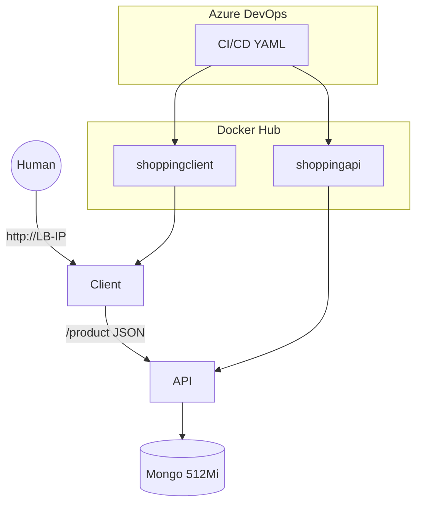

**Caveman goal:** Artifact walks path  
`code → image → scan → registry → cluster → browser`  
without mystery failures.

**Caveman status:** Path works. Mongo fed. Rocks documented.

