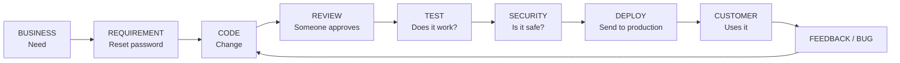
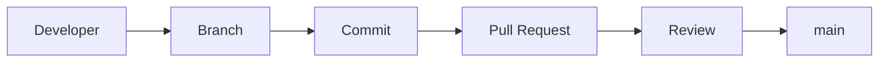
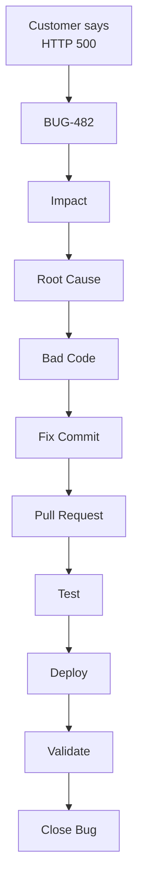
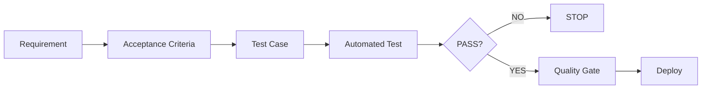
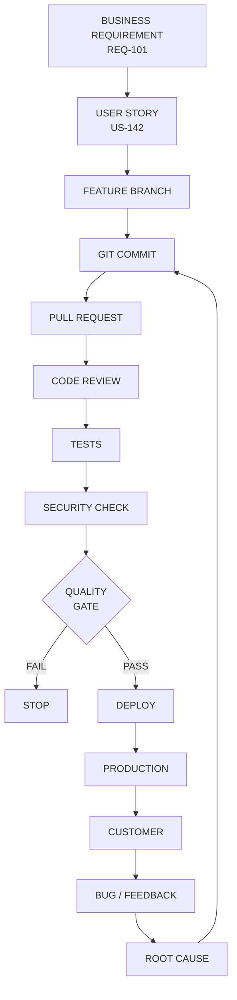
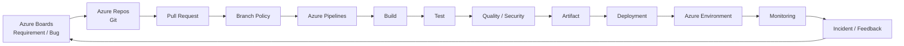
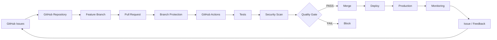
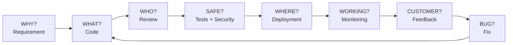

#azure #azure-devops

# Traceability Caveman Version

The whole lesson can be reduced to:

> **Something changed. We need to know WHY, WHO, WHAT, DID IT WORK, and WHERE IT WENT.**

That's it.

---

# 1. Imagine a password-reset system

Customer says:

> **"I clicked reset password. It crashed."**

Caveman says:

```text
BROKEN.
```

Cloud Architect says:

```text
Why broken?
Who changed it?
What changed?
Who approved change?
Did tests pass?
Was security checked?
Which version reached production?
Did fix actually solve problem?
```

**That is traceability.**

---

# 2. The entire thing



Think:

> **Need → Code → Check → Deploy → Customer → Learn**

That's the DevOps loop.

---

# 3. Three big words

The course splits traceability into **three areas**.

## ① Source Traceability

Simple question:

> **"Who changed the code?"**



So if production breaks, we can walk backward:

```text
Production
   ↓
Deployment
   ↓
Commit
   ↓
Pull Request
   ↓
Developer
```

### Example

Bad:

```text
"fixed login"
```

Better:

```text
fix: prevent expired password-reset token
```

Now Git history tells us something useful.

The source recommends **GitHub Flow, meaningful/semantic commits, code review, and dependency tracking** for this purpose.

---

# 4. Bug Traceability

Customer says:

> **"Password reset returns HTTP 500."**

We create:

```text
BUG-482
```

Now we don't just write:

```text
Password reset broken.
```

We connect everything.



Now we can tell the **whole story of the bug**.

That's what bug traceability means: track the defect from discovery through investigation, fixing, and validation.

---

# 5. Severity vs Priority — super simple

People often confuse these.

### Severity = **HOW BAD?**

```text
Critical → Everything dead
High     → Major feature broken
Medium   → Important but workaround exists
Low      → Small problem
```

### Priority = **HOW FAST?**

```text
P0 → DROP EVERYTHING
P1 → FIX VERY SOON
P2 → Normal work
P3 → Later
P4 → Backlog
```

Example:

### Bank login completely broken

```text
Severity = Critical
Priority = P0
```

### Button says "Passwrod"

```text
Severity = Low
Priority = P3
```

The important distinction:

> **Severity talks about impact. Priority talks about urgency.**

The course explicitly uses severity and priority as part of defect classification.

---

# 6. Quality Traceability

Now business says:

> **"Users must be able to reset their password securely."**

We need proof.



So instead of saying:

> "Yeah bro, we tested it."

We can prove:

```text
Requirement
     ↓
Test Case
     ↓
Test Run
     ↓
PASS
     ↓
Code Version
     ↓
Deployment
```

That's **quality traceability**.

The course specifically calls out requirement coverage, test results, code coverage, performance benchmarks, and customer feedback.

---

# 7. Now combine the three

This is the important architecture.



Look at what happened.

We started with:

```text
"Business wants password reset."
```

And ended with:

```text
"Customer used password reset."
```

And if something breaks, we can go backward.

That's the magic.

---

# 8. Azure DevOps version

If Microsoft gives you an Azure DevOps environment, think:



### Translate that into caveman:

```text
Boards
  ↓
"What do we need?"

Repos
  ↓
"What code changed?"

PR
  ↓
"Who approved it?"

Pipeline
  ↓
"Did it pass?"

Artifact
  ↓
"What exactly are we deploying?"

Environment
  ↓
"Where are we deploying it?"

Monitoring
  ↓
"Is it working?"

Incident
  ↓
"Oh crap, something broke."

Boards
  ↓
"Track it."
```

Azure DevOps specifically provides integration between work items, code, branch policies, pipelines, testing, reporting and enterprise governance.

---

# 9. GitHub version

Same idea, different tools:



GitHub provides the pieces for source, issue, review, security, automation, and quality traceability.

---

# 10. The Staff Architect brain

This is where the level changes.

### Junior engineer

> **"Where is my code?"**

### DevOps engineer

> **"How do I build and deploy my code?"**

### Cloud Architect

> **"Can I trace the entire change from business requirement to production outcome?"**

And the architect asks:

```text
WHY?
 ↓
Requirement

WHAT?
 ↓
Code change

WHO?
 ↓
Review / approval

SAFE?
 ↓
Security + quality

WHERE?
 ↓
Deployment

WORKING?
 ↓
Monitoring

CUSTOMER HAPPY?
 ↓
Feedback
```

That is **enterprise traceability**.

---

# 11. The one diagram to memorize

If you remember only **one thing from this lesson**, remember this:



### Caveman translation:

> **Business says "build this."**  
> **Developer changes code.**  
> **Someone reviews it.**  
> **Machines test it.**  
> **Security checks it.**  
> **Pipeline deploys it.**  
> **Monitoring watches it.**  
> **Customer uses it.**  
> **If broken → find why → fix code → repeat.**

That is **source + bug + quality traceability**.

And that's a much better mental model than memorizing three definitions.