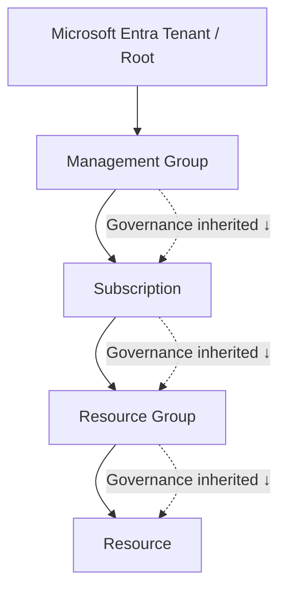
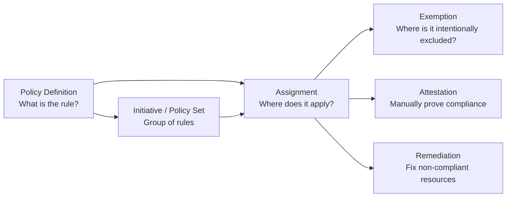
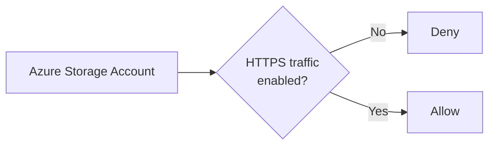
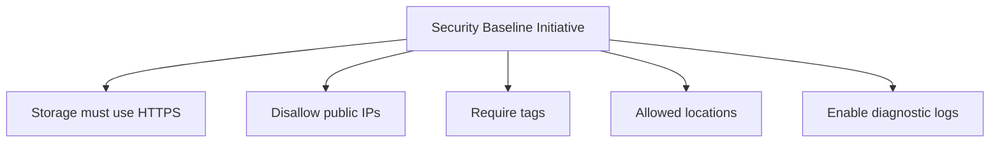
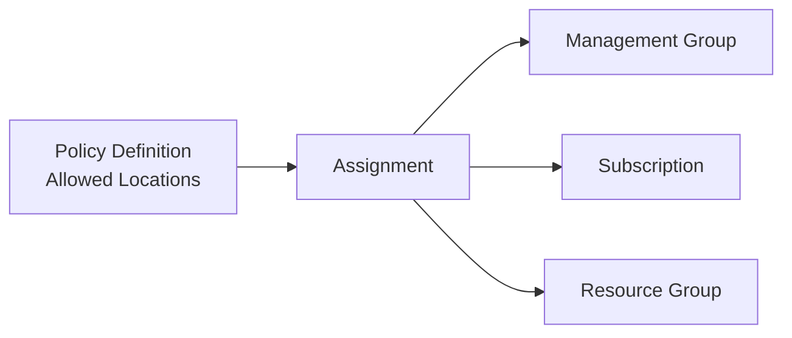
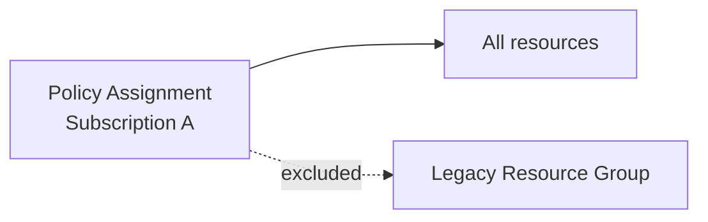
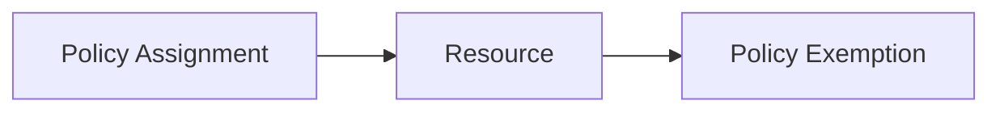
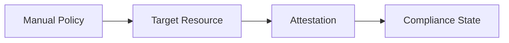
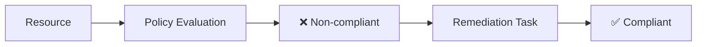
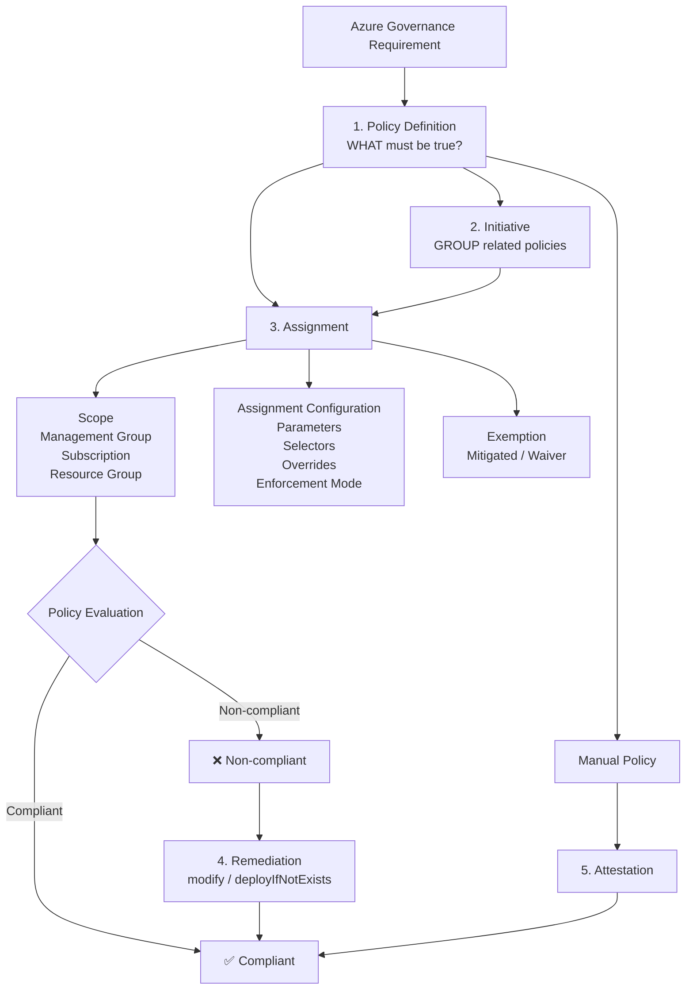

#azure


Think of Azure Policy as:

> **Rules → Group rules → Assign rules → Exempt exceptions → Evaluate → Fix/Attest**


### 1. The hierarchy: **Where does the policy apply?**



**Key idea:** Lower scopes inherit policy from higher scopes.

So if you assign a policy at a **Management Group**, subscriptions beneath it inherit that governance.

---

# 2. The six Azure Policy resources

This is the part worth memorizing:



### The six in plain English

|Resource|Think of it as|Purpose|
|---|---|---|
|**Policy Definition**|📜 Rule|Defines the condition + effect|
|**Initiative**|📚 Rulebook|Groups multiple policies|
|**Assignment**|🎯 Deployment of the rule|Determines where/how policy applies|
|**Exemption**|🚪 Exception|Intentionally excludes something|
|**Attestation**|✍️ Manual proof|Declares compliance for manual policies|
|**Remediation**|🔧 Fix|Brings non-compliant resources into compliance|

---

# 3. Policy Definition = **WHAT?**

A policy definition contains:

```text
IF resource matches condition
THEN apply effect
```

Example:



For example:

> **All Storage Accounts must require HTTPS.**

The definition describes the rule.

It does **not** by itself mean every resource in Azure is subject to it.

That's where **assignment** comes in.

---

# 4. Initiative = **WHAT + WHAT + WHAT?**

Suppose your organization wants a security baseline:



Instead of assigning five policies individually:

```text
Assignment
    ↓
Security Baseline Initiative
    ├── Policy A
    ├── Policy B
    ├── Policy C
    ├── Policy D
    └── Policy E
```

You assign **one initiative**.

### Built-in vs Custom

**Built-in policy**

Microsoft provides it.

**Custom policy**

Your organization writes it because the built-ins don't satisfy your requirement.

---

# 5. Assignment = **WHERE?**

This is probably the most important distinction:

> **Definition says WHAT. Assignment says WHERE.**



An assignment can also control:

- **Parameters**
    
- **Exclusions**
    
- **Resource selectors**
    
- **Overrides**
    
- **Enforcement mode**
    
- **Non-compliance messages**
    
- **Managed identity** for remediation
    

---

# 6. Inclusion vs Exclusion vs Exemption

This is where people commonly mix things up.

### Exclusion

You configure the **assignment** to not apply to something.



### Exemption

The resource remains within the assignment but receives a formal exemption.



And exemptions have two reasons:

```text
Exemption
├── Mitigated
│   └── Requirement satisfied another way
│
└── Waiver
    └── Temporary acceptance of non-compliance
```

### Architect's distinction

**Exclusion:**

> "Don't evaluate this scope."

**Exemption:**

> "This scope is governed, but we formally recognize an exception."

That's a useful governance distinction.

---

# 7. Attestation = **MANUAL COMPLIANCE**

Some compliance requirements can't simply be determined from resource properties.

For those, Azure Policy supports **manual effects**.



Think:

> "We can't automatically prove this control. An authorized person attests that it has been satisfied."

---

# 8. Remediation = **FIX IT**

Policy detects:

```text
❌ Resource is non-compliant
```

A remediation task can bring it into compliance for policies using effects such as:

- `modify`
    
- `deployIfNotExists`
    



For `deployIfNotExists` / `modify`, the assignment can use a **managed identity** so Azure Policy has the permissions required to perform the remediation.

---

# The entire Azure Policy lifecycle

This is the diagram I'd keep in your Obsidian notes:



## Staff-architect mental model

If you're designing Azure governance, ask these six questions:

```text
┌─────────────────────────────────────────────┐
│              AZURE POLICY                   │
├─────────────────────────────────────────────┤
│  WHAT?       → Policy Definition             │
│  GROUP WHAT? → Initiative                    │
│  WHERE?      → Assignment + Scope            │
│  EXCEPTION?  → Exemption                     │
│  PROVE IT?   → Attestation                   │
│  FIX IT?     → Remediation                   │
└─────────────────────────────────────────────┘
```

And the **one sentence to remember**:

> **Definitions define the rule, initiatives bundle rules, assignments apply them, exemptions formalize exceptions, attestations establish manual compliance, and remediations fix violations.**

One subtle but important governance point: **Azure Policy is not merely a "deny bad resources" mechanism.** It can **audit, enforce, deploy configuration, modify resources, track compliance, and support regulatory governance** depending on the policy effect and assignment configuration.