 Microsoft Entra ID — Complete Beginner Mental Model

> [!NOTE] Core idea  
> **Microsoft Entra ID is Microsoft's cloud identity platform.**
> 
> It answers:
> 
> **Who are you? → How do you authenticate? → What are you allowed to access? → Under what conditions?**
> 
> For a cloud/DevOps engineer, think of Entra as the **identity and access-control foundation surrounding Azure, Microsoft 365, SaaS applications, users, devices, and workloads.**

---

## 1. The Big Picture

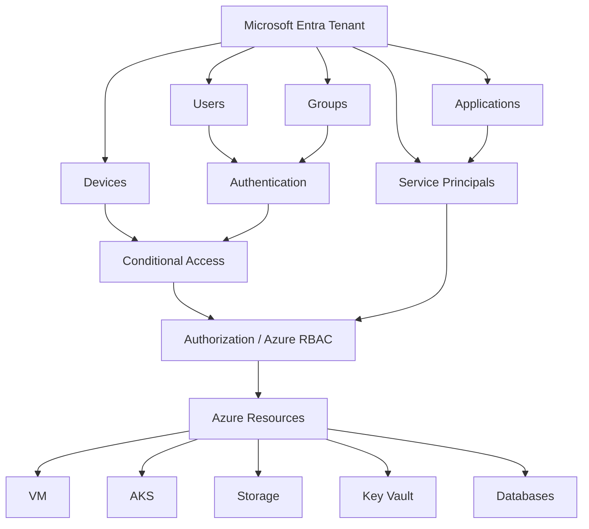

### The flow

```text
User / Application
       ↓
Microsoft Entra ID
       ↓
Authentication
       ↓
Conditional Access
       ↓
Authorization
       ↓
Azure / SaaS / Applications
```

---

# 2. Entra ID vs Active Directory Domain Services

The easiest distinction:

> **AD DS = traditional Windows enterprise identity**
> 
> **Entra ID = modern cloud/web identity**

---

## AD DS

AD DS is traditionally deployed on Windows Server and managed by the organization.

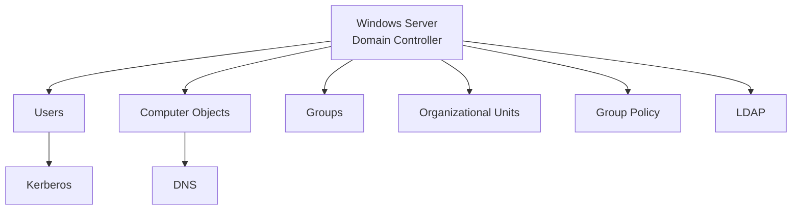

Typical technologies:

- Domain Controllers
    
- DNS
    
- LDAP
    
- Kerberos
    
- OUs
    
- GPOs
    
- Computer objects
    
- Domain/forest trusts
    

Think:

```text
Corporate Network
       ↓
AD Domain
       ↓
Users + Computers + Servers
       ↓
Kerberos / LDAP / DNS
```

---

# 3. Microsoft Entra ID

Entra is a **Microsoft-managed cloud service**.

You don't deploy:

```text
Windows Server
      ↓
Domain Controller
      ↓
AD DS
```

Instead:

```text
Microsoft Cloud
      ↓
Microsoft Entra ID
      ↓
Your Tenant
```

Microsoft manages the underlying identity infrastructure.

You manage things such as:

- Users
    
- Groups
    
- Applications
    
- Service principals
    
- Devices
    
- Access policies
    
- Roles
    
- Authentication methods
    

---

# 4. AD DS vs Entra — Quick Comparison

|Concept|AD DS|Microsoft Entra ID|
|---|---|---|
|Primary purpose|Windows/domain identity|Cloud/web identity|
|Deployment|You manage servers|Microsoft-managed|
|Identity boundary|Domain/forest|Tenant|
|Directory|Hierarchical|Mostly flat|
|LDAP|Yes|No|
|Kerberos|Yes|No|
|DNS dependency|Major|Not equivalent|
|OUs|Yes|No|
|GPO|Yes|No|
|Computer objects|Yes|Device objects|
|Main communication|LDAP/Kerberos/etc.|HTTP/HTTPS|
|SSO|Primarily enterprise/domain scenarios|Cloud/SaaS/web applications|
|Multi-tenant|Traditional AD isn't multi-tenant like Entra|Yes|
|APIs|LDAP|REST/Graph APIs|
|Modern protocols|Kerberos|OAuth 2.0, OIDC, SAML, WS-Fed|

---

# 5. Don't Think "Entra = AD in Azure"

This is a very common beginner mistake.

You can run AD DS **on an Azure VM**:

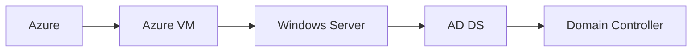

That is still **traditional AD DS**.

It does **not** become Entra ID.

```text
AD DS running on Azure VM
          ≠
Microsoft Entra ID
```

Azure is simply providing the infrastructure for the VM.

---

# 6. Entra Tenant

A **tenant** is an isolated Microsoft Entra directory.

Think:

```text
Microsoft Cloud
      │
      ├── Company A Tenant
      │      ├── Users
      │      ├── Groups
      │      └── Applications
      │
      ├── Company B Tenant
      │      ├── Users
      │      └── Applications
      │
      └── Company C Tenant
```

### Mental model

> **Tenant = identity/security boundary for an Entra directory.**

A tenant contains objects such as:

```text
Tenant
├── Users
├── Groups
├── Applications
├── Service Principals
└── Devices
```

---

# 7. Tenant vs Azure Subscription

This is critical.

### Azure

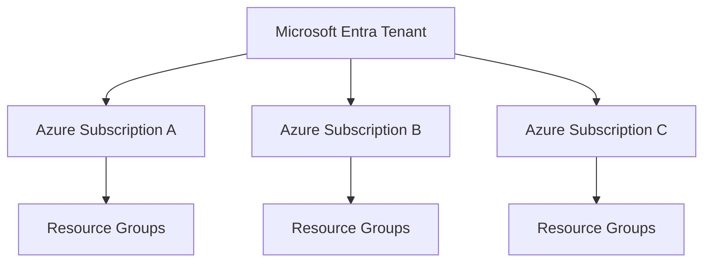

A tenant can be associated with **multiple Azure subscriptions**.

But:

```text
Azure Subscription
       ↓
ONE associated Entra tenant
```

### Important distinction

> **Tenant = identity boundary**
> 
> **Subscription = Azure resource/billing/management boundary**

---

# 8. GCP → Azure Mental Mapping

Since you already understand GCP:

|GCP|Azure|Mental model|
|---|---|---|
|Organization|Azure management hierarchy / tenant context|Top-level organization|
|Folder|Management Group|Group subscriptions|
|**Project**|**Subscription**|Major resource/billing boundary|
|Resource|Resource|Actual cloud resource|
|Labels|Tags|Metadata|
|IAM|Azure RBAC|Authorization|
|VPC|VNet|Network|
|GKE|AKS|Kubernetes|
|Kubernetes Namespace|Kubernetes Namespace|Workload isolation|
|GKE Fleet|No exact 1:1|Multi-cluster management concept|

### The most important mapping

```text
GCP Project
     ≈
Azure Subscription
```

Do **not** treat:

```text
GCP Project ≈ Azure Resource Group
```

That's misleading.

---

# 9. Azure Resource Groups

A resource group is a **logical grouping of Azure resources inside a subscription**.

Example:

```text
Production Subscription
│
├── rg-network
│    ├── VNet
│    ├── NSG
│    └── Subnets
│
├── rg-platform
│    ├── AKS
│    ├── Key Vault
│    └── Load Balancer
│
└── rg-data
     ├── Database
     └── Storage
```

Think:

> **Subscription = major boundary**
> 
> **Resource Group = logical/lifecycle grouping inside the subscription**

---

# 10. Entra Schema

Entra's object model is simpler and flatter than traditional AD DS.

### AD DS

```text
Domain
│
├── OU=Engineering
│    ├── Alice
│    └── Bob
│
├── OU=Finance
│    └── Sarah
│
└── OU=HR
     └── John
```

### Entra

```text
Tenant
│
├── Alice
├── Bob
├── Sarah
├── Engineering Group
├── Finance Group
├── Applications
└── Devices
```

There are **no traditional OUs** and **no traditional GPOs**.

Instead, modern management uses things such as:

- Groups
    
- Roles
    
- Azure RBAC
    
- Conditional Access
    
- Intune/device management
    
- Application policies
    

---

# 11. Authentication vs Authorization

This distinction is fundamental.

### Authentication

> **Who are you?**

```text
Hardik
  ↓
Password / MFA
  ↓
Entra
  ↓
"Yes, this is Hardik."
```

### Authorization

> **What are you allowed to do?**

```text
Hardik
  ↓
Authenticated
  ↓
Azure RBAC
  ↓
Reader
  ↓
Storage Account
```

Remember:

```text
Authentication = WHO?
Authorization   = WHAT CAN THEY DO?
```

---

# 12. Applications and Service Principals

This is one of the more confusing Entra concepts.

An **Application object** defines/registers an application.

A **Service Principal** represents that application in a particular tenant.

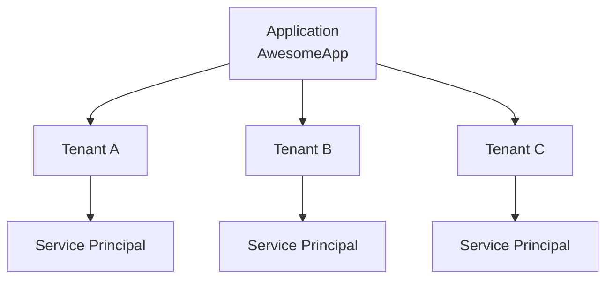

### Mental model

```text
Application
    ↓
"What is this application?"

Service Principal
    ↓
"What identity does this application have
in this tenant?"
```

A useful, imperfect analogy:

```text
Docker Image
     ↓
Container instances
```

roughly resembles:

```text
Application definition
     ↓
Tenant-specific service principals
```

---

# 13. Why Service Principals Matter to DevOps

CI/CD systems need identities too.

Example:

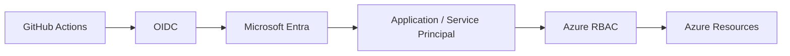

Instead of:

```text
GitHub Actions
      ↓
Hard-coded Azure password
```

you can use modern workload identity patterns such as OIDC/federation.

This is highly relevant to:

- GitHub Actions
    
- Terraform
    
- OpenTofu
    
- Azure DevOps
    
- Kubernetes workloads
    
- CI/CD
    
- DevSecOps
    

---

# 14. Entra Authentication Protocols

Entra is designed around modern web protocols rather than traditional Kerberos-based domain authentication.

### OAuth 2.0

Primarily about:

> **Authorization / delegated access**

```text
Application
    ↓
OAuth token
    ↓
API
    ↓
Allowed operations
```

### OpenID Connect

Adds an identity layer:

> **Who is this user?**

```text
User
 ↓
OIDC
 ↓
Identity information
```

### SAML

Commonly used for enterprise SSO:

```text
Employee
   ↓
Entra
   ↓ SAML
Salesforce / SaaS
```

### Simplified memory

```text
OIDC → Identity
OAuth → Authorization
SAML → Enterprise SSO/federation
```

---

# 15. Conditional Access

Conditional Access is one of the most important Entra security concepts.

Instead of simply asking:

```text
"Is Hardik authenticated?"
```

Entra can ask:

```text
Is Hardik authenticated?
        +
Is the device trusted?
        +
Where is the request coming from?
        +
What application is being accessed?
        +
Is MFA required?
```

Conceptually:

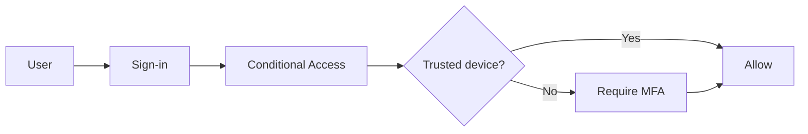

This is a major **P1** capability.

---

# 16. Entra ID Licensing

Don't memorize every bullet from the course.

Understand the progression:

```text
Free
  ↓
Basic identity
  ↓
P1
  ↓
Enterprise access control
  ↓
P2
  ↓
Risk + privileged access security
```

---

## Entra ID Free

Think:

> **Basic identity**

```text
Users
Groups
Directory
Basic authentication
```

---

# 17. Entra ID P1

Think:

> **"Under what conditions should this identity be allowed access?"**

Important P1 concepts:

- Conditional Access
    
- Enterprise MFA
    
- Self-service password reset
    
- Password writeback
    
- Self-service group management
    
- Advanced security reports
    
- Hybrid identity capabilities
    
- Entra Connect Health
    
- Cloud App Discovery
    

The big one:

```text
P1
 ↓
Conditional Access
```

---

# 18. Entra ID P2

Think:

> **"Is this identity risky, and should this administrator have privilege right now?"**

Two major concepts:

```text
P2
├── Identity Protection
└── Privileged Identity Management
```

---

# 19. Identity Protection

Identity Protection focuses on **risk**.

Imagine:

```text
Normal sign-in
    ↓
Low risk
    ↓
Allow
```

versus:

```text
Suspicious sign-in
    ↓
Higher risk
    ↓
MFA / remediation / block
```

Conceptually:

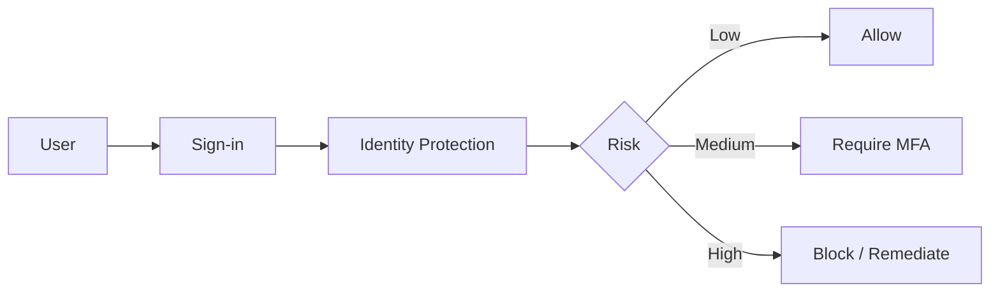

### Remember

```text
MFA
→ Stronger authentication

Identity Protection
→ Risk-aware identity security
```

---

# 20. Privileged Identity Management — PIM

PIM solves the problem of **permanent administrative privileges**.

### Dangerous model

```text
Engineer
   ↓
Permanent Owner
   ↓
Production
```

If the account is compromised:

```text
Attacker
   ↓
Engineer account
   ↓
Owner
   ↓
Production
```

Bad.

---

## PIM model

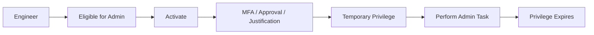

This is **Just-In-Time privileged access**.

Instead of:

```text
Admin privileges
24 × 7 × 365
```

you have:

```text
Normal user
    ↓
Need admin access
    ↓
Activate
    ↓
Admin for limited time
    ↓
Automatic expiration
```

This is a classic:

> **Least privilege + Just-In-Time access**

pattern.

---

# 21. The Three Types of Entra Users

This is another major concept from the module.

The easiest way to remember them:

> **Where was this identity born?**

---

## 21.1 Cloud Identity

Born directly in Entra.

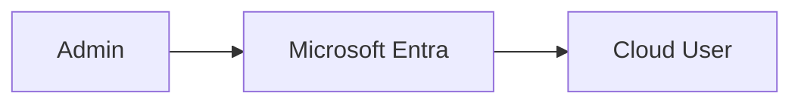

Example:

```text
hardik@company.com
```

created directly in Entra.

Source:

```text
Microsoft Entra ID
```

Typical examples:

- Cloud administrators
    
- Cloud-only employees
    
- Manually created users
    

---

## 21.2 Directory-Synchronized Identity

Born in on-premises AD DS.

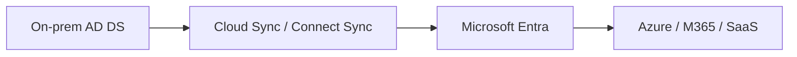

Source:

```text
Windows Server AD
```

The important principle:

> **AD DS is the source of truth.**

If the identity is deleted from AD DS, synchronization can remove/disable the corresponding Entra representation.

---

## 21.3 Guest User

Born outside your organization.

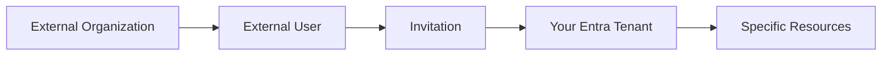

Example:

```text
Your company
     ↓
invites
     ↓
External consultant
     ↓
Guest in Entra
     ↓
Azure resource access
```

The guest's original identity belongs to their external organization.

You are granting them a controlled representation/access in your tenant.

---

# 22. Three User Types — Cheat Sheet

|User type|Born where?|Source|Typical use|
|---|---|---|---|
|**Cloud identity**|Entra|Microsoft Entra ID|Cloud-native users/admins|
|**Synced identity**|AD DS|Windows Server AD|Hybrid enterprise|
|**Guest**|Outside organization|Invited user|Contractors/vendors/partners|

### Memory trick

```text
Cloud
→ Born here

Synced
→ Born in AD DS

Guest
→ Born somewhere else
```

---

# 23. Hybrid Identity

This combines traditional AD DS with Entra.

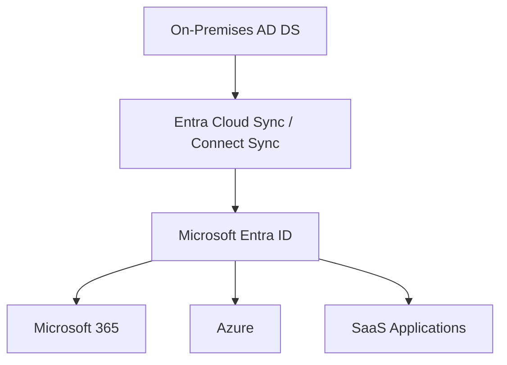

This lets an enterprise keep its existing Windows identity infrastructure while extending identity into the cloud.

---

# 24. Full Microsoft Identity Picture

Put everything together:

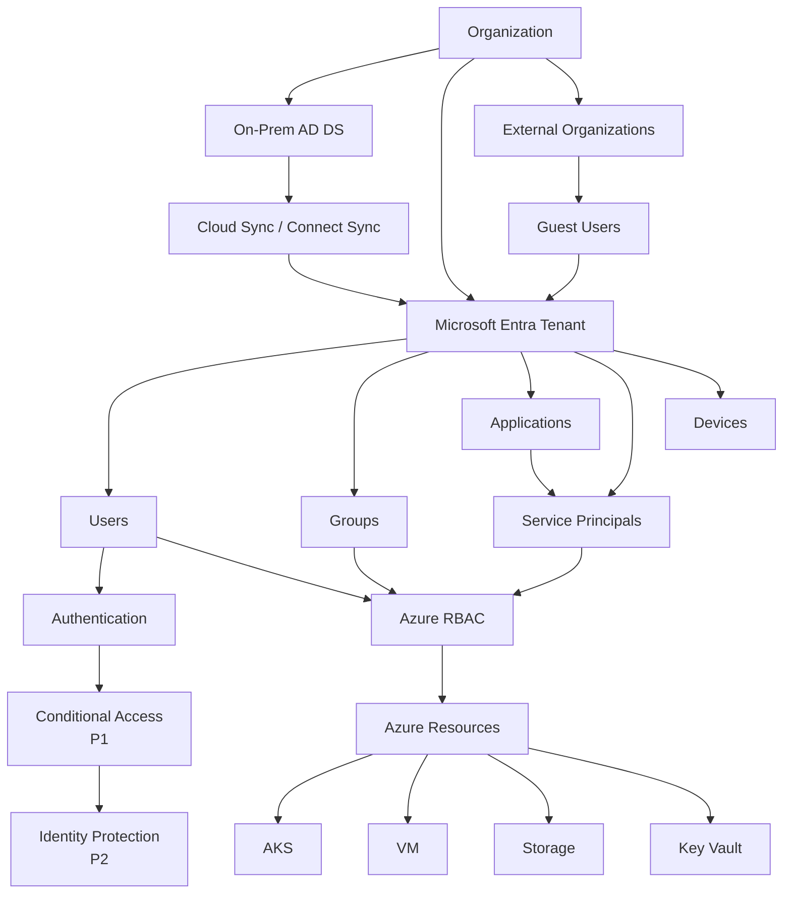

---

# 25. The Cloud Engineer Mental Model

For your GCP/GKE → Azure/AKS transition, I'd keep **four separate layers** in your head.

```text
┌──────────────────────────────────────────────┐
│ 1. IDENTITY                                  │
│                                              │
│ Entra Tenant                                 │
│ Users / Groups / Apps / Devices              │
└──────────────────────┬───────────────────────┘
                       │
┌──────────────────────▼───────────────────────┐
│ 2. ACCESS SECURITY                           │
│                                              │
│ MFA                                          │
│ Conditional Access                           │
│ Identity Protection                          │
│ PIM                                          │
└──────────────────────┬───────────────────────┘
                       │
┌──────────────────────▼───────────────────────┐
│ 3. AUTHORIZATION                             │
│                                              │
│ Azure RBAC                                   │
│ Roles                                        │
│ Scope                                        │
└──────────────────────┬───────────────────────┘
                       │
┌──────────────────────▼───────────────────────┐
│ 4. RESOURCES                                 │
│                                              │
│ Subscription                                 │
│ Resource Groups                              │
│ AKS / VM / VNet / Storage / Key Vault        │
└──────────────────────────────────────────────┘
```

---

# 26. GCP → Azure: Your Final Translation Table

|GCP concept|Azure concept|Remember|
|---|---|---|
|Organization|Azure management hierarchy / tenant context|Enterprise boundary|
|Folder|Management Group|Groups subscriptions|
|**Project**|**Subscription**|Major resource/billing boundary|
|Resource|Resource|Actual infrastructure|
|IAM|Azure RBAC|Authorization|
|Service Account|No exact 1:1; Managed Identity / Service Principal depending on scenario|Workload identity|
|Cloud Identity|Entra ID|Identity platform|
|GKE|AKS|Kubernetes|
|GKE Fleet|No exact 1:1|Multi-cluster management|
|VPC|VNet|Networking|
|Labels|Tags|Metadata|
|Workload Identity|Managed Identity / Workload Identity Federation patterns|Workload authentication|
|Cloud IAM role|Azure RBAC role|Permissions|

---

# 27. The 30-second revision sheet

If you're revising this module before an interview/exam:

```text
MICROSOFT ENTRA ID
│
├── Tenant
│    └── Identity/security boundary
│
├── Users
│    ├── Cloud
│    ├── Directory-synchronized
│    └── Guest
│
├── Groups
│
├── Applications
│    └── Service Principals
│
├── Devices
│
├── Authentication
│    ├── MFA
│    ├── OIDC
│    ├── SAML
│    └── OAuth ecosystem
│
├── P1
│    └── Conditional Access
│
└── P2
     ├── Identity Protection
     └── PIM
```

And:

```text
AD DS
├── Domain
├── Domain Controller
├── LDAP
├── Kerberos
├── DNS
├── OU
├── GPO
└── Computer Objects

              VS

Entra ID
├── Tenant
├── Users
├── Groups
├── Applications
├── Service Principals
├── Devices
├── OAuth / OIDC / SAML
├── Conditional Access
├── Identity Protection
└── PIM
```

---

## The one mental model I'd keep

> **AD DS manages identity inside a traditional Windows domain.**
> 
> **Entra ID manages identity and access in the cloud/internet era.**
> 
> **Tenant defines the identity boundary.**
> 
> **Subscription defines a major Azure resource/billing boundary.**
> 
> **Resource Group organizes resources inside a subscription.**
> 
> **Users, groups, applications and workloads get identities from/through Entra.**
> 
> **Azure RBAC decides what those identities can do.**
> 
> **P1 adds contextual access control.**
> 
> **P2 adds identity-risk detection and privileged-access management.**

That is the conceptual foundation. Once this is solid, the next Microsoft topics—**Azure RBAC, managed identities, service principals, App Registrations, Conditional Access, Entra Connect, and workload identity federation**—will stop looking like a pile of unrelated Microsoft terminology and start fitting into one architecture.