#azure-devops 

> [!summary] Rule  
> **Branch → Work → PR → Check → Merge → `main`**
> 
> Keep `main` healthy. Keep branches short-lived.

---

## 1. Basic model

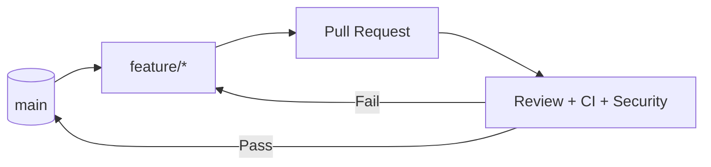

```text
main = stable
feature = work
PR = review
CI = test
merge = integrate
```

Microsoft baseline:

```text
Feature branches
      ↓
Pull Requests
      ↓
High-quality main
```

---

# 2. Feature Branch Workflow

**One feature/bug = one branch.**

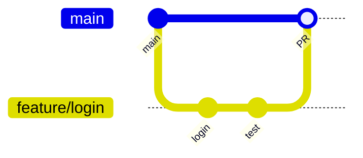

```text
main
 ├── feature/login
 ├── feature/payment
 └── bugfix/api
          ↓
         PR
          ↓
        main
```

### Why?

```text
No branch:
dev → main → chaos

Branches:
dev → feature → PR → main
```

---

# 3. Keep Feature Branch Current

Main moves:

```text
main:     A──B──C──D
               \
feature:         F──G
```

Rebase:

```text
A──B──C──D──F'──G'
```

```bash
git fetch origin
git rebase origin/main
```

**Rebase = replay my work on latest main.**

**Do not rebase shared/public work casually.**

---

# 4. Merge vs Rebase

```text
MERGE
A──B──C────M
   \      /
    F────G

REBASE
A──B──C──F'──G'
```

||Meaning|
|---|---|
|`merge`|Join histories|
|`rebase`|Replay commits on new base|
|`PR`|Review + controlled merge|

---

# 5. GitHub Flow

**Simple + frequent delivery.**

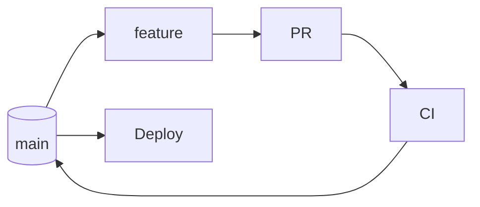

Use when:

```text
frequent releases
+
continuous delivery
+
short-lived branches
+
PRs
```

**Main should stay deployable.**

---

# 6. Release Branch

**Problem: release needs stabilization while new work continues.**

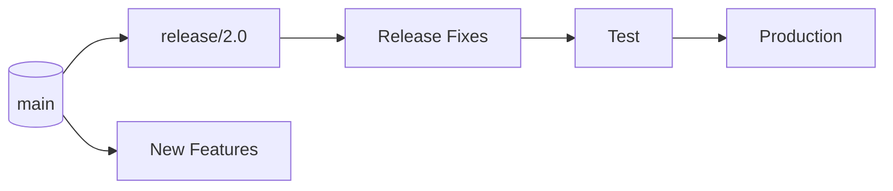

```text
main
 ├── future work
 │
 └── release/2.0
       ├── fix
       ├── test
       └── production
```

Use when:

```text
Need release stabilization
        ↓
release/*
```

Not:

```text
Compliance = release branch
```

---

# 7. Compliance

**Branch type does not create compliance. Controls do.**

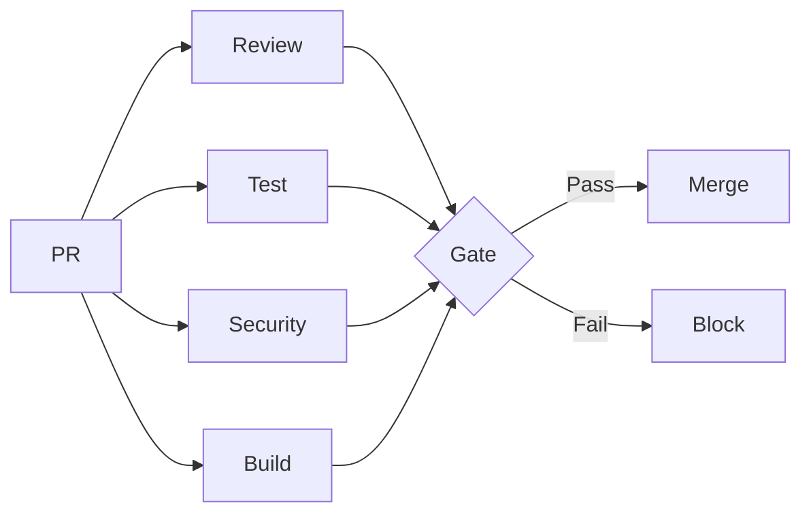

Typical:

```text
Protected main
PR required
Reviewer required
Build required
Tests required
Security checks
Audit history
No direct push
```

**Compliance = controls around change.**

---

# 8. Hotfix

Problem:

```text
production = old stable version
main       = new + unfinished work
```

Do this:

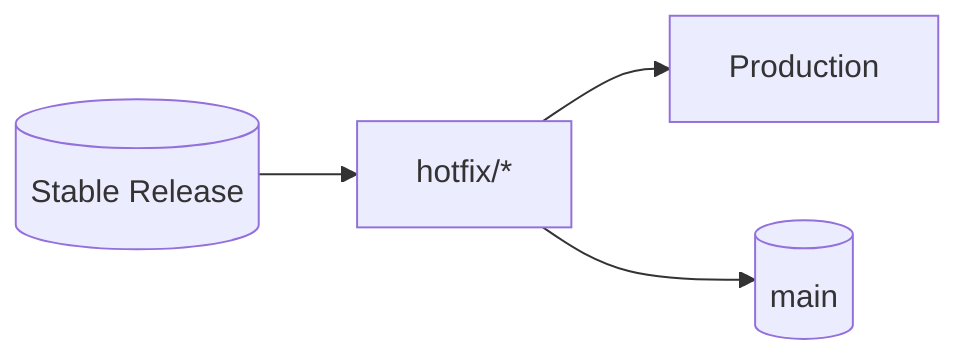

```text
Stable
  ↓
Hotfix
  ├──→ Production
  └──→ main
```

**Fix production version. Then carry fix forward.**

---

# 9. Forking Workflow

**Fork = separate repository copy.**

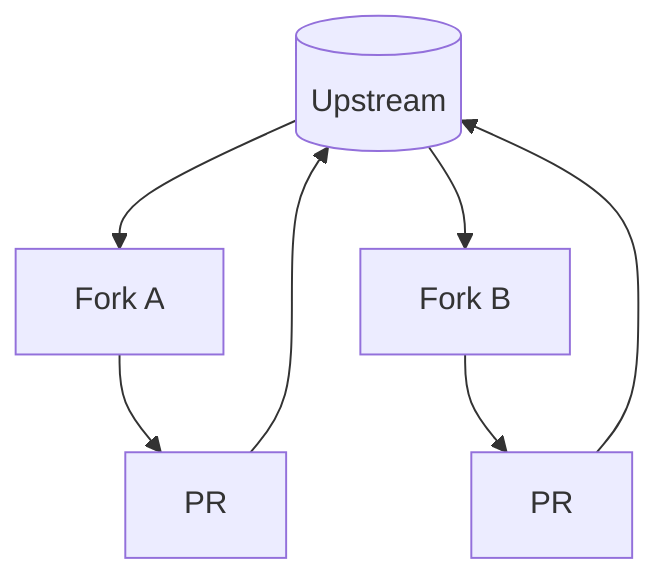

Use for:

```text
Open source
External contributors
No direct write access
Distributed contributors
```

**Fork ≠ feature branch.**

---

# 10. Release Fix → main

Release branch has:

```text
release
 ├── release-only change
 └── important bug fix
```

Need only bug fix in `main`:

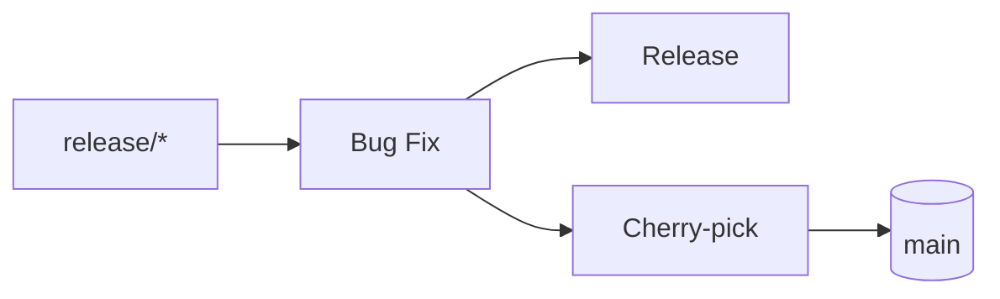

**Cherry-pick = take this exact commit.**

Useful when:

```text
Release fix
   ↓
Need same fix in main
```

---

# 11. Continuous Deployment

Don't make:

```text
main
 ├── dev
 ├── staging
 └── production
```

Prefer:

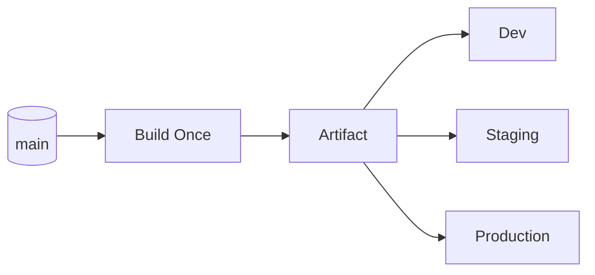

**Build once → promote artifact.**

Use environment/deployment branches only when there is a real reason.

---

# 12. Decision Tree

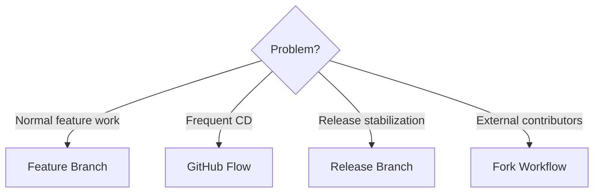

---

# 13. Enterprise DevSecOps

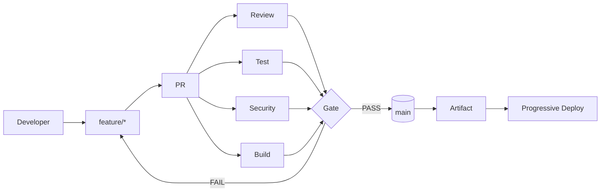

```text
feature
   ↓
PR
   ↓
review + test + security + build
   ↓
gate
   ↓
main
   ↓
artifact
   ↓
deploy
```

---

# 14. Cheat Sheet

|If question says...|Answer|
|---|---|
|Isolate feature|**Feature branch**|
|Code review|**PR**|
|Keep main stable|**Feature branch + PR**|
|Frequent CD|**GitHub Flow**|
|Stabilize release|**Release branch**|
|External contributors|**Fork**|
|Prevent direct push|**Branch policy**|
|Automated quality gate|**PR + CI policies**|
|Production bug + unfinished main|**Hotfix from stable release**|
|Release fix → main|**Cherry-pick**|
|Keep feature current|**Rebase / merge main**|
|CD environments|**Promote artifact**|

---

# 15. One Thing To Remember

```text
              MAIN
               │
        ┌──────┴──────┐
        ↓             ↓
     feature        bugfix
        │             │
        └──────┬──────┘
               ↓
              PR
               ↓
       REVIEW + CI + SECURITY
               ↓
             GATE
               ↓
          ┌────┴────┐
          │         │
        FAIL       PASS
          │         │
          ↓         ↓
        Fix       main
                    │
                    ↓
                 Artifact
                    │
                    ↓
                 Deploy
```

> **Caveman rule:**  
> **Don't work on `main`. Branch it. Review it. Test it. Protect it. Merge it.**