![[Pasted image 20260902125530.png]]
> [!abstract] Pattern  
> **Deployment → Pod → InitContainer → Shared Volume → Main Container**

---

## 1. Architecture

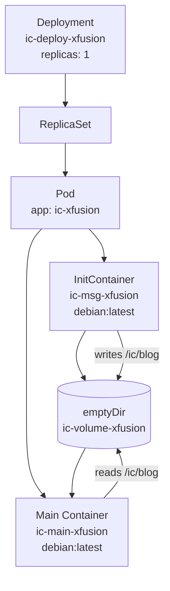

---

## 2. Deployment Selector

### Critical invariant

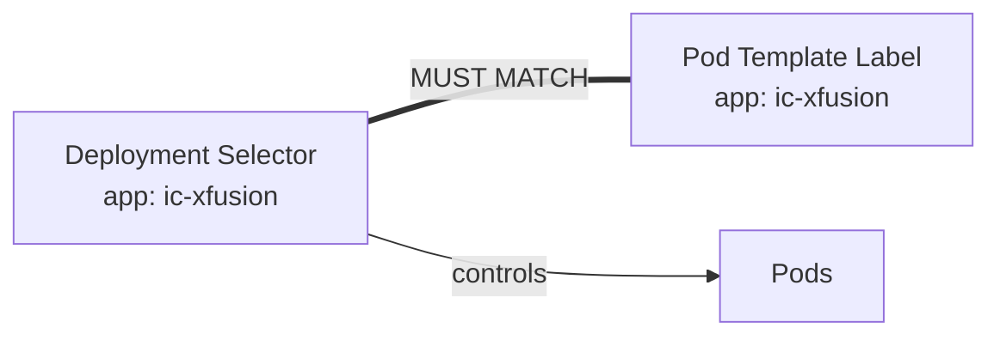

```yaml
selector:
  matchLabels:
    app: ic-xfusion

template:
  metadata:
    labels:
      app: ic-xfusion
```

> [!danger] Production rule  
> `spec.selector.matchLabels` is the Deployment's **identity contract** for its Pods.

---

## 3. InitContainer Lifecycle

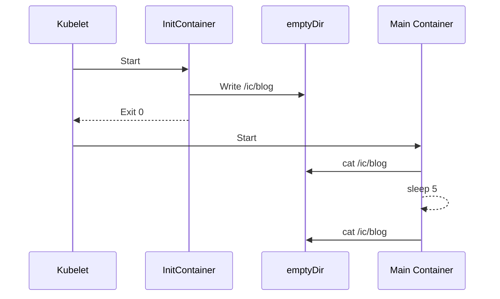

### Key property

```text
InitContainer
     │
     │ MUST succeed
     ▼
Main Container starts
```

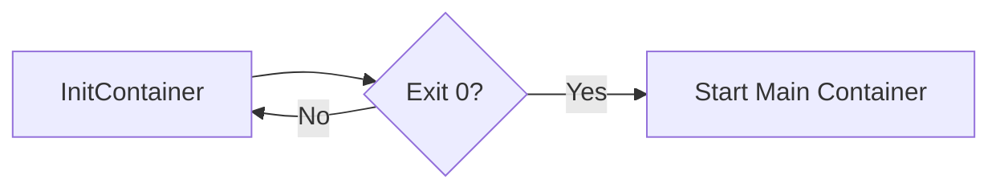

---

## 4. Shared `emptyDir`

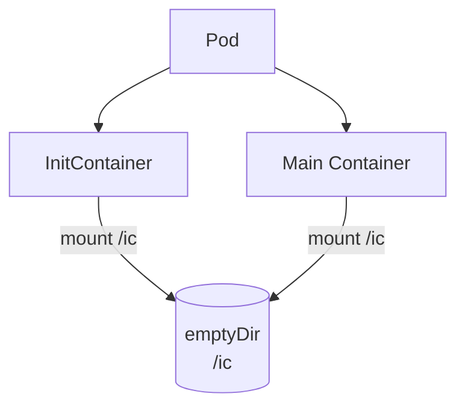

### Storage lifecycle

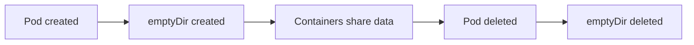

> [!warning] Architect's rule  
> `emptyDir` is **Pod-scoped ephemeral storage**.
> 
> **Pod dies → data dies.**

---

# 5. Container Responsibilities

|Component|Responsibility|
|---|---|
|`ic-msg-xfusion`|Initialization|
|`ic-volume-xfusion`|Temporary shared filesystem|
|`ic-main-xfusion`|Long-running workload|

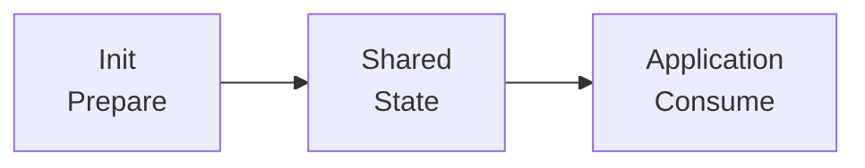

---

# 6. Why InitContainers Exist

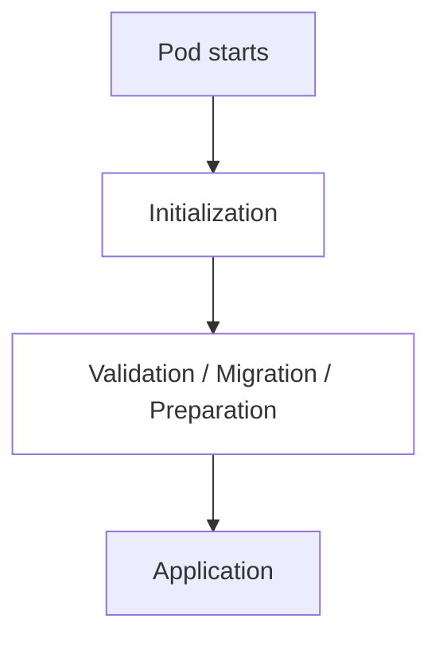

Typical responsibilities:

```text
InitContainer
├── generate configuration
├── download/bootstrap files
├── database migration
├── permissions / filesystem setup
├── wait for dependency
└── service initialization
```

---

# 7. Production Workload Example

## Configuration bootstrap for a web application

A realistic production pattern:

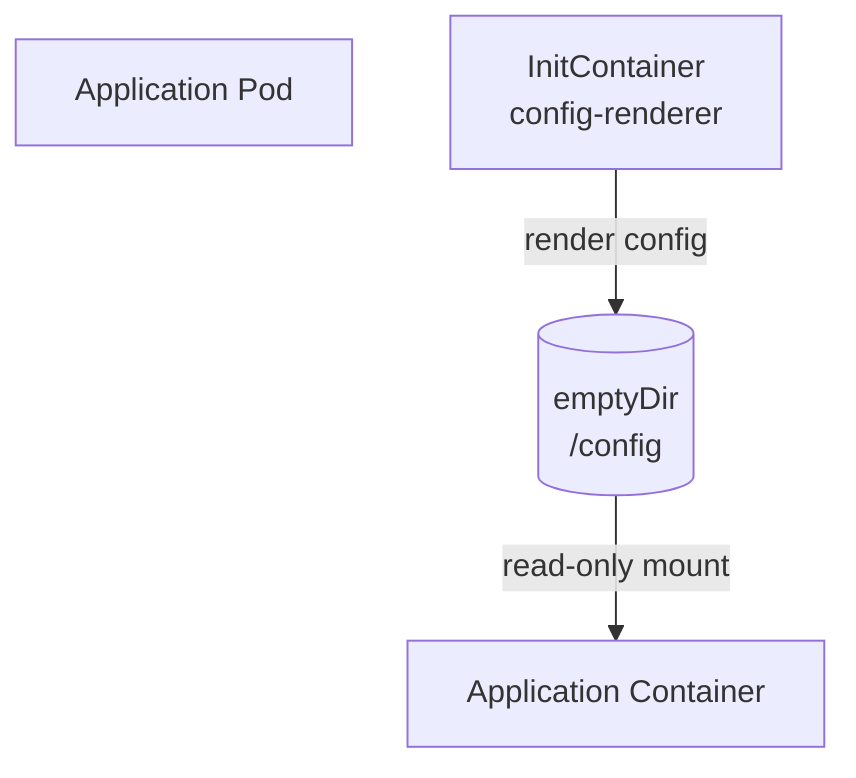

### Example workload

```text
InitContainer
     │
     ├── fetch configuration
     ├── render application.conf
     └── validate configuration
              │
              ▼
        /config/app.conf
              │
              ▼
Application Container
```

**When this is useful in production:**

> A platform team can keep application containers immutable while an InitContainer prepares runtime configuration before the application starts.

This pattern appears in workloads involving **configuration generation, certificate/bootstrap preparation, migrations, dependency checks, and sidecar-style initialization**.

---

# 8. `emptyDir` vs PersistentVolume

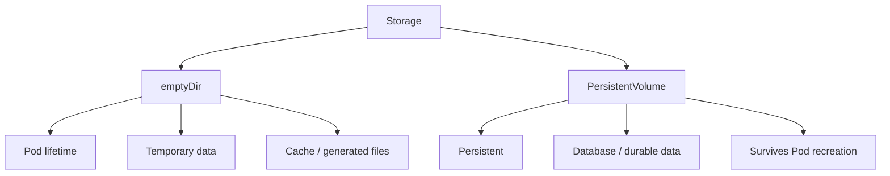

### Decision

```text
Need data after Pod deletion?
        │
   ┌────┴────┐
   │         │
  YES       NO
   │         │
  PV      emptyDir
```

---

# 9. Validation Commands

```bash
kubectl get deployment ic-deploy-xfusion

kubectl get pods

kubectl describe pod <pod-name>

kubectl logs <pod-name> -c ic-msg-xfusion

kubectl logs <pod-name> -c ic-main-xfusion
```

Expected:

```text
Deployment
    │
    └── replicas: 1

Pod
    │
    └── 1/1 Running

InitContainer
    │
    └── Completed

MainContainer
    │
    └── Running
```

---

# 10. Debugging Mental Model

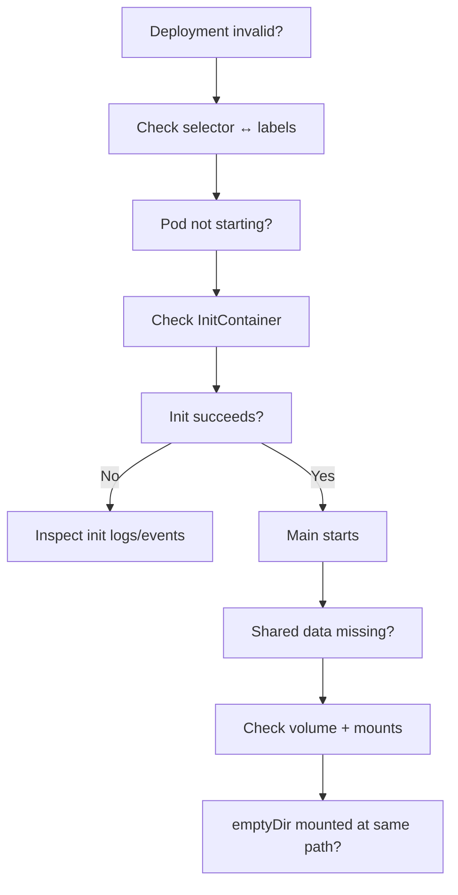

---

# 11. Final Architecture Principle

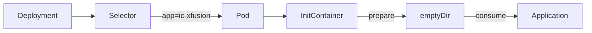

> [!tip] Remember  
> **Selector identifies → Init prepares → Volume shares → Main consumes**

#kubernetes #deployment #initcontainer #emptydir #volumes #platform-engineering #cloud-architecture