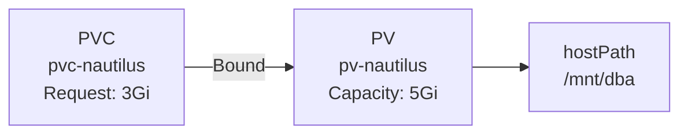
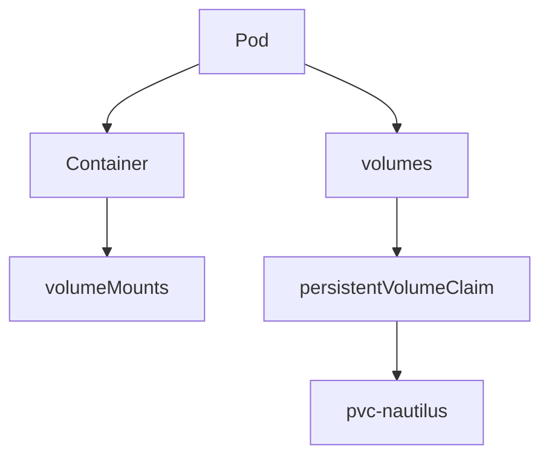
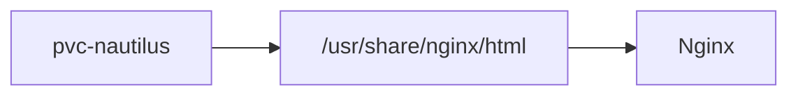
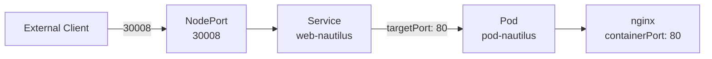
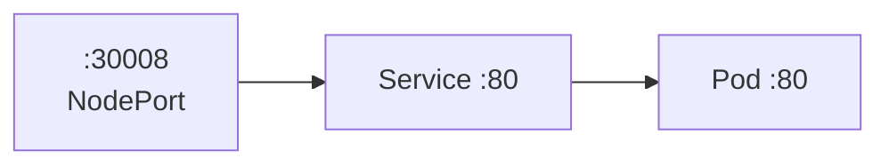
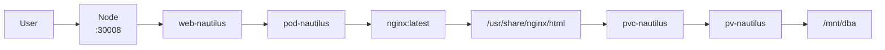
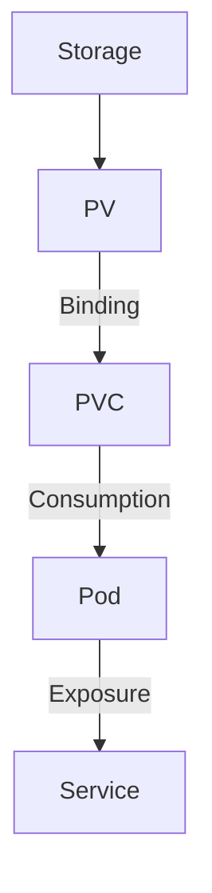

![[Pasted image 20260901221537.png]].


## 1. Architecture

```mermaid
flowchart TB
    U[Client]

    SVC[Service<br/>web-nautilus<br/>NodePort 30008]

    POD[Pod<br/>pod-nautilus]

    C[Container<br/>container-nautilus<br/>nginx:latest]

    M[/usr/share/nginx/html]

    PVC[PVC<br/>pvc-nautilus<br/>3Gi]

    PV[PV<br/>pv-nautilus<br/>5Gi]

    HP[HostPath<br/>/mnt/dba]

    U -->|:30008| SVC
    SVC -->|targetPort 80| POD
    POD --> C
    C --> M
    M --> PVC
    PVC --> PV
    PV --> HP
```

---

## 2. Storage Relationship



### Remember

```text
PV = Actual storage
PVC = Request for storage
Pod = Consumer of PVC
```

**Pod does NOT directly reference the PV.**

```text
Pod
 ↓
PVC
 ↓
PV
 ↓
Storage
```

---

## 3. Pod Volume Model



### Critical distinction

|Field|Location|Purpose|
|---|---|---|
|`volumeMounts`|Container|**Where** storage appears|
|`volumes`|Pod `spec`|**What** storage is used|

```yaml
containers:
  - name: container-nautilus
    volumeMounts:
      - name: web-content
        mountPath: /usr/share/nginx/html

volumes:
  - name: web-content
    persistentVolumeClaim:
      claimName: pvc-nautilus
```

Think:

```text
volumeMounts = WHERE
volumes      = WHAT
```

---

# 4. Nginx Document Root



For the official Nginx image:

```text
/usr/share/nginx/html
        ↑
     document root
```

So the PVC is mounted there.

---

# 5. Service Networking



### Port terminology

```text
nodePort     = 30008
     ↓
Service port = 80
     ↓
targetPort   = 80
     ↓
Container    = 80
```



---

# 6. Complete Request Path



---

# 7. Final State

```text
PV
└── pv-nautilus
    ├── 5Gi
    ├── manual
    ├── RWO
    └── /mnt/dba
          │
          ▼
PVC
└── pvc-nautilus
    ├── 3Gi request
    ├── manual
    └── RWO
          │
          ▼
Pod
└── pod-nautilus
    └── container-nautilus
        └── nginx:latest
            └── /usr/share/nginx/html
                  │
                  ▼
              PVC mounted
```

## 8. Staff-level mental model



**The hierarchy to remember:**

> **Storage → PV → PVC → Pod → Service**

And the key Kubernetes design principle:

> **Workloads consume claims, not physical storage directly.**

That abstraction is what lets Kubernetes separate **storage provisioning** from **application deployment**.


https://www.coursera.org/programs/learning-program-for-family-iwira/learn/strategic-foresight?source=search
https://www.coursera.org/learn/analysis-business-problem-iese?utm_source=chatgpt.com