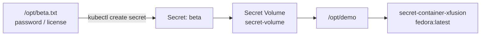
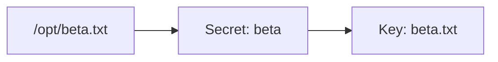
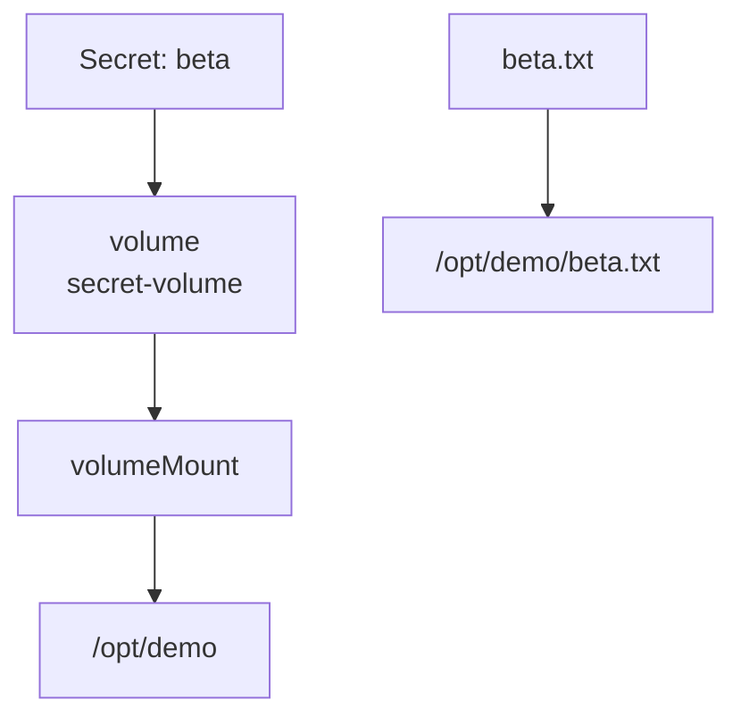
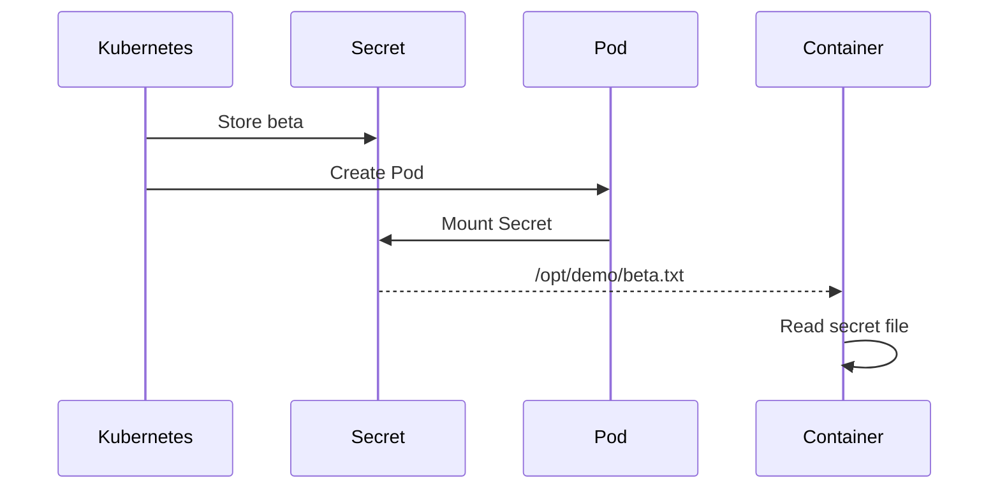
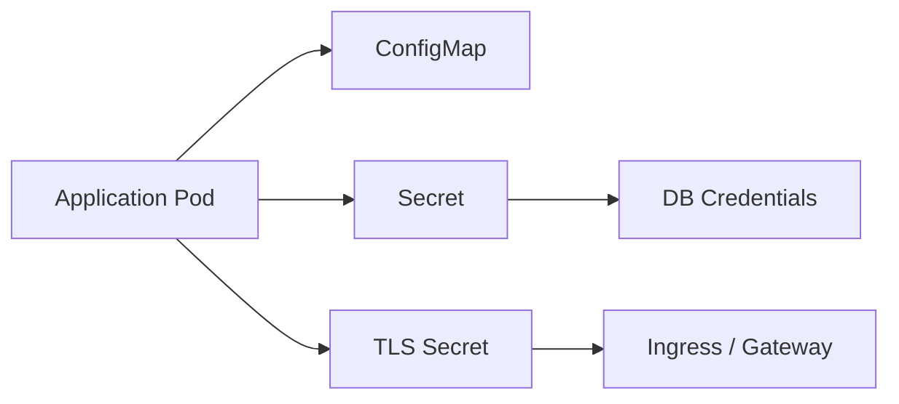
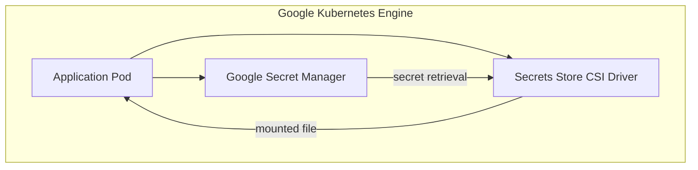
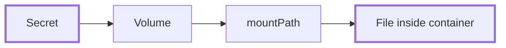

![[Pasted image 20260902135450.png]]![[Pasted image 20260902140322.png]]
> [!abstract] Pattern  
> **Kubernetes Secret → Pod Volume → Container Filesystem**

---

## Architecture



---

## 1. Create Secret

```bash
kubectl create secret generic beta \
  --from-file=beta.txt=/opt/beta.txt
```



---

## 2. Pod Manifest

```yaml
apiVersion: v1
kind: Pod
metadata:
  name: secret-xfusion

spec:
  containers:
    - name: secret-container-xfusion
      image: fedora:latest
      command: ["sleep", "infinity"]

      volumeMounts:
        - name: secret-volume
          mountPath: /opt/demo
          readOnly: true

  volumes:
    - name: secret-volume
      secret:
        secretName: beta
```

### Critical Mapping



> [!warning] YAML is case-sensitive  
> `mountPath` ✅  
> `MountPath` ❌

---

## 3. Deploy

```bash
kubectl apply -f pod.yaml
```

```bash
kubectl get pod secret-xfusion
```

Expected:

```text
secret-xfusion   1/1   Running
```

---

## 4. Verify

```bash
kubectl exec -it secret-xfusion \
  -c secret-container-xfusion -- bash
```

```bash
ls -l /opt/demo
cat /opt/demo/beta.txt
```



---

# Production Pattern

### Typical workload



### Real-world usage

|Secret|Typical use|
|---|---|
|DB password|PostgreSQL / Cloud SQL|
|API key|External SaaS API|
|TLS certificate|Ingress / Gateway|
|License key|Commercial software|
|Service credentials|Internal services|

---

## GKE Production Architecture



> [!tip] Architecture decision  
> **Lab:** Kubernetes Secret volume  
> **Production GKE:** Prefer **Google Secret Manager + Secret Manager integration/CSI** for centrally managed sensitive data.

---

## Mental Model



**Secret ≠ environment variable ≠ volume**

The application simply reads:

```text
/opt/demo/beta.txt
```

Kubernetes handles the **Secret → Volume → Filesystem** wiring.