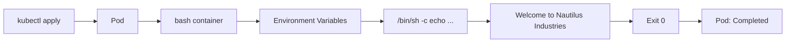

 **Kubernetes batch-style Pod pattern**: inject configuration through environment variables, execute a command, then terminate successfully.

### Mental model

### What you learned

- **`env:`** → injects runtime configuration into the container.
    
- **`command:`** → overrides the image's default command.
    
- **`/bin/sh -c`** → lets the shell expand `$(GREETING)` etc.
    
- **`restartPolicy: Never`** → don't restart after the command finishes.
    
- **`Completed`** → process exited successfully; **not an error**.
    
- **`kubectl logs`** → retrieves the process's stdout.
    

### Real-world value

This exact pattern appears in:

- **Kubernetes Jobs** → run migrations, backups, cleanup tasks.
    
- **Init containers** → perform setup before the application starts.
    
- **CI/CD** → execute deployment/setup commands.
    
- **Configuration injection** → pass environment-specific values without rebuilding images.
    
- **Debugging** → run a container with a controlled command to inspect behavior.
    

**Platform-engineer takeaway:** Kubernetes doesn't care about your application logic; it manages **process lifecycle + configuration + execution environment**. Here, you explicitly defined all three.