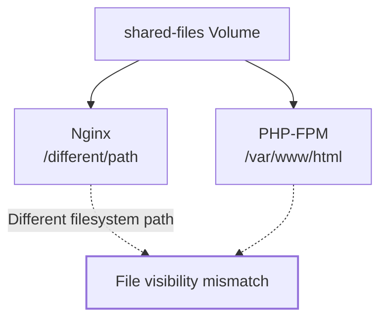
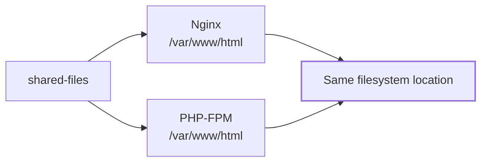
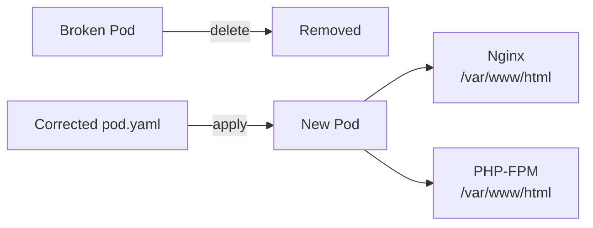
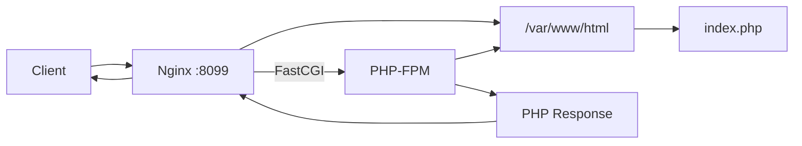
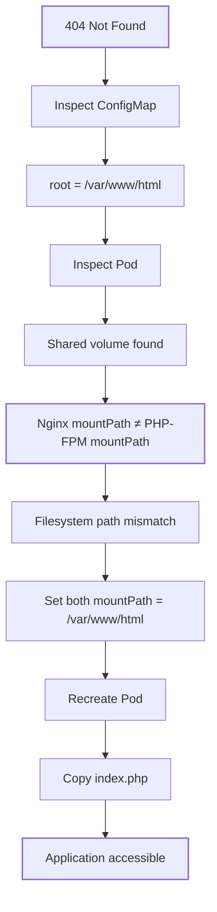

> [!abstract] Problem  
> Nginx returned **404 Not Found** even though the Nginx ConfigMap looked correct.
> 
> **Root cause:** Nginx and PHP-FPM mounted the same shared volume at **different filesystem paths**.

![[Pasted image 20260829131306.png]]


---

![[Pasted image 20260829131549.png]]


## 1. Inspect the Nginx Configuration

```bash
kubectl get configmap nginx-config -o yaml
```
![[Pasted image 20260829131644.png]]
**Why:** Validate the configuration actually consumed by Nginx.

Key values:

```yaml
listen 8099;
root /var/www/html;
fastcgi_pass ...
```

### Expected relationship


> [!important] Configuration vs Runtime  
> The ConfigMap said Nginx should serve files from `/var/www/html`.  
> Next step: verify that the **container filesystem actually provides that path**.

---

# 2. Inspect the Pod

```bash
kubectl get pods
```

**Why:** Identify the Pod and confirm its runtime state.
![[Pasted image 20260829131846.png]]


```bash
kubectl get pod nginx-php-fpm -o yaml
```

![[Pasted image 20260829131816.png]]
**Why:** Inspect the actual Pod specification, especially:

- `containers`
    
- `volumeMounts`
    
- `volumes`
    
- container names
    

---

## 3. Find the Mount-Path Mismatch

The Pod contains:

```text
nginx-php-fpm
├── nginx
└── php-fpm
```

Both containers use the shared volume:

```yaml
volumes:
- name: shared-files
```

But the mount paths were different.



###  This breaks the application 

A Kubernetes volume is shared at the **storage level**, not automatically at the same filesystem path.

```text
Same volume
      │
      ├── Nginx → /path-A
      │
      └── PHP-FPM → /path-B
```

Therefore:

```text
Nginx sees:     /path-A/index.php
PHP-FPM sees:   /path-B/index.php
```

The containers are effectively looking at **different locations**.

---

# 4. Correct the Mount Path

Export the existing Pod:

```bash
kubectl get pod nginx-php-fpm -o yaml > pod.yaml
```

**Why:** Create a local manifest that can be edited and reapplied.


Edit:

```bash
vi pod.yaml
```

Change the Nginx mount:

```yaml
volumeMounts:
- name: shared-files
  mountPath: /var/www/html
```

![[Pasted image 20260829132143.png]]
Now both containers agree:

![[Pasted image 20260829132345.png]]



> [!success] Correct State  
> **Nginx and PHP-FPM must mount the shared volume at the same logical application path** when both processes need to access the same files.

---

# 5. Recreate the Pod

Delete the old Pod and Apply the corrected manifest:

![[Pasted image 20260829132435.png]]

> **Why:** The Pod needs to be recreated with the corrected `volumeMount`and Creates the Pod using the modified specification.




---

# 6. Copy the Application File

```bash
kubectl cp index.php nginx-php-fpm:/var/www/html/index.php -c nginx
```

### Command anatomy

|Component|Purpose|
|---|---|
|`kubectl cp`|Copy files between local machine and Pod|
|`index.php`|Source file on jump host|
|`nginx-php-fpm:`|Target Pod|
|`/var/www/html/index.php`|Destination inside container|
|`-c nginx`|Select the Nginx container|

> [!important] Why `-c nginx`?  
> The Pod has **two containers**. Explicitly specifying `-c nginx` prevents `kubectl` from selecting the wrong container.

---

# 7. Final Request Path



---

# Root Cause → Resolution



> [!tip] Architectural Takeaway  
> **Kubernetes volume sharing does not imply path sharing.**
> 
> When sidecar/container processes collaborate on the same application files, verify all three layers:
> 
> **ConfigMap → Container `mountPath` → Application document root**
> 
> They must describe the **same filesystem contract**.