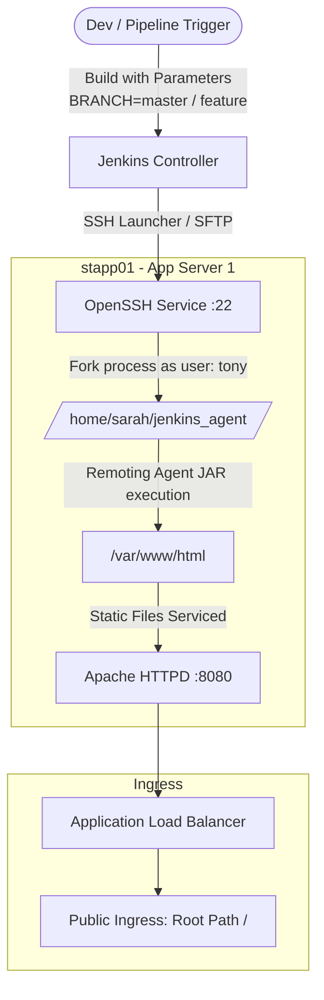
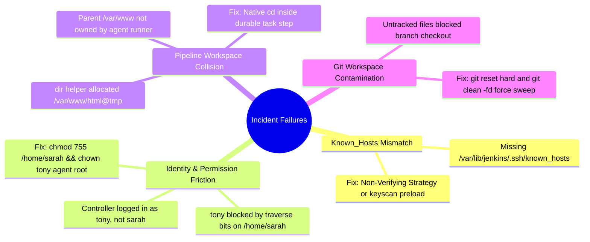
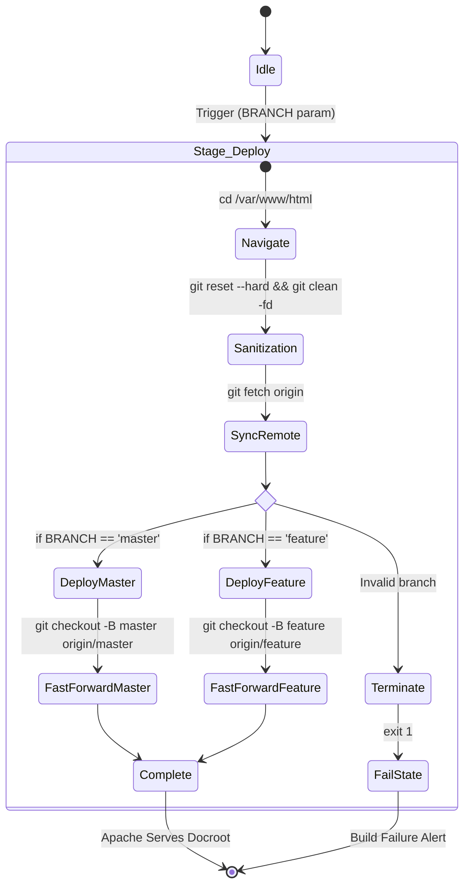

![[Pasted image 20260912021555.png]]![[Pasted image 20260912021652.png]]

```groovy

pipeline {
    agent { label 'stapp01' }

    parameters {
        string(name: 'BRANCH', defaultValue: 'master', description: 'Branch to deploy')
    }

    stages {
        stage('Deploy') {
            steps {
                sh '''
                    cd /var/www/html

                    # Reset and fetch to ensure clean branch checkout
                    git reset --hard
                    git clean -fd
                    git fetch origin

                    if [ "$BRANCH" = "master" ]; then
                        git checkout -B master origin/master
                        git reset --hard origin/master
                    elif [ "$BRANCH" = "feature" ]; then
                        git checkout -B feature origin/feature
                        git reset --hard origin/feature
                    else
                        echo "ERROR: Invalid branch value: $BRANCH"
                        echo "Allowed values are: master or feature"
                        exit 1
                    fi
                '''
            }
        }
    }
}
```

# Dynamic CI/CD Delivery Engine: Architecture & War Room Retrospective

## System Topology & Deployment Flow

Code snippet



## Root Cause Analysis: Node Provisioning & Execution Failures

Code snippet



## Technical Caveman Breakdown

### 1. SSH Host Key Failure

- **Break**: Jenkins want check `known_hosts`. File not on disk. SSH scream and die.
    
      
    
- **Fix**: Flip strategy to `NonVerifyingKeyVerificationStrategy`. Handshake pass.
    
      
    

### 2. SFTP Remoting Drop Failure

- **Break**: User `tony` try write `remoting.jar` inside `/home/sarah/jenkins_agent`. `/home/sarah` locked (`700`). `tony` no enter.
    
      
    
- **Fix**: `chmod 755 /home/sarah`. `chown -R tony:tony /home/sarah/jenkins_agent`. Engine drop jar clean.
    
      
    

### 3. Workspace `@tmp` Directory Trap

- **Break**: Pipeline step `dir('/var/www/html')` make sibling folder `/var/www/html@tmp`. `/var/www` owned by root. Write fail hard.
    
      
    
- **Fix**: No Jenkins `dir()` step. Use native shell: `cd /var/www/html`. Temporary files stay inside agent home directory.
    
      
    

### 4. Git Dirty Tree Block

- **Break**: Branch switch want overwrite local modified files (`feature.html`, `index.html`). Git abort checkout.
    
      
    
- **Fix**: Force wipe before branch shift: `git reset --hard` + `git clean -fd`. Pristine sync every time.
    
      
    

## Core Pipeline Execution State Machine

Code snippet



## Canonical Pipeline Artifact


```Groovy
pipeline {
    agent { label 'stapp01' }

    parameters {
        string(name: 'BRANCH', defaultValue: 'master', description: 'Branch target')
    }

    stages {
        stage('Deploy') {
            steps {
                sh '''
                    cd /var/www/html

                    # Purge dirty tree drift
                    git reset --hard
                    git clean -fd
                    git fetch origin

                    # Controlled branch deployment
                    if [ "$BRANCH" = "master" ]; then
                        git checkout -B master origin/master
                        git reset --hard origin/master
                    elif [ "$BRANCH" = "feature" ]; then
                        git checkout -B feature origin/feature
                        git reset --hard origin/feature
                    else
                        echo "FATAL: Invalid branch: $BRANCH"
                        exit 1
                    fi
                '''
            }
        }
    }
}
```

## Architectural Rules of Engagement

- **Never Use Jenkins `dir()` Over System Mounts**: Creates sibling `@tmp` scratchpads. If user lacks root write permissions on parent directory, build fails immediately.
    
      
    
- **Stateless Shell Operations Over Dirty States**: Always enforce hard resets (`git reset --hard`, `git clean -fd`) when continuous delivery agents deploy directly into live web document roots.
    
      
    
- **Boundary Traversal Hygiene**: Owning a sub-folder is useless if intermediate parent folders deny execute (`+x`) permissions to the effective execution UID.