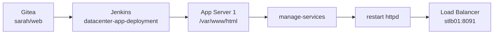
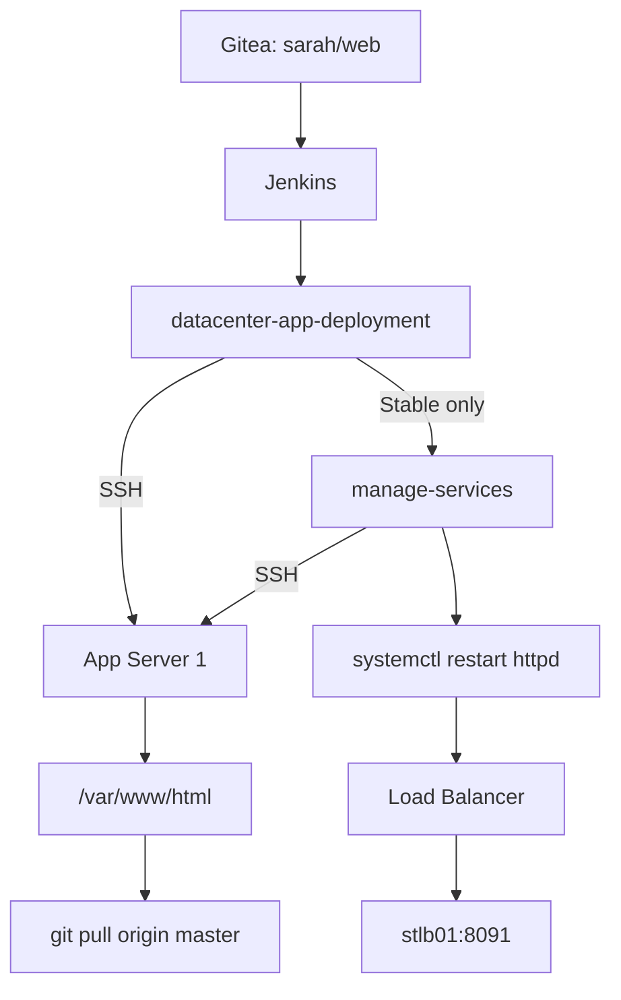

![[Pasted image 20260915034115.png]]![[Pasted image 20260915034131.png]]![[Pasted image 20260915034153.png]]![[Pasted image 20260915034343.png]]![[Pasted image 20260915034528.png]]

## What we built



Simple idea:

> **Pull code → update server → restart Apache → serve app**

---

# 1. Jenkins Job 1

## Job

```text
datacenter-app-deployment
```

Purpose:

> Get the latest code from `master` and update `/var/www/html` on App Server 1.

### Git

Repository:

```text
sarah/web
```

Branch:

```text
master
```

Jenkins successfully checked out the repository.

---

# 2. Deploy to App Server 1

Jenkins uses:

```text
Send files or execute commands over SSH
```

SSH server:

```text
Application Server 1
```

No files need to be transferred.

### Exec command

```bash
sudo git -C /var/www/html pull origin master
```

Meaning:

```text
sudo
 ↓
run with required privileges

git -C /var/www/html
 ↓
use this Git repository

pull origin master
 ↓
get latest code
```

---

# 3. Git Safe Directory Problem

First Jenkins run failed with:

```text
fatal: detected dubious ownership in repository
```

Why?

`git` was running as `root` because of:

```bash
sudo git ...
```

But the Git safe-directory setting had been added for `tony`, not `root`.

Fix:

```bash
sudo git config --global --add safe.directory /var/www/html
```

Then:

```bash
sudo git -C /var/www/html pull origin master
```

worked.

---

# 4. Jenkins Job 2

## Job

```text
manage-services
```

Purpose:

> Restart Apache after deployment.

SSH server:

```text
Application Server 1
```

Exec command:

```bash
sudo systemctl restart httpd && sudo systemctl is-active --quiet httpd
```

This means:

```text
restart httpd
      ↓
check httpd is running
      ↓
SUCCESS
```

---

# 5. Chain the Jobs

`datacenter-app-deployment` triggers:

```text
manage-services
```

But only when deployment is stable.

```text
datacenter-app-deployment
          │
          │ SUCCESS
          ▼
   manage-services
          │
          ▼
    restart httpd
```

Jenkins log confirmed:

```text
Started by upstream project
"datacenter-app-deployment"
```

and:

```text
Finished: SUCCESS
```

---

# 6. Final Application Test

Load balancer:

```text
http://stlb01:8091
```

Test:

```bash
curl http://stlb01:8091
```

Result:

```text
Welcome to KodeKloud!
```

Application works from the main URL.

---

# 7. `/web` Is Not Needed

This:

```bash
curl http://stlb01:8091/web
```

returns:

```text
404 Not Found
```

That is correct.

The requirement is:

```text
http://stlb01:8091
```

NOT:

```text
http://stlb01:8091/web
```

---

# Final Architecture



# Important Commands

### Update application

```bash
sudo git -C /var/www/html pull origin master
```

### Fix Git safe directory

```bash
sudo git config --global --add safe.directory /var/www/html
```

### Restart Apache

```bash
sudo systemctl restart httpd
```

### Check Apache

```bash
sudo systemctl status httpd
```

### Test application

```bash
curl http://stlb01:8091
```

# Result

```text
Gitea
  ↓
Jenkins deployment
  ↓
App Server 1
  ↓
git pull
  ↓
restart httpd
  ↓
Load Balancer
  ↓
Application
```

**Lab complete.**