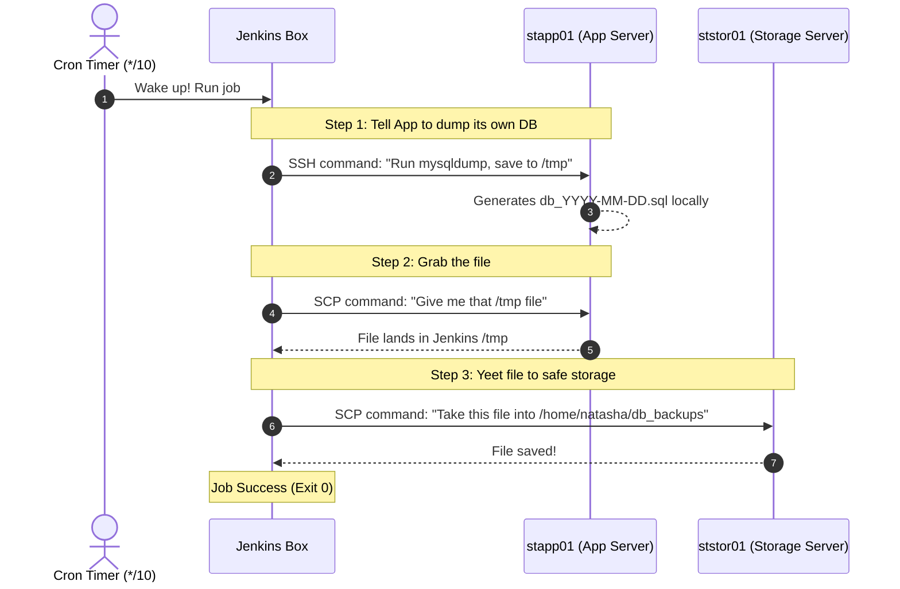
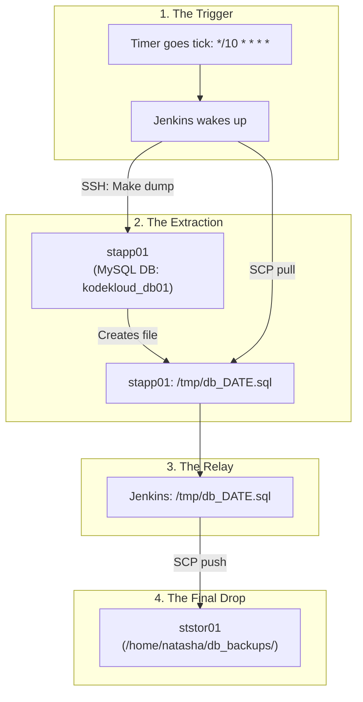

 

## Visual Execution Path

Code snippet

## What Actually Happened

Code snippet

## Server Role Card

- **Jenkins:** The middleman runner. Has no database itself. Calls everyone via SSH.
    
      
    
- **`stapp01`:** The worker box holding the live MySQL database. Created the raw SQL dump on demand.
    
      
    
- **`ststor01`:** The storage vault. Did zero work, just received the final `.sql` file.