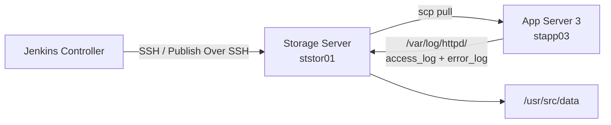
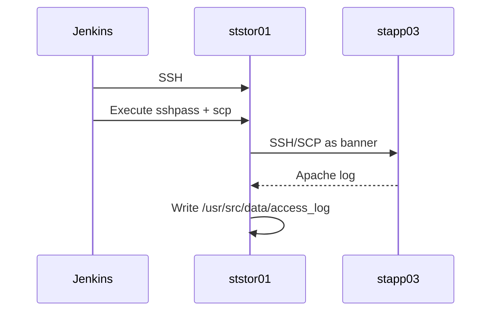
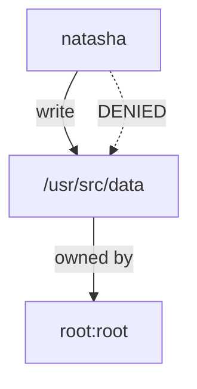
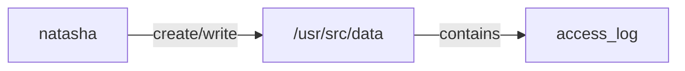
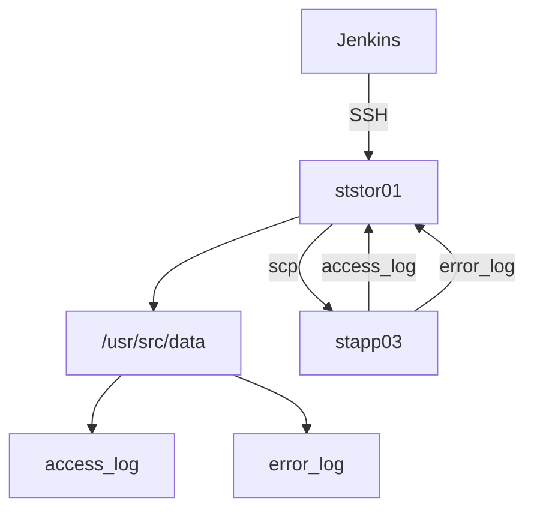
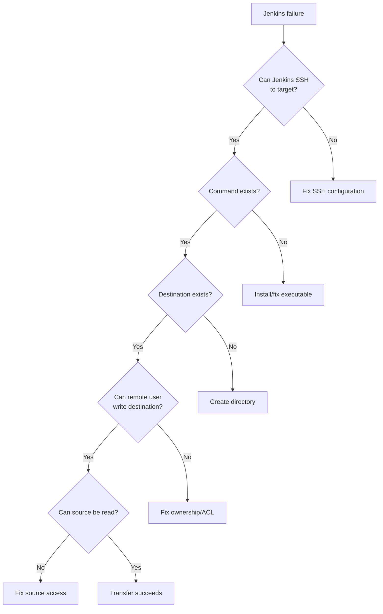
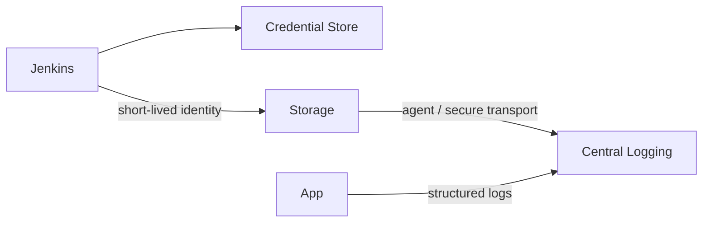

![[Pasted image 20260910215142.png]]
> [!NOTE] Architecture  
> Jenkins executes the transfer command **on the Storage Server**, which then pulls Apache logs from App Server 3.



---

## 1. Execution Context



### Critical rule

```text
SSH Server = Storage Server
             ↓
Exec command runs HERE
             ↓
scp source = stapp03
scp target = local Storage Server
```

---

## 2. Command Semantics

```bash
sshpass -p "BigGr33n" \
scp -o StrictHostKeyChecking=no \
banner@stapp03:/var/log/httpd/access_log \
/usr/src/data/access_log
```

|Component|Role|
|---|---|
|`sshpass`|Non-interactive password injection|
|`scp`|Secure file copy|
|`banner@stapp03:`|Remote source|
|`/var/log/httpd/access_log`|Apache log|
|`/usr/src/data/access_log`|**Local destination**|
|`StrictHostKeyChecking=no`|Avoid host-key prompt|

The destination path is interpreted **on `ststor01`**.

---

## 3. Failure Chain

### Failure ① — Exit `127`

```text
Jenkins
  ↓
Storage Server
  ↓
sshpass
  ↓
NOT FOUND
  ↓
exit 127
```

```bash
which sshpass
# /usr/bin/sshpass
```

**Root cause:** executable unavailable in remote execution environment.

---

### Failure ② — No destination

```text
scp
 ↓
/usr/src/data/access_log
 ↓
directory missing
 ↓
No such file or directory
```

Fix:

```bash
sudo mkdir -p /usr/src/data
```

---

### Failure ③ — Permission denied



Observed:

```text
drwxr-xr-x root root /usr/src/data
```

`natasha`:

```text
r-x
```

but needs:

```text
write
```

Fix:

```bash
sudo chown natasha:natasha /usr/src/data
```

Expected:

```text
drwxr-xr-x natasha natasha /usr/src/data
```

---

## 4. Permission Model



Required capability:

```text
Directory:
    execute → traverse
    write   → create/delete files
```

`755 root:root`:

```text
root  → rwx
group → r-x
other → r-x
```

Therefore:

```text
natasha ≠ owner
natasha ∉ root group
→ cannot create file
```

---

## 5. Correct State



Storage Server:

```bash
ls -ld /usr/src/data
```

Expected:

```text
drwxr-xr-x natasha natasha /usr/src/data
```

Verification:

```bash
ls -lh /usr/src/data/
```

Expected:

```text
access_log
error_log
```

---

## 6. Jenkins Configuration

### Schedule

```text
*/6 * * * *
```

### SSH target

```text
Storage Server
```

### Exec

```bash
sshpass -p "BigGr33n" scp -o StrictHostKeyChecking=no banner@stapp03:/var/log/httpd/access_log /usr/src/data/access_log

sshpass -p "BigGr33n" scp -o StrictHostKeyChecking=no banner@stapp03:/var/log/httpd/error_log /usr/src/data/error_log
```

---

## 7. Our Diagnostic Method



### Debug in this order

```bash
whoami
hostname
command -v sshpass
command -v scp
ls -ld /usr/src/data
touch /usr/src/data/test
ls -l /var/log/httpd/
```

---

## 8. Production Architecture ≠ Lab Architecture

### Lab

```text
Jenkins
   ↓
sshpass + password
   ↓
Storage Server
   ↓
scp
```

### Production



Avoid:

```markdown
- passwords in Jenkinsfile
- passwords in shell commands
- sshpass
- StrictHostKeyChecking=no
- manually distributing log files
```

Prefer:

```markdown
- SSH keys / workload identity
- Jenkins Credentials
-  host-key verification
- centralized logging
- least privilege
- immutable log pipeline
```

---

## 9. Staff-Level Takeaway

> **Always identify the execution context before debugging a remote command.**

```text
Jenkins target
      ↓
Where does Exec execute?
      ↓
What user?
      ↓
What filesystem?
      ↓
What binaries?
      ↓
What permissions?
      ↓
What network path?
      ↓
What source identity?
```

The three failures were three different layers:

```text
127
 ↓
PROCESS / DEPENDENCY

No such file
 ↓
FILESYSTEM / PATH

Permission denied
 ↓
AUTHORIZATION / UNIX PERMISSIONS
```

That separation is the important part.

#jenkins #linux