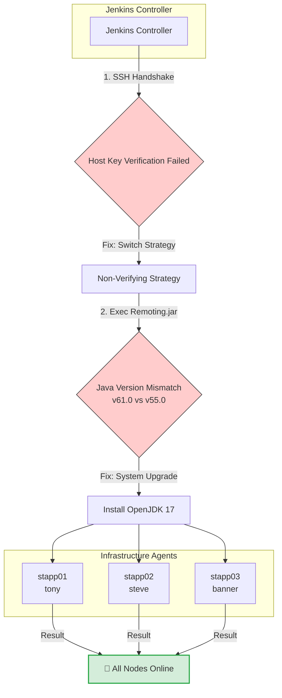

![[Pasted image 20260911172939.png]]![[Pasted image 20260911173628.png]]![[Pasted image 20260911174436.png]]


```bash
$ ssh tony@stapp01
The authenticity of host 'stapp01 (10.244.127.254)' can't be established.
ED25519 key fingerprint is SHA256:yEyN8qvzhNxfcKVE+H05zwQPmQMKCXj4JyGWuOP1HIg.
This key is not known by any other names.
Are you sure you want to continue connecting (yes/no/[fingerprint])? yes
Warning: Permanently added 'stapp01' (ED25519) to the list of known hosts.
tony@stapp01's password: 
[tony@stapp01 ~]$ sudo yum install java-17-openjdk -y
Last metadata expiration check: 0:28:06 ago on Fri Sep 11 11:44:07 2026.
Dependencies resolved.
=============================================================================
 Package                   Arch    Version                  Repository  Size
=============================================================================
Installing:
 java-17-openjdk           x86_64  1:17.0.20.0.8-1.2.el9    appstream  428 k
Upgrading:
 tzdata-java               noarch  2026c-1.el9              appstream  223 k
Installing dependencies:
 java-17-openjdk-headless  x86_64  1:17.0.20.0.8-1.2.el9    appstream   44 M


Upgraded:
  tzdata-java-2026c-1.el9.noarch                                             
Installed:
  java-17-openjdk-1:17.0.20.0.8-1.2.el9.x86_64                               
  java-17-openjdk-headless-1:17.0.20.0.8-1.2.el9.x86_64                      

Complete!
[tony@stapp01 ~]$ ssh steve@stapp02
The authenticity of host 'stapp02 (10.244.197.231)' can't be established.
ED25519 key fingerprint is SHA256:yEyN8qvzhNxfcKVE+H05zwQPmQMKCXj4JyGWuOP1HIg.
This key is not known by any other names.
Are you sure you want to continue connecting (yes/no/[fingerprint])? yes
Warning: Permanently added 'stapp02' (ED25519) to the list of known hosts.
steve@stapp02's password: 
[steve@stapp02 ~]$ sudo yum install java-17-openjdk -y
Last metadata expiration check: 0:35:01 ago on Fri Sep 11 11:37:45 2026.
Dependencies resolved.
=============================================================================
 Package                   Arch    Version                  Repository  Size
=============================================================================
Installing:
 java-17-openjdk           x86_64  1:17.0.20.0.8-1.2.el9    appstream  428 k
Upgrading:
 tzdata-java               noarch  2026c-1.el9              appstream  223 k
Installing dependencies:
 java-17-openjdk-headless  x86_64  1:17.0.20.0.8-1.2.el9    appstream   44 M

Transaction Summary
=============================================================================
Install  2 Packages
Upgrade  1 Package

Total download size: 45 M
Downloading Packages:
(1/3): tzdata-java-2026c-1.el9.noarch.rpm    858 kB/s | 223 kB     00:00    
(2/3): java-17-openjdk-17.0.20.0.8-1.2.el9.x 1.5 MB/s | 428 kB     00:00    
(3/3): java-17-openjdk-headless-17.0.20.0.8-  27 MB/s |  44 MB     00:01    
-----------------------------------------------------------------------------
Total                                         19 MB/s |  45 MB     00:02     
Running transaction check
Transaction check succeeded.
Running transaction test
Transaction test succeeded.
Running transaction
  Upgraded:
  tzdata-java-2026c-1.el9.noarch                                             
Installed:
  java-17-openjdk-1:17.0.20.0.8-1.2.el9.x86_64                               
  java-17-openjdk-headless-1:17.0.20.0.8-1.2.el9.x86_64                      
Complete!


[steve@stapp02 ~]$ ssh banner@stapp03
The authenticity of host 'stapp03 (10.244.56.19)' can't be established.
ED25519 key fingerprint is SHA256:yEyN8qvzhNxfcKVE+H05zwQPmQMKCXj4JyGWuOP1HIg.
This key is not known by any other names.
Are you sure you want to continue connecting (yes/no/[fingerprint])? yes
Warning: Permanently added 'stapp03' (ED25519) to the list of known hosts.
banner@stapp03's password: 


[banner@stapp03 ~]$ sudo yum install java-17-openjdk -y
Last metadata expiration check: 0:36:53 ago on Fri Sep 11 11:36:35 2026.
Dependencies resolved.
=============================================================================
 Package                   Arch    Version                  Repository  Size
=============================================================================
Installing:
 java-17-openjdk           x86_64  1:17.0.20.0.8-1.2.el9    appstream  428 k
Upgrading:
 tzdata-java               noarch  2026c-1.el9              appstream  223 k
Installing dependencies:
 java-17-openjdk-headless  x86_64  1:17.0.20.0.8-1.2.el9    appstream   44 M

Transaction Summary
=============================================================================
Install  2 Packages
Upgrade  1 Package

Total download size: 45 M
Downloading Packages:
(1/3): tzdata-java-2026c-1.el9.noarch.rpm    2.2 MB/s | 223 kB     00:00    
(2/3): java-17-openjdk-17.0.20.0.8-1.2.el9.x 3.9 MB/s | 428 kB     00:00    
(3/3): java-17-openjdk-headless-17.0.20.0.8-  67 MB/s |  44 MB     00:00    
-----------------------------------------------------------------------------
Total                                         39 MB/s |  45 MB     00:01     
Running transaction check
Transaction check succeeded.
Running transaction test
Transaction test succeeded.
Running transaction
Upgraded:
  tzdata-java-2026c-1.el9.noarch                                             
Installed:
  java-17-openjdk-1:17.0.20.0.8-1.2.el9.x86_64                               
  java-17-openjdk-headless-1:17.0.20.0.8-1.2.el9.x86_64                      
Complete!
[banner@stapp03 ~]$ 
```

![[Pasted image 20260911174655.png]]![[Pasted image 20260911174740.png]]---
tags: [jenkins, devops, troubleshooting, java, ssh]
date: 2026-09-11


##  Problem Overview
During the setup of Jenkins remote agent nodes (`stapp01`, `stapp02`, `stapp03`), two critical bottlenecks prevented the controller from launching the `remoting.jar` process over SSH.

1. **Issue 1:** SSH Host Key verification failed because the controller was missing a `known_hosts` entry for the target nodes.
2. **Issue 2:** Once connected, the agent process crashed with an `UnsupportedClassVersionError` because the slave servers were running an outdated Java version (Java 11) while Jenkins required **Java 17**.

---

##  Visual Architecture & Lifecycle



---

# 🛠️ Root Cause Analysis & Resolutions

### Phase 1: Fixing the SSH Authentication Error

#### **The Error:**
```text
/var/lib/jenkins/.ssh/known_hosts [SSH] No Known Hosts file was found.
Key exchange was not finished, connection is closed.
```

#### **The Fix:**
The `Host Key Verification Strategy` inside Jenkins node configuration was altered to **Non-verifying Verification Strategy** to allow automated cluster attachments without forcing manual `ssh-keyscan` populating across the controller's file path.

---

### Phase 2: Fixing the Java Runtime Version Mismatch

#### **The Error:**
```text
java.lang.UnsupportedClassVersionError: hudson/remoting/Launcher has been compiled by a more recent version of the Java Runtime (class file version 61.0), this version of the Java Runtime only recognizes class file versions up to 55.0
```
* **Class file version 61.0** = Java 17 (Required by Jenkins Controller)
* **Class file version 55.0** = Java 11 (Installed on Slave Servers)

#### **The Fix:**
Connected to each deployment node host step-by-step and upgraded the systems to the target OpenJDK ecosystem.

```bash
# 1. Connect and install OpenJDK 17 on stapp01 (User: tony)
sudo yum install java-17-openjdk -y

# 2. Connect and install OpenJDK 17 on stapp02 (User: steve)
sudo yum install java-17-openjdk -y

# 3. Connect and install OpenJDK 17 on stapp03 (User: banner)
sudo yum install java-17-openjdk -y
```

---

## ✅ Final State Verification
* All target endpoints are equipped with `java-17-openjdk-headless`.
* The Jenkins launcher initiates successfully.
* System logs confirm `Verified agent jar. No update is necessary`.
