#linux

#  Git Stash

### When do we need this?

Use **Git Stash** when you are in the middle of a task but suddenly need to switch branches.

For example:

```text
You are working on:
        │
        ▼
feature-login
        │
        ├── login.py modified
        ├── config.yaml modified
        └── README.md modified
                │
                ▼
       NOT ready to commit
                │
                ▼
     Urgent bug on main branch
```

You don't want to commit unfinished work just to switch branches.

So you **stash** it temporarily.

---

## What does `git stash` do?

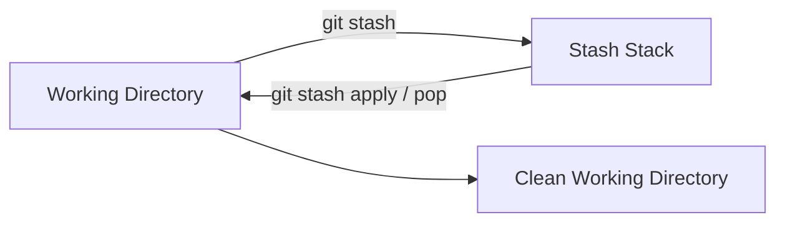

Think of stash as:

> **A temporary drawer for unfinished Git work.**

Your changes are removed from the working directory and stored in Git's stash.

---

## Basic Stash Workflow

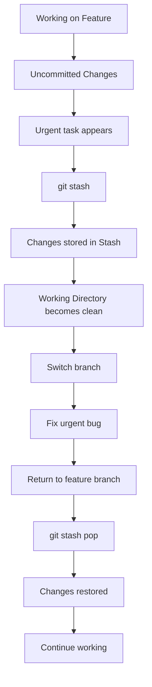

---

## Main Commands

### Hide your changes

```bash
git stash
```

Your unfinished changes are temporarily stored.

---

### See your stashes

```bash
git stash list
```

Example:

```text
stash@{0}: WIP on feature-login
stash@{1}: WIP on feature-payment
stash@{2}: WIP on feature-api
```

The stash works like a **stack**:

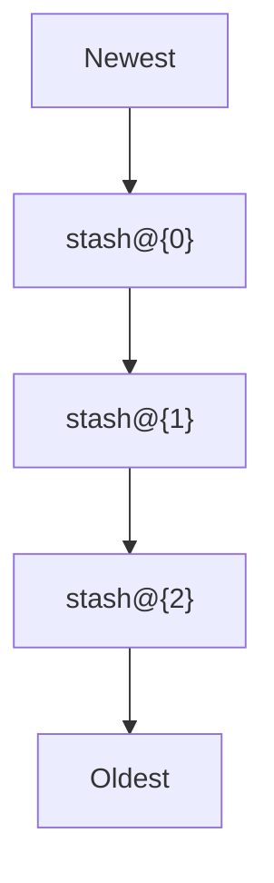

---

## Restore Stashed Changes

There are two important ways to restore a stash.

### `git stash apply`

```bash
git stash apply stash@{1}
```

Restores the changes **but keeps the stash entry**.

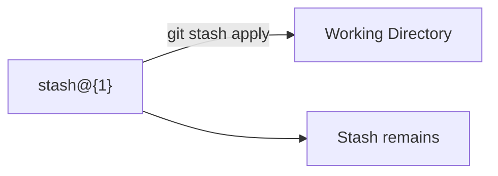

### `git stash pop`

```bash
git stash pop
```

Restores the changes and removes the stash entry if the operation succeeds.

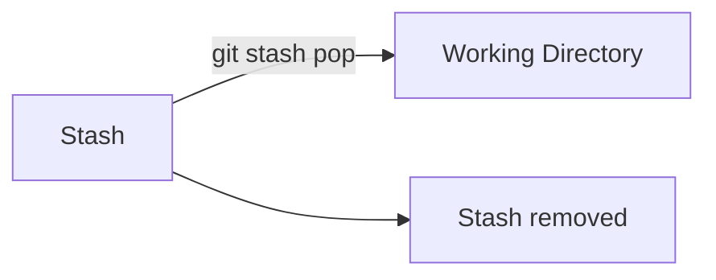

### Easy way to remember

```text
APPLY = Restore + Keep stash

POP   = Restore + Remove stash
```

---

## Example: Urgent Bug Fix

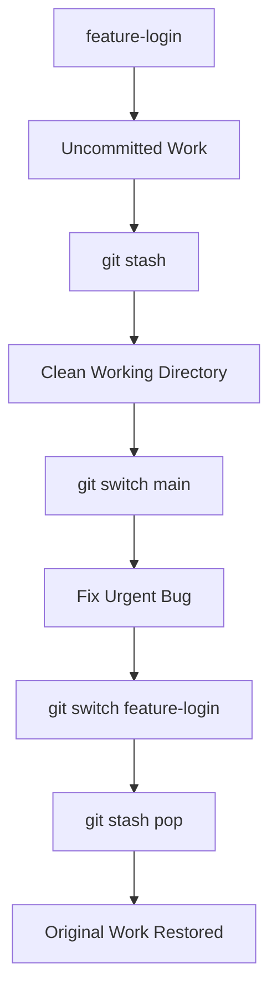

---

## Important Point

Stashing helps maintain a **clean working directory without losing your progress**.

Your changes are safely stored in the stash stack and can be reapplied later.

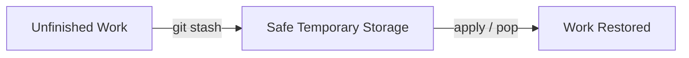

### Expected Outcome

After restoring the stash:

```text
Your unfinished changes
        │
        ▼
Working Directory
        │
        ▼
Continue working
        │
        ▼
git add
        │
        ▼
git commit
```

---

# 4. Git Rebase

## When do we need this?

Use **Git Rebase** when you want to maintain a **clean, linear Git history**.

Instead of creating an additional merge commit, rebase takes your feature commits and **replays them on top of the latest commit from the base branch**.

---

## Before Rebase

Imagine:

```text
main:

A ─── B ─── C
       \
        D ─── E
             feature
```

Here:

- `A → B → C` = `main`
    
- `D → E` = your feature work
    

Your feature branch is based on an older version of `main`.

---

## Rebase Command

First switch to your feature branch:

```bash
git checkout feature-branch
```

Then:

```bash
git rebase main
```

Modern equivalent:

```bash
git switch feature-branch
git rebase main
```

---

## What Rebase Does

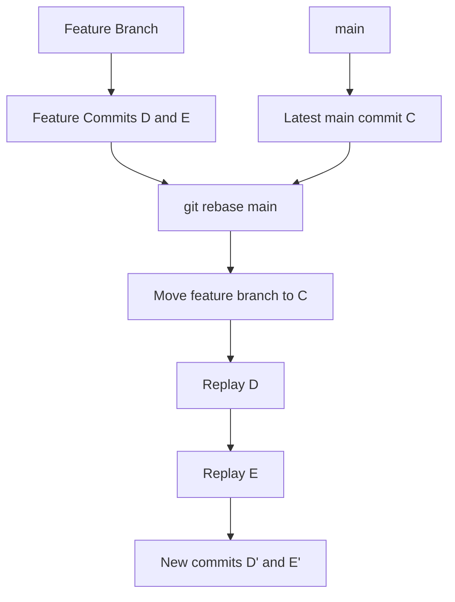

The result becomes:

```text
Before:

A ─── B ─── C
       \
        D ─── E


After rebase:

A ─── B ─── C ─── D' ─── E'
```

Your feature commits now appear **on top of the latest `main`**.

---

# Why Rebase Creates a Linear History

### Merge approach

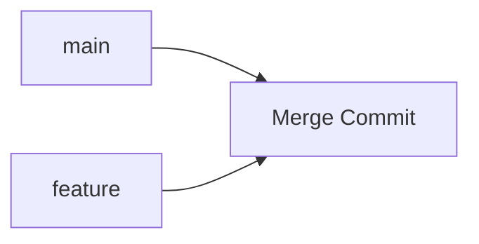

Conceptually:

```text
A ─── B ─── C ───────── M
       \               /
        D ─── E ──────
```

There is an additional merge commit `M`.

---

### Rebase approach

```text
A ─── B ─── C ─── D' ─── E'
```

Much more linear.

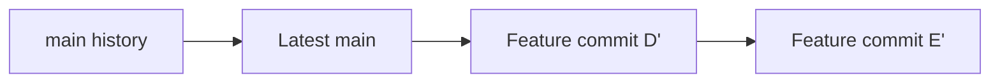

---

# Rebase Changes Commit History

Rebase does **not** simply move the original commits.

Git takes the changes from your commits and creates new commits.

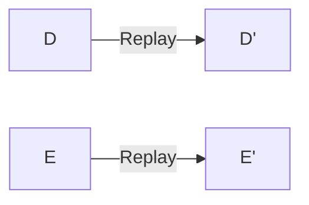

Therefore:

```text
D  ≠  D'
E  ≠  E'
```

The commit IDs change.

This is why you need to be careful when rebasing shared branches.

---

# Rebase Conflict

Sometimes your feature changes conflict with changes already made in `main`.

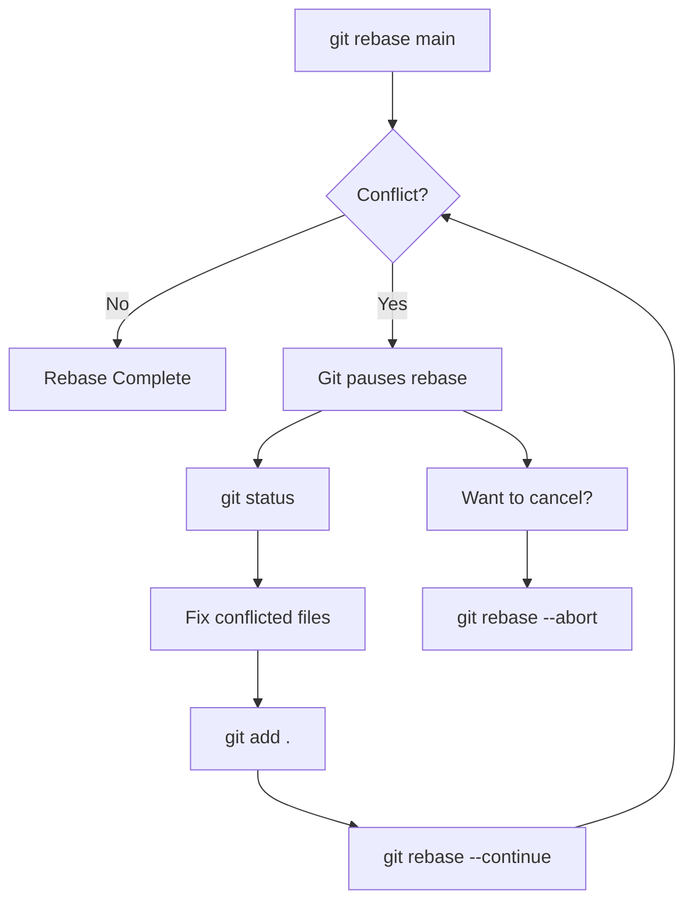

### Continue after fixing conflict

```bash
git add .
git rebase --continue
```

### Cancel the rebase

```bash
git rebase --abort
```

This returns the branch to the state it was in before the rebase started.

---

# Important Rule: Shared Branches

> **Never casually rebase a branch that has already been pushed and is being used by other developers.**

Why?

Because rebase rewrites commit history.

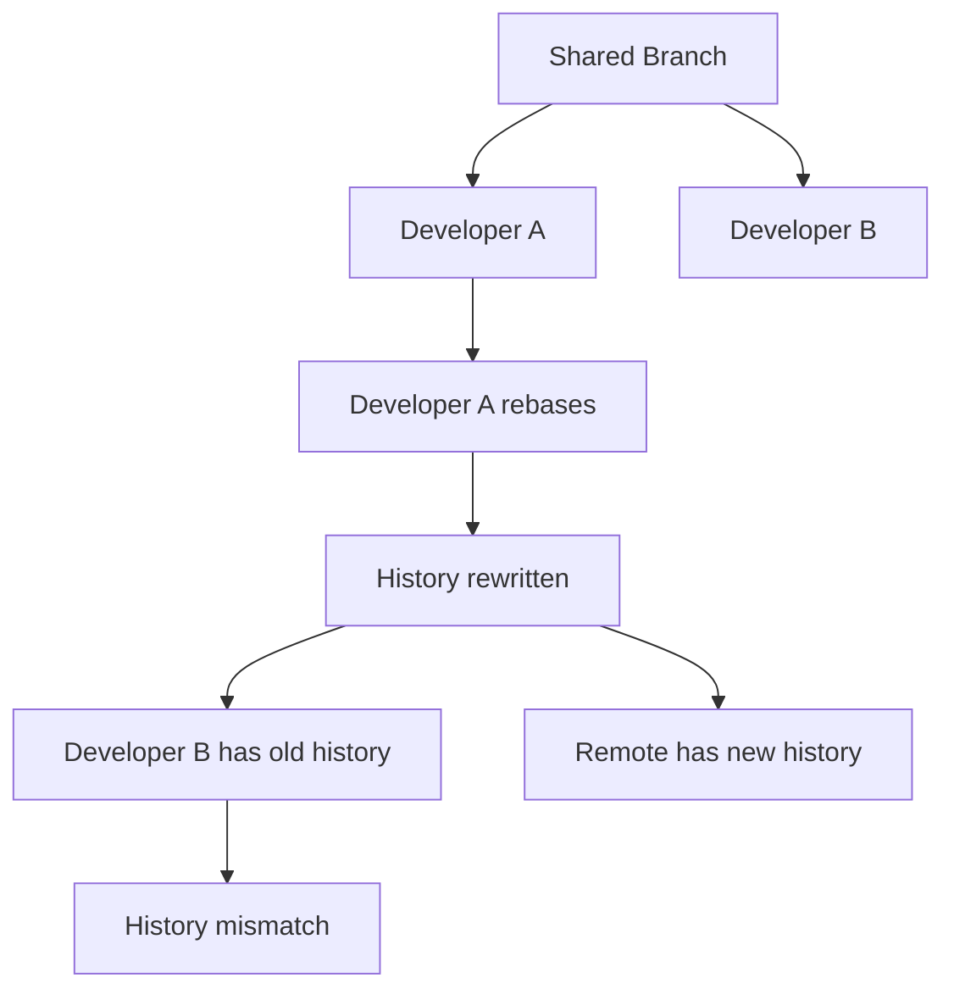

### Safer approach

Rebase your **private feature branch** before it is shared:

```text
feature/my-work
       │
       └── Only you are using it
                │
                ▼
          git rebase main
```

Be careful with:

```text
main
develop
production
shared-feature
```

---

# Stash vs Rebase

These two commands solve **different problems**.

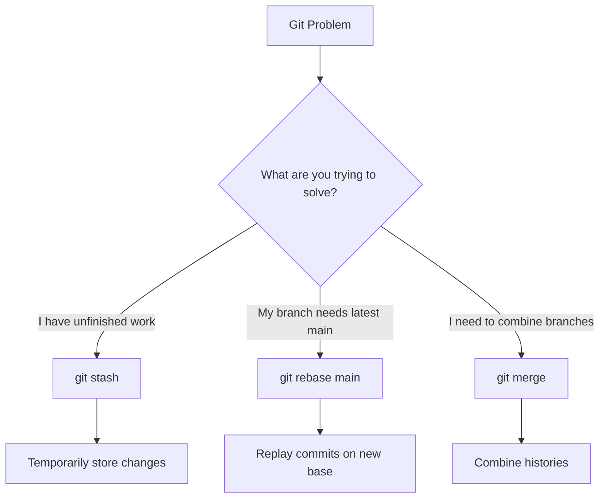

|Feature|Purpose|
|---|---|
|`git stash`|Temporarily store uncommitted work|
|`git stash apply`|Restore stash, keep stash|
|`git stash pop`|Restore stash, remove stash|
|`git rebase main`|Replay feature commits on latest `main`|
|`git merge`|Combine two branch histories|
|`git rebase --continue`|Continue after resolving conflict|
|`git rebase --abort`|Cancel rebase|

---

# The Two Concepts to Memorize

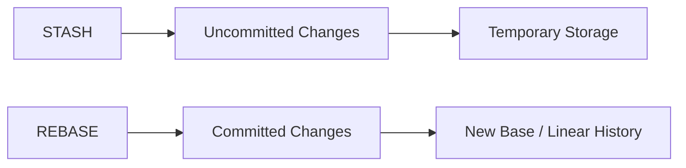

### Git Stash

> **"I'm not ready to commit. Put my work somewhere safe temporarily."**

```bash
git stash
git stash list
git stash apply stash@{1}
git stash pop
```

### Git Rebase

> **"Put my feature commits on top of the latest main and keep the history linear."**

```bash
git switch feature-branch
git rebase main
```

---

# Day 31 Lab — Complete Flow

For the lab you described, the important sequence is:

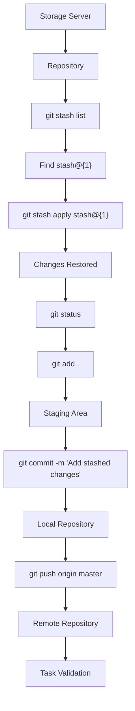

### Commands

```bash
cd <repository>

git stash list

git stash apply stash@{1}

git status

git add .

git commit -m "Add stashed changes"

git push origin master
```

**One-line memory trick:**

```text
STASH  → Hide unfinished work
APPLY  → Restore but keep stash
POP    → Restore and remove stash
REBASE → Replay commits onto a new base
```