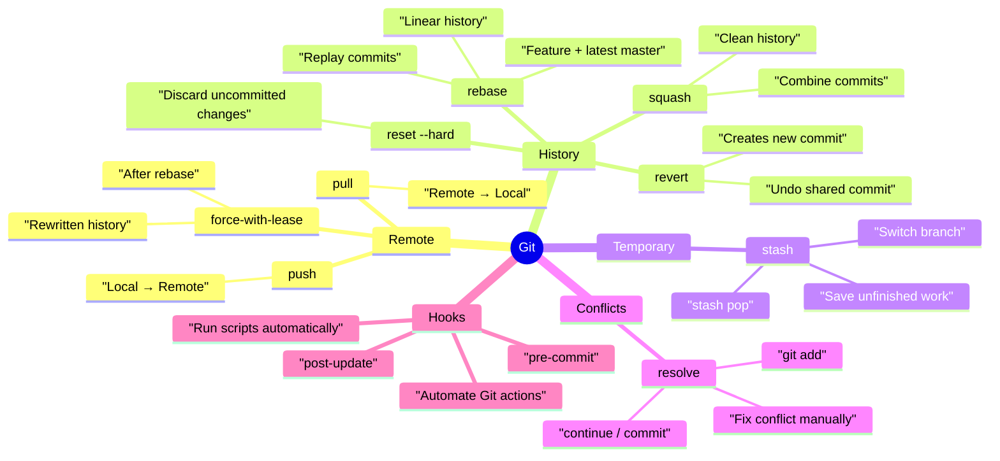
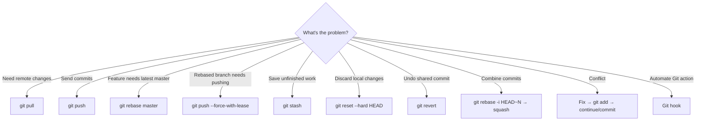

#git #linux 


> **Mental model:**
> 
> `pull` = get → `push` = send → `rebase` = replay → `stash` = park → `reset` = discard → `revert` = undo safely → `squash` = combine → `conflict` = resolve → `hook` = automate

## Mindmap



## Scenario → Command

|Scenario|Command / Action|Remember|
|---|---|---|
|Need latest remote changes|`git pull`|**Get**|
|Send committed work|`git push`|**Send**|
|Feature needs latest `master`|`git rebase master`|**Replay**|
|Rebased branch → remote|`git push --force-with-lease`|**Rewrite safely**|
|Need to switch with unfinished work|`git stash`|**Park**|
|Delete uncommitted tracked changes|`git reset --hard HEAD`|**Destroy**|
|Undo a shared/bad commit|`git revert <commit>`|**New undo commit**|
|Combine multiple commits|`git rebase -i HEAD~N` → `squash`|**Combine**|
|Merge/rebase conflict|Fix → `git add` → continue/commit|**Resolve**|
|Automate action after Git event|Git hook|**Automate**|

## 7-Second Decision Tree



## Memory Hook

```text
PULL              → Get
PUSH              → Send
REBASE            → Replay
SQUASH            → Combine
STASH             → Park
RESET             → Destroy
REVERT            → Undo
FORCE-WITH-LEASE  → Safely rewrite remote
CONFLICT          → Fix → Add → Continue
HOOK              → Automate
```

### ⭐ Critical Distinctions

```text
Uncommitted + KEEP       → git stash
Uncommitted + DELETE     → git reset --hard

Committed + SHARED + UNDO → git revert
Feature + latest master   → git rebase
Rebased + PUSH            → git push --force-with-lease

Many commits + CLEAN      → squash
Git can't merge changes   → resolve conflict manually
Git event + automation    → hook
```