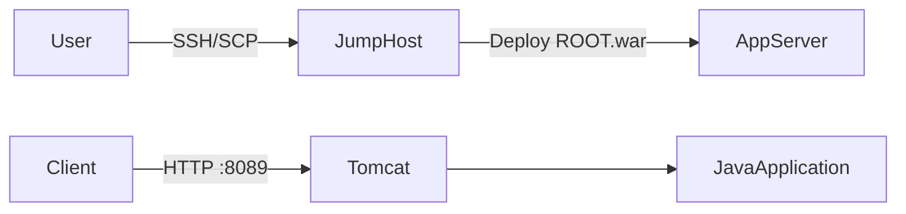
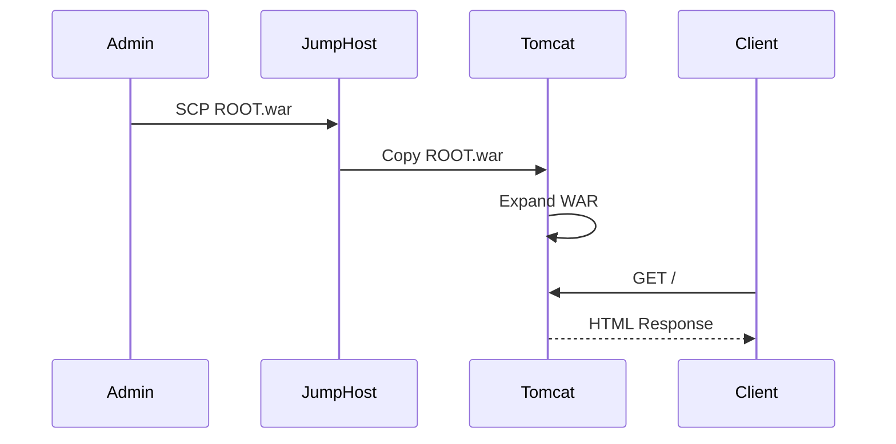
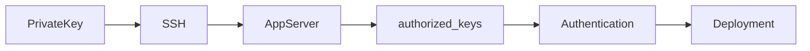

## 1. Business Context

A Java application has completed testing and is ready for deployment. The operations/platform team must install an application server, deploy the application, and expose it on the required port.

**Business value**

- Provides a standardized runtime for Java applications.
    
- Separates application code from infrastructure.
    
- Enables repeatable deployments across environments (Dev → QA → Prod).
    

**Real-world examples**

- **Amazon:** Internal Java microservices run on containers or application servers behind load balancers.
    
- **Banks:** Legacy Java applications often run on Tomcat clusters.
    
- **Netflix:** Historically used Tomcat before moving heavily toward containerized microservices.
    

---

# 2. High-Level Architecture

### ASCII

```text
Developer (Jump Host)
        |
    SSH / SCP
        |
   App Server 3
+-------------------+
| Tomcat :8089      |
| ROOT.war          |
+-------------------+
        |
    HTTP 8089
        |
      Client
```

### Mermaid



---

# 3. Infrastructure Components

|Component|Purpose|
|---|---|
|Jump Host|Secure administration and deployment.|
|App Server 3|Runs Tomcat and hosts the application.|
|Tomcat|Java Servlet container that executes the WAR.|
|ROOT.war|Packaged Java web application deployed at `/`.|

---
### Deployment Script (Concept)

``` sh
#!/bin/bash
set -e

yum install -y tomcat tomcat-webapps tomcat-admin-webapps

sed -i '0,/port="8080"/s//port="8089"/' /usr/share/tomcat/conf/server.xml

cp /tmp/ROOT.war /var/lib/tomcat/webapps/ROOT.war
rm -rf /var/lib/tomcat/webapps/ROOT

systemctl enable --now tomcat
systemctl restart tomcat

curl http://localhost:8089
```
# 4. Complete Request Flow

1. Admin copies `ROOT.war` from Jump Host using SCP.
    
2. WAR is placed in Tomcat's `webapps` directory.
    
3. Tomcat detects the WAR.
    
4. Tomcat extracts it into `ROOT/`.
    
5. Tomcat binds to **TCP port 8089**.
    
6. Client requests `http://stapp03:8089`.
    
7. Tomcat routes `/` to the ROOT application.
    
8. HTML response is returned.
    

---

# 5. Sequence Diagram



---

# 6. Requirement Explanation

|Requirement|Why?|
|---|---|
|Install Tomcat|Provides a Java web runtime.|
|Port **8089**|Avoids conflicts and meets application/network policy.|
|Deploy `ROOT.war`|Makes the application available directly at `/`.|
|Use Jump Host|Centralized and secure administration.|

---

# 7. Linux Concepts

- **Tomcat** – Java application server.
    
- **systemd** – Starts, stops, and manages Tomcat.
    
- **WAR** – Java Web Archive containing compiled application code.
    
- **SCP** – Secure file transfer over SSH.
    
- **SSH** – Secure remote administration.
    

---

# 8. Networking Concepts

- SSH → Port **22** for administration.
    
- HTTP → Port **8089** for application traffic.
    
- DNS resolves `stapp03` to its IP.
    
- TCP establishes a reliable connection before HTTP.
    

---

# 9. Security



- SSH keys reduce password usage.
    
- Only authorized administrators can deploy applications.
    
- Tomcat runs as a service instead of root.
    

---

# 10. Filesystem Flow

```text
Jump Host
/tmp/ROOT.war
        |
        v
App Server
/tmp/ROOT.war
        |
        v
/var/lib/tomcat/webapps/ROOT.war
        |
        v
ROOT/
```

---

# 11. Behind the Scenes

- `scp` encrypts and transfers the WAR over SSH.
    
- Tomcat's deployment scanner detects `ROOT.war`.
    
- The WAR is extracted into the `ROOT/` directory.
    
- Tomcat loads servlets, JSPs, and configuration into memory.
    
- The HTTP connector listens on **8089** and serves requests.
    

---

# 12. Production Variants

Instead of:

- Manual SCP → **Jenkins, GitHub Actions, Argo CD**
    
- Single Tomcat → **Kubernetes + Ingress**
    
- Single server → **Load balancer + multiple Tomcat instances**
    
- Manual deployment → **Blue/Green or Canary deployments**
    

---

# 13. Common Errors

|Error|Cause|Fix|
|---|---|---|
|Connection refused|Wrong port/service stopped|Restart Tomcat, verify connector.|
|Tomcat welcome page|Default ROOT app|Replace with `ROOT.war`.|
|`No such file`|WAR not copied|SCP from Jump Host first.|
|`Permission denied`|SSH/auth issue|Use correct user or SSH keys.|

---

# 14. Interview Questions

1. Why deploy as `ROOT.war`?
    
2. Difference between Tomcat and Apache HTTP Server?
    
3. How does Tomcat auto-deploy a WAR?
    
4. Why change the default port?
    
5. Why use SCP instead of FTP?
    
6. What does `systemctl enable` do?
    
7. How does Tomcat detect new applications?
    
8. Difference between a WAR and a JAR?
    
9. Why use a Jump Host?
    
10. What happens if two services use the same port?
    

---

# 15. Skills Learned


- **Java:** WAR packaging and Tomcat deployment.
    
- **DevOps:** Manual application deployment workflow.
        
- **Production Architecture:** Standard Java application hosting and deployment pipeline.