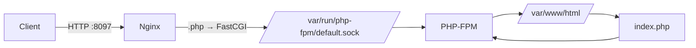
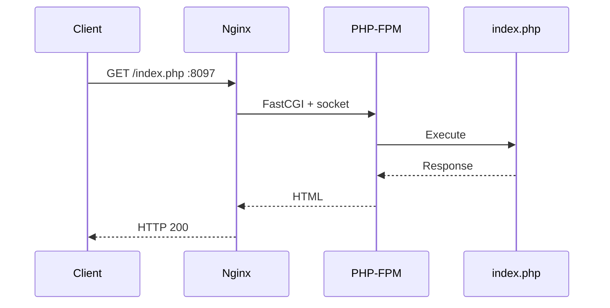

#linux 

> [!summary] Goal  
> Nginx `:8097` → PHP-FPM Unix socket → PHP app



## Nginx

```nginx
server {
    listen 8097;
    root /var/www/html;

    location ~ \.php$ {
        include /etc/nginx/fastcgi_params;
        fastcgi_param SCRIPT_FILENAME $document_root$fastcgi_script_name;
        fastcgi_pass unix:/var/run/php-fpm/default.sock;
    }
}
```

### Key directives

|Directive|Meaning|
|---|---|
|`listen 8097`|Nginx listens on port `8097`|
|`root`|Application document root|
|`location ~ \.php$`|Match PHP requests|
|`fastcgi_pass`|Send PHP requests to PHP-FPM|
|`SCRIPT_FILENAME`|Tells PHP-FPM which PHP file to execute|

## PHP-FPM

```ini
listen = /var/run/php-fpm/default.sock
```

**Unix socket = local IPC** between Nginx and PHP-FPM.



## Troubleshooting Model

```text
curl fails
   │
   ├─ Connection refused → Nginx not listening
   │                       ↓
   │                    ss -lntp
   │
   ├─ 404 → Nginx routing/root
   │
   └─ 502 → Nginx ↔ PHP-FPM
                         ↓
                 socket + permissions
```

### Verification

```bash
nginx -t
sudo systemctl status nginx
sudo systemctl status php-fpm
sudo ss -lntp | grep 8097
curl http://stapp01:8097/index.php
```

> [!success] Final result  
> `Welcome to xFusionCorp Industries!` → **Nginx + PHP-FPM integration working.**