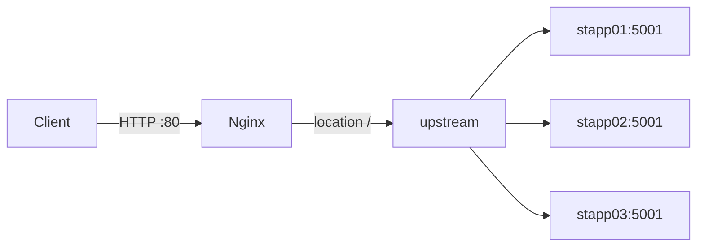
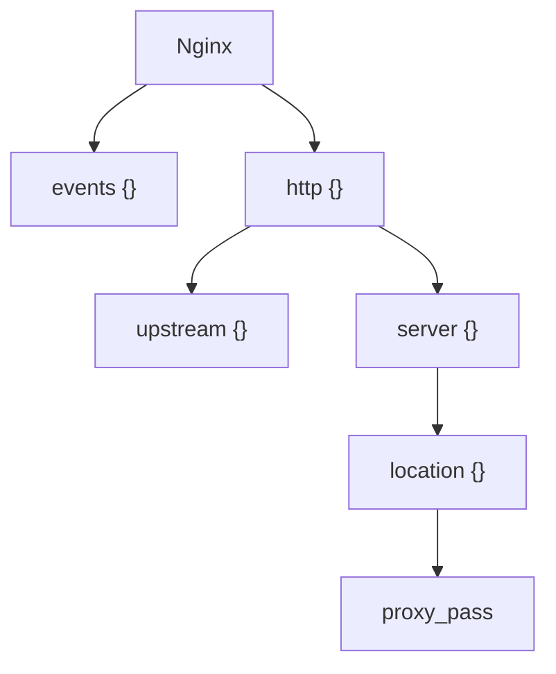
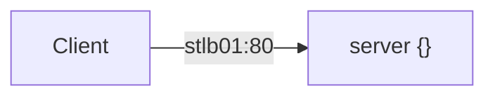
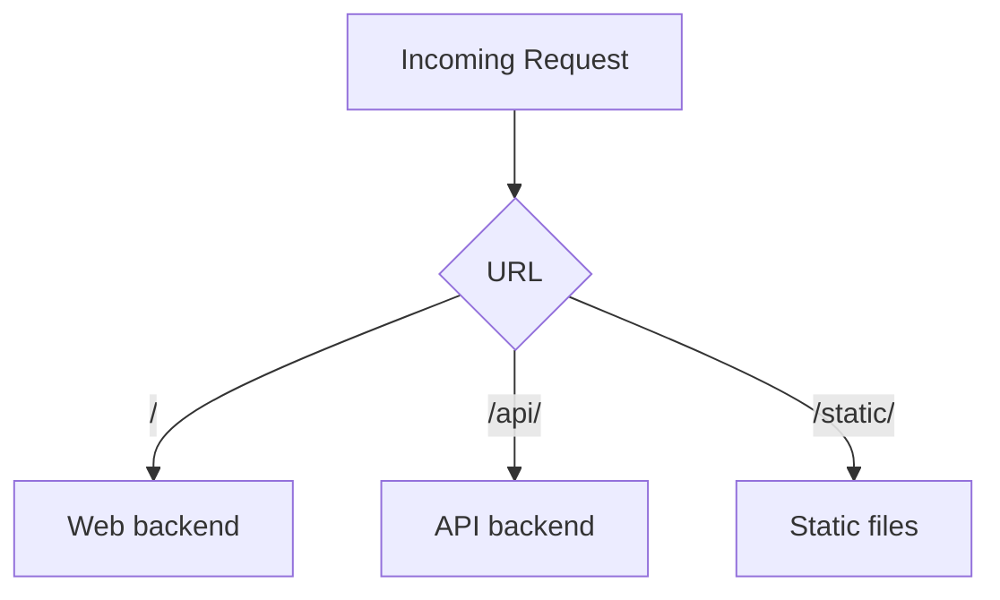
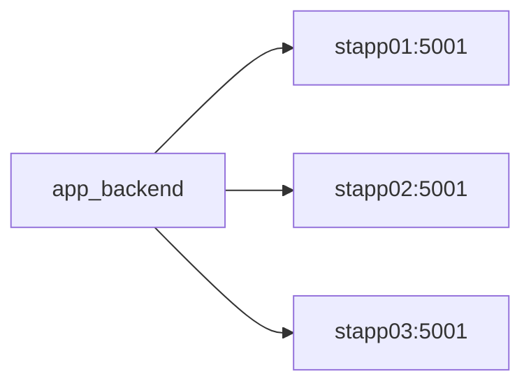
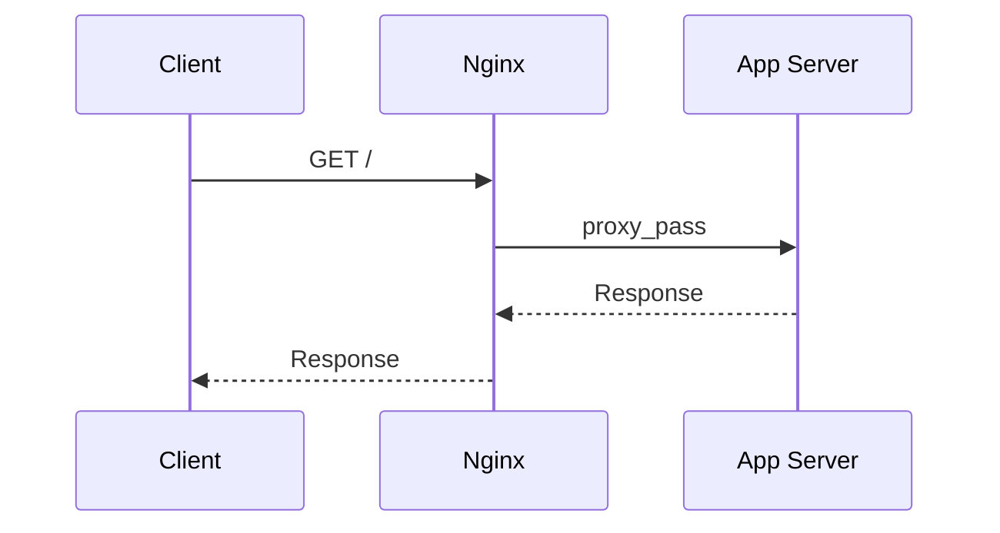

#linux 
The only thing you need to understand first is:



## 1. Basic Nginx structure

```nginx
events {
    worker_connections 1024;
}

http {

    upstream app_backend {
        server stapp01:5001;
        server stapp02:5001;
        server stapp03:5001;
    }

    server {
        listen 80;
        server_name stlb01;

        location / {
            proxy_pass http://app_backend;
        }
    }
}
```

Think of it as:



---

## 2. `http {}`

```nginx
http {
    ...
}
```

Contains **HTTP-related configuration**.

Your `upstream` and `server` blocks normally live inside it.

---

## 3. `server {}` = Virtual Server

```nginx
server {
    listen 80;
    server_name stlb01;
}
```

Means:

> "Nginx, accept HTTP traffic on port 80 for `stlb01`."



If you hosted multiple websites:

```nginx
server {
    listen 80;
    server_name app.example.com;
}

server {
    listen 80;
    server_name api.example.com;
}
```

Nginx can route requests based on the **Host header**.

---

## 4. `location` = URL Routing

```nginx
location / {
    ...
}
```

`location` decides **what to do with a particular URL/path**.

Example:

```nginx
location / {
    proxy_pass http://app_backend;
}

location /api/ {
    proxy_pass http://api_backend;
}

location /static/ {
    root /var/www;
}
```

Conceptually:



So:

> **`server` chooses the website; `location` chooses the URL handling rule.**

---

## 5. `upstream` = Backend Pool

```nginx
upstream app_backend {
    server stapp01:5001;
    server stapp02:5001;
    server stapp03:5001;
}
```

Creates a group of backend servers.



By default, Nginx distributes requests using **round-robin**:

```text
Request 1 → stapp01
Request 2 → stapp02
Request 3 → stapp03
Request 4 → stapp01
```

---

## 6. `proxy_pass` = Forward the Request

```nginx
location / {
    proxy_pass http://app_backend;
}
```

This is the actual routing action.



Without `proxy_pass`, Nginx isn't acting as your reverse proxy for that location.

---

# The Core Nginx Routing Formula

Remember this:

```text
CLIENT
   ↓
listen 80
   ↓
server {}
   ↓
location /
   ↓
proxy_pass
   ↓
upstream
   ↓
backend server
```

## Mental Model

> **`server` = WHO → `location` = WHAT PATH → `proxy_pass` = WHERE → `upstream` = WHICH BACKEND**.