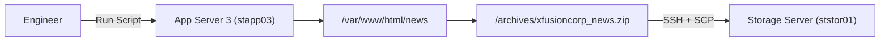
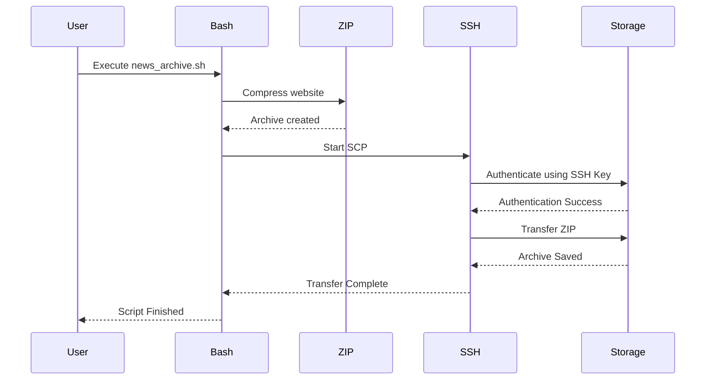
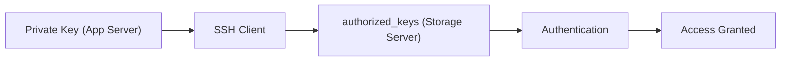
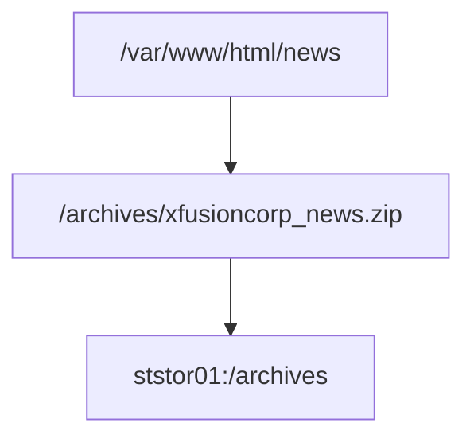

## 1. Business Context

### Problem

xFusionCorp hosts a static website on **App Server 3**.

Website files continuously change because of:

- Content updates
    
- Bug fixes
    
- Deployments
    
- Marketing changes
    

If the server crashes, those files could be lost.

Therefore the operations team needs an automated backup solution.

Instead of asking an engineer to manually copy files every day, they automate it using a Bash script.

---

### Why Companies Need This

Imagine Amazon updating thousands of web assets every day.

If one server fails and there is no backup:

- Website downtime
    
- Lost customer data
    
- Lost revenue
    
- Slow disaster recovery
    

Backups are one of the most fundamental Site Reliability Engineering (SRE) practices.

---

### Which Teams Use This

- DevOps Engineers
    
- Linux Administrators
    
- Platform Engineers
    
- SREs
    
- Infrastructure Teams
    

---

## 2. High-Level Architecture

### ASCII Diagram

```text
                    Engineer

                        │

                Execute Script

                        │

                        ▼

              +------------------+
              |  App Server 3    |
              |   stapp03        |
              +------------------+
                       │
                       │
             Read Website Files
                       │
                       ▼
        /var/www/html/news
                       │
                       ▼
             ZIP Compression
                       │
                       ▼
     /archives/xfusioncorp_news.zip
                       │
             SSH Authentication
                       │
                SCP File Transfer
                       │
                       ▼
             +-------------------+
             | Storage Server    |
             | ststor01          |
             +-------------------+
                       │
                       ▼
          /archives/xfusioncorp_news.zip
```

### Mermaid Architecture



---

# 3. Infrastructure Components

## App Server

Purpose

Runs the production website.

Responsibilities

- Hosts website
    
- Serves users
    
- Generates backups
    
- Creates ZIP archive
    

Important Directories

```
/var/www/html/news
/scripts
/archives
```

---

## Storage Server

Purpose

Stores backups only.

Responsibilities

- Backup storage
    
- Disaster recovery
    
- Validation
    
- Long-term retention
    

It never serves customer traffic.

---

# 4. Complete Request Flow

## Step 1

Engineer executes

```
news_archive.sh
```

Machine

```
App Server
```

User

```
banner
```

---

## Step 2

Bash loads

```
#!/bin/bash
```

Variables are created

```
SOURCE_DIR
ARCHIVE_NAME
REMOTE_HOST
REMOTE_USER
```

---

## Step 3

ZIP begins reading

```
/var/www/html/news
```

Every file becomes compressed.

Linux reads the filesystem inode by inode.

---

## Step 4

ZIP writes

```
/archives/xfusioncorp_news.zip
```

This archive now exists locally.

---

## Step 5

SCP starts.

Internally it launches SSH.

```
scp backup.zip server:/archives
```

is essentially

```
SSH
+
Encrypted Copy
```

---

## Step 6

SSH authentication begins.

Instead of

```
Password?
```

SSH sends proof that the client owns the private key.

Storage Server compares it against

```
~/.ssh/authorized_keys
```

If they match

```
Access Granted
```

---

## Step 7

Encrypted file transfer begins.

```
ZIP

↓

TCP

↓

SSH Encryption

↓

Network

↓

Storage Server

↓

Disk Write
```

---

## Step 8

SSH closes.

Script exits.

---

# 5. Mermaid Sequence Diagram



---

# 6. Why Every Requirement Exists

## Why create ZIP on App Server?

Because that's where the website lives.

```
stapp03

↓

/var/www/html/news
```

The Storage Server doesn't have these files.

---

## Why copy to Storage Server?

Never store backups on the same machine.

If App Server dies

```
Website ❌

Backup ❌
```

Everything is lost.

Instead

```
Website

↓

Backup Server
```

Now disaster recovery is possible.

---

## Why SCP?

SCP provides

- Encryption
    
- Authentication
    
- Integrity
    

FTP would transmit credentials in plaintext.

---

## Why passwordless SSH?

Automation.

Imagine

```
2 AM

Cron Job

↓

Password?
```

No human is awake.

Backup fails.

SSH keys remove human interaction.

---

## Why executable permissions?

Linux won't execute text files by default.

```
chmod +x
```

tells Linux

```
"This is executable."
```

---

## Why no sudo?

Production scripts should run with the minimum privileges required. Embedding `sudo` can:

- Prompt for a password and break automation.
    
- Give the script broader access than necessary.
    
- Make behavior depend on the user's sudo configuration.
    

Following the principle of least privilege makes automation safer and more predictable.

---

# 7. Linux Concepts

|Concept|Purpose|Production Usage|
|---|---|---|
|Bash|Shell scripting|Automation|
|zip|Compress files|Backups|
|scp|Secure copy|File transfer|
|ssh|Secure remote login|Remote administration|
|chmod|File permissions|Make scripts executable|
|Variables|Configuration|Reusable scripts|
|Absolute Paths|Reliability|Cron jobs and automation|

---

# 8. Networking Concepts

Protocol Stack

```
Application

↓

SCP

↓

SSH

↓

TCP

↓

IP

↓

Ethernet
```

Port

```
22
```

Traffic

```
App Server

↓

TCP Connection

↓

SSH Encryption

↓

Storage Server
```

---

# 9. Security Deep Dive

## Why SSH Keys?

Mermaid Authentication Diagram



The private key never leaves the App Server. The Storage Server verifies the client by checking the corresponding public key listed in `authorized_keys`.

---

# 10. Filesystem Flow

```
App Server

/var/www/html/news

↓

ZIP

↓

/archives/xfusioncorp_news.zip

↓

Storage Server

/archives/xfusioncorp_news.zip
```

Mermaid



---

# 11. Behind the Scenes

When running

```
scp archive.zip server:/archives
```

Linux performs:

1. Resolve hostname (DNS or `/etc/hosts`, depending on configuration).
    
2. Establish a TCP connection on port 22.
    
3. Negotiate an SSH session and encryption.
    
4. Authenticate using the client's private key and the server's `authorized_keys`.
    
5. Read the ZIP file from disk.
    
6. Encrypt and transmit the data in packets.
    
7. Write the received data to the Storage Server's filesystem.
    
8. Close the SSH session.
    

---

# 12. Production Variants

|Small Environment|Enterprise Alternative|
|---|---|
|Bash|Ansible|
|SCP|Amazon S3 / Google Cloud Storage / Azure Blob Storage|
|Cron|Kubernetes CronJobs|
|Local Server|Object Storage|
|Single Storage Server|Geo-replicated Backup Systems|

---

# 13. Debugging Guide

|Error|Cause|Fix|
|---|---|---|
|Permission denied|Missing execute bit|`chmod +x`|
|Authentication failed|SSH key mismatch|Copy public key|
|Host not found|Wrong hostname|Verify DNS or `/etc/hosts`|
|No such file|Incorrect path|Use absolute paths|
|Connection refused|SSH service unavailable or blocked|Check SSH service and firewall|
|Archive missing|ZIP step failed|Verify source directory and permissions|

---

# 14. Interview Questions

1. Why should backups be stored on a different server?
    
    - To protect data if the application server fails.
        
2. Why use SSH keys instead of passwords?
    
    - They enable secure, non-interactive automation.
        
3. Difference between SCP and rsync?
    
    - SCP copies the entire file each time; `rsync` can transfer only the changed portions.
        
4. Why use absolute paths in scripts?
    
    - Scripts may run from any working directory, especially via cron or automation.
        
5. Why avoid `sudo` inside automation scripts?
    
    - It can require interaction and violates least-privilege practices.
        
6. What happens during SSH authentication?
    
    - The client proves possession of its private key; the server verifies it against the matching public key.
        
7. Why compress files before transfer?
    
    - To reduce size and package multiple files into a single archive.
        
8. Why make the script executable?
    
    - Linux requires execute permission before treating a file as a program.
        
9. Why use a Storage Server instead of another directory on the App Server?
    
    - To isolate backups from application failures.
        
10. What is the purpose of `authorized_keys`?
    
    - It lists the public keys allowed to authenticate to a user account.
        

---

# 15. Skills Learned

### Linux

- Bash scripting
    
- File permissions
    
- File compression
    
- Filesystem navigation
    

### Networking

- SSH
    
- SCP
    
- TCP/IP
    
- Hostname resolution
    

### Security

- SSH key authentication
    
- Encryption in transit
    
- Least privilege
    

### Bash

- Variables
    
- Script execution
    
- Absolute paths
    

### DevOps

- Backup automation
    
- Operational scripting
    
- Secure file transfer
    

### SRE

- Disaster recovery
    
- Backup validation
    
- Automation reliability
    

### Cloud

- Concepts that map to object storage and managed backup services
    

### Platform Engineering

- Operational workflows
    
- Secure infrastructure automation
    

### Production Architecture

- Separate application and backup responsibilities
    
- Automated, repeatable backup pipelines
    

### Interview Concepts

- SSH authentication
    
- Backup strategies
    
- Secure automation
    
- Linux permissions
    
- File transfer protocols