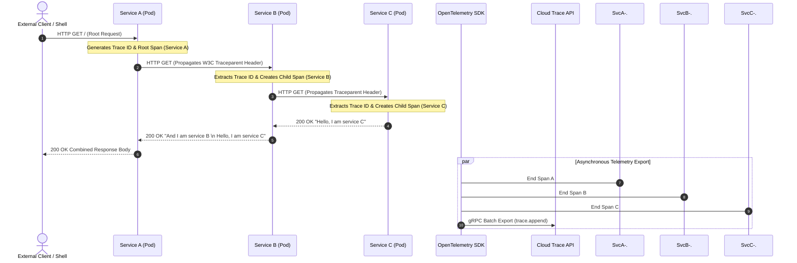

  

## Executive Summary

  

Modern microservice architectures decompose complex workflows into decoupled, asynchronous network calls across containerized services, making end-to-end request latency difficult to diagnose using conventional centralized logging alone. This repository demonstrates an enterprise-grade distributed tracing solution deployed on **Google Kubernetes Engine (GKE)** using **OpenTelemetry** instrumentation and **Google Cloud Trace**, capturing multi-hop telemetry to pinpoint latency bottlenecks across inter-service dependencies (`service-a` → `service-b` → `service-c`).

  

---

  

## Architecture Overview

  

The distributed tracing architecture captures intra-cluster request flows by embedding vendor-neutral OpenTelemetry instrumentation directly into containerized application runtimes. Spans are created contextually as HTTP requests propagate across service boundaries, and telemetry is asynchronously exported to the **Cloud Trace API** for centralized visualization and latency breakdown.

  

```mermaid

graph TD

    User([Client / curl]) -->|HTTP GET Request| SvcA[Cloud Trace Demo Service A<br/>gke-cloud-trace-demo]

    subgraph GKE Cluster: cloud-trace-demo (Zone: us-east1-c)

        subgraph Namespace: default

            SvcA -->|HTTP RPC / OpenTelemetry Context| SvcB[Cloud Trace Demo Service B]

            SvcB -->|HTTP RPC / OpenTelemetry Context| SvcC[Cloud Trace Demo Service C]

        end

    end

  

    subgraph OpenTelemetry Instrumentation Layer

        SvcA -.->|BatchSpanProcessor| OTelA[CloudTraceSpanExporter]

        SvcB -.->|BatchSpanProcessor| OTelB[CloudTraceSpanExporter]

        SvcC -.->|BatchSpanProcessor| OTelC[CloudTraceSpanExporter]

    end

  

    subgraph Google Cloud Control Plane & Observability

        OTelA -->|gRPC / trace.append| CloudTrace[Google Cloud Trace Backend]

        OTelB -->|gRPC / trace.append| CloudTrace

        OTelC -->|gRPC / trace.append| CloudTrace

        CloudTrace --> TraceExplorer[Trace Explorer UI / Latency Heatmap]

    end

  

    style GKE Cluster: cloud-trace-demo (Zone: us-east1-c) fill:#f5f7fa,stroke:#4285f4,stroke-width:2px

    style Google Cloud Control Plane & Observability fill:#e8f0fe,stroke:#1a73e8,stroke-width:2px

    style SvcA fill:#34a853,color:#fff

    style SvcB fill:#fab107,color:#000

    style SvcC fill:#ea4335,color:#fff

```

  

---

  

## Business Problem

  

In enterprise microservice ecosystems, a single user-facing HTTP request frequently cascades through dozens of downstream microservices, databases, and third-party APIs. When end-to-end latency spikes occur, traditional server logs report isolated status codes without context regarding which downstream hop introduced the delay.

  

* **Debugging Blind Spots:** Microservice boundary crossings mask transient Network I/O delays, thread contention, and blocking downstream dependencies.

* **Elevated Mean Time to Resolution (MTTR):** Platform and DevOps teams waste significant operational effort manually stitching together time-correlated logs from multiple pod containers.

* **SLA/SLO Breaches:** Without detailed span-level duration visibility, teams cannot isolate long-tail (P99) latency degradation before it violates customer Service Level Agreements.

  

---

  

## Solution Overview

  

This architecture implements end-to-end distributed tracing using **OpenTelemetry** Python SDKs integrated with **Google Cloud Trace**:

  

1. **Context Propagation:** Service A automatically generates a root trace context (`Trace ID`) and injects headers into downstream HTTP requests sent to Service B and Service C.

2. **Non-Blocking Telemetry Export:** OpenTelemetry uses a `BatchSpanProcessor` and `CloudTraceSpanExporter` to collect span data asynchronously in memory, preventing telemetry overhead from increasing request latency.

3. **Managed Heatmap Analytics:** Google Cloud Trace aggregates incoming spans across all cluster workloads, rendering latency distribution heatmaps, parent-child Gantt charts, and quantitative span breakdown metrics.

  

---

  

## Reference Architecture

  

### Request Flow & Telemetry Export Sequence

  

The sequence diagram below details how a single client invocation initiates a trace hierarchy across microservices, propagating W3C Trace Context and emitting spans out-of-band to Cloud Trace.

  



  

### Core Google Cloud & Cloud Native Components

  

✦ **Google Kubernetes Engine (GKE)**

  

[Google Kubernetes Engine](https://cloud.google.com/kubernetes-engine/docs) is Google's managed Kubernetes orchestration platform.

  

It abstracts container cluster management and node provisioning while allowing platform engineering teams to run scalable, resilient containerized microservices without operational control plane maintenance.

  

**Enterprise Use Cases:**

* Production multi-zone microservice deployments

* Automated container scaling and self-healing workloads

* Native integration with Google Cloud Observability tools

  

---

  

✦ **Google Cloud Trace**

  

[Google Cloud Trace](https://cloud.google.com/trace/docs) is Google Cloud's fully managed, low-latency distributed tracing system.

  

It collects, aggregates, and visualizes trace data sent from cloud applications, enabling platform engineers to analyze latency heatmaps and inspect request execution flows.

  

**Enterprise Use Cases:**

* Root-cause analysis of microservice performance bottlenecks

* End-to-end latency monitoring across hybrid and multi-cloud environments

* Correlate application spans with Google Cloud service latency

  

---

  

✦ **OpenTelemetry (Python SDK)**

  

[OpenTelemetry](https://opentelemetry.io/docs) is a vendor-neutral, CNCF observability framework for generating and exporting telemetry data (traces, metrics, and logs).

  

It provides standardized SDKs and exporters that allow applications to transmit spans to backend platforms without vendor lock-in.

  

**Enterprise Use Cases:**

* Standardized instrumentation across multi-language microservice repositories

* Decoupled telemetry ingestion pipelines via open-source span processors

* Native exporting to Google Cloud Trace via `opentelemetry-exporter-gcloud-trace`

  

---

  

## Prerequisites

  

Before executing this lab, ensure you have access to the following accounts, tools, and permissions:

  

* **Google Cloud Project:** A dedicated GCP project with billing enabled.

* **IAM Permissions:**

  * `roles/container.admin` (Kubernetes Engine Admin to provision GKE clusters)

  * `roles/cloudtrace.agent` (Cloud Trace Agent to allow workloads to write traces)

  * `roles/serviceusage.serviceUsageAdmin` (To enable required Google APIs)

* **Cloud Shell / Local CLI Environment:**

  * `gcloud` CLI (Google Cloud SDK version 400.0.0+)

  * `kubectl` (Kubernetes CLI binary compatible with GKE cluster control plane)

  * `git` (For cloning target sample repositories)

  

---

  

## Repository Structure

  

The sample application source code is maintained within the official Google Cloud documentation samples repository.

  

```

python-docs-samples/

└── trace/

    └── cloud-trace-demo-app-opentelemetry/

        ├── setup.sh             # Master deployment shell script (builds/deploys A, B, C)

        ├── app_a/               # Service A (Flask + OpenTelemetry setup)

        ├── app_b/               # Service B (Flask + OpenTelemetry setup)

        ├── app_c/               # Service C (Flask + OpenTelemetry setup)

        └── kubernetes/          # Kubernetes Deployment & LoadBalancer Service manifests

```

  

---

  

## Environment Variables

  

Establish explicit shell parameters prior to executing provisioning commands to avoid project or location misconfigurations:

  

```bash

# Set Google Cloud Project ID and Compute Zone

export PROJECT_ID=$(gcloud config get-value project)

export REGION="us-east1"

export ZONE="us-east1-c"

export CLUSTER_NAME="cloud-trace-demo"

  

# Set gcloud default properties

gcloud config set compute/zone $ZONE

```

  

---

  

## Implementation

  

Follow these step-by-step instructions to provision infrastructure, build microservices, and deploy OpenTelemetry workloads on GKE.

  

### Step 1: Initialize Cloud Shell & Download Source Code

  

Activate Cloud Shell and clone the reference application repository containing OpenTelemetry sample microservices:

  

```bash

git clone https://github.com/GoogleCloudPlatform/python-docs-samples.git

```

  

> [!NOTE]

> Cloud Shell provides pre-authenticated access to `gcloud`, `kubectl`, and standard developer tools configured directly to your temporary lab credentials.

  

---

  

### Step 2: Enable Google Kubernetes Engine API

  

Enable the Container API to grant the Google Cloud project permission to manage GKE clusters:

  

```bash

gcloud services enable container.googleapis.com

```

  

---

  

### Step 3: Provision GKE Cluster

  

Create a regional single-zone GKE Standard cluster named `cloud-trace-demo` in zone `us-east1-c`:

  

```bash

gcloud container clusters create cloud-trace-demo \

   --zone $ZONE

```

  

> [!WARNING]

> GKE cluster creation typically requires 3 to 5 minutes. The cluster default service account automatically includes `https://www.googleapis.com/auth/trace.append` permissions to allow workloads to transmit trace spans.

  

---

  

### Step 4: Configure Cluster Credentials & Verify Access

  

Fetch cluster authentication credentials to configure local `kubectl` context:

  

```bash

gcloud container clusters get-credentials cloud-trace-demo --zone $ZONE

```

  

Verify that all cluster nodes are provisioned and reporting `Ready` status:

  

```bash

kubectl get nodes

```

  

<p align="center">

  

</p>

  

---

  

### Step 5: Deploy Sample OpenTelemetry Microservices

  

Navigate into the OpenTelemetry sample application directory and execute the automated setup script:

  

```bash

cd python-docs-samples/trace/cloud-trace-demo-app-opentelemetry && ./setup.sh

```

  

The `./setup.sh` script provisions three distinct microservice workloads (`cloud-trace-demo-a`, `cloud-trace-demo-b`, and `cloud-trace-demo-c`) alongside corresponding Kubernetes `LoadBalancer` services.

  

```bash

# Expected terminal execution output:

deployment.apps/cloud-trace-demo-a is created

service/cloud-trace-demo-a is created

deployment.apps/cloud-trace-demo-b is created

service/cloud-trace-demo-b is created

deployment.apps/cloud-trace-demo-c is created

service/cloud-trace-demo-c is created

```

  

<p align="center">

  

</p>

  

---

  

## Verification

  

### Step 1: Generate Trace Telemetry via HTTP Request

  

Retrieve the external ingress IP address of `cloud-trace-demo-a` dynamically and send an HTTP `GET` request using `curl`:

  

```bash

curl $(kubectl get svc -o=jsonpath='{.items[?(@.metadata.name=="cloud-trace-demo-a")].status.loadBalancer.ingress[0].ip}')

```

  

The HTTP response reflects the aggregated output generated by the cascading calls through Service A, Service B, and Service C:

  

```text

Hello, I am service A

And I am service B

Hello, I am service C

```

  

<p align="center">

  

</p>

  

> [!TIP]

> Execute the `curl` command multiple times in a loop to generate multiple trace data points across the Cloud Trace heatmap.

> ```bash

> for i in {1..10}; do

>   curl -s $(kubectl get svc -o=jsonpath='{.items[?(@.metadata.name=="cloud-trace-demo-a")].status.loadBalancer.ingress[0].ip}')

>   echo ""

>   sleep 1

> done

> ```

  

---

  

## Observability

  

### Accessing Google Cloud Trace Explorer

  

Navigate in the Google Cloud Console to **Navigation Menu () > View all products > Observability > Trace > Trace Explorer**.

  

<p align="center">

  

</p>

  

---

  

### Latency Heatmap & Span Duration Analytics

  

The **Trace Explorer** interface displays a time-series heatmap charting span duration over time against request volume. Darker color block intensities indicate clusters of requests with matching latency profiles.

  

<p align="center">

  

</p>

  

Hovering over or clicking specific heatmap buckets isolates temporal latency anomalies or long-tail performance outliers across the application timeline.

  

<p align="center">

  

</p>

  

---

  

### Grouped Trace Summary & Span Table

  

Below the heatmap graph, the **Spans Table** categorizes ingested traces, providing high-level metrics including **Span ID**, **HTTP Method**, **Latency**, **Status Code**, and **Resource Path**.

  

<p align="center">

  

</p>

  

---

  

### Distributed Waterfall & Parent-Child Span Hierarchy

  

Selecting an individual **Span ID** renders a Gantt chart breakdown of the distributed request path. The top horizontal bar represents the total end-to-end duration of `cloud-trace-demo-a`, while nested child bars detail the execution time of `cloud-trace-demo-b` and `cloud-trace-demo-c`.

  

```mermaid

gantt

    title Distributed Request Latency Waterfall (Trace ID Breakdown)

    dateFormat  SS.SSS

    axisFormat %S.%L s

  

    section Service A (Root)

    HTTP GET / (cloud-trace-demo-a)        :a1, 00.000, 00.450

    section Service B (Child)

    HTTP GET / (cloud-trace-demo-b)        :a2, 00.050, 00.380

    section Service C (Leaf)

    HTTP GET / (cloud-trace-demo-c)        :a3, 00.120, 00.220

```

  

<p align="center">

  

</p>

  

---

  

### Span Attribute Inspection & Correlated Telemetry

  

Clicking any individual span bar opens the **Span Details Pane**, surfacing key metadata attributes:

* **Span Attributes:** `http.status_code`, `http.method`, `http.url`, `g.co/agent`

* **Timing Details:** Start time, end time, and total duration in milliseconds

* **Correlated Logs:** Direct integration with Cloud Logging to inspect log entries emitted during span execution

  

<p align="center">

  

</p>

  

---

  

## Design Decisions & Trade-offs

  

| Architecture Choice | Selected Approach | Alternative Evaluated | Key Trade-off / Architectural Rationale |

| :--- | :--- | :--- | :--- |

| **Telemetry SDK** | OpenTelemetry Python SDK | Vendor-specific Cloud Trace SDK (`google-cloud-trace`) | **Trade-off:** OpenTelemetry requires slightly more initial configuration boilerplate. <br/>**Rationale:** Provides vendor-neutral standards, avoiding lock-in and allowing telemetry export to external collectors or Cloud Trace. |

| **Span Processing** | `BatchSpanProcessor` | `SimpleSpanProcessor` | **Trade-off:** Minimal memory buffer footprint overhead on container pods. <br/>**Rationale:** Transmits spans asynchronously in batches, ensuring telemetry export network calls do not block client request paths. |

| **Ingress Exposure** | Kubernetes `LoadBalancer` | `Ingress` / Gateway API | **Trade-off:** Provisions individual Cloud Pass-through Network Load Balancers per service. <br/>**Rationale:** Simplifies lab setup and isolates Service A external IP for straightforward `curl` verification without ingress controller overhead. |

  

---

  

## Troubleshooting

  

### 1. Spans Do Not Appear in Trace Explorer

  

* **Root Cause:** Asynchronous span batching delays or insufficient IAM permissions on the GKE node pool service account.

* **Resolution:**

  1. Re-run `curl` multiple times to push batched spans to the exporter.

  2. Verify that the node pool service account possesses the `roles/cloudtrace.agent` role:

     ```bash

     gcloud projects add-iam-policy-binding $PROJECT_ID \

       --member="serviceAccount:$(gcloud iam service-accounts list --filter="name:Compute Engine default service account" --format="value(email)")" \

       --role="roles/cloudtrace.agent"

     ```

  

### 2. External IP Stranded in `<pending>` Status

  

* **Root Cause:** Cloud Load Balancer provisioning is still in progress.

* **Resolution:** Wait 1-2 minutes and re-query service status:

  ```bash

  kubectl get svc cloud-trace-demo-a --watch

  ```

  

---

  

## Cleanup

  

To prevent unnecessary Google Cloud infrastructure charges, tear down all provisioned cluster resources upon lab completion:

  

```bash

# Delete GKE cluster (removes underlying Compute instances and Load Balancers)

gcloud container clusters delete cloud-trace-demo \

   --zone $ZONE \

   --quiet

```

  

Verify that all external compute and network resources have been deprovisioned:

  

```bash

gcloud compute instances list

```