Imagine TechHealth has a payment application running on AKS. Everything is healthy until one of the Pods stops responding.

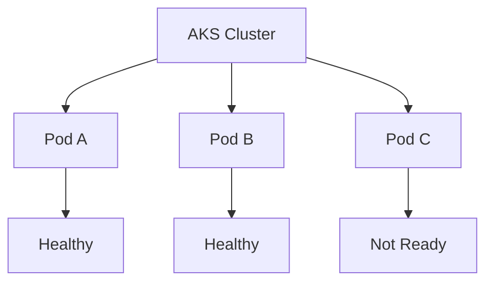

Now let's see what happens from detection all the way to recovery.

---

## 1. Azure Monitor detects the problem

Pod C becomes unhealthy. Azure Monitor is monitoring the AKS environment and detects that the Pod is no longer ready.

An alert such as `KubePodNotReady` fires.

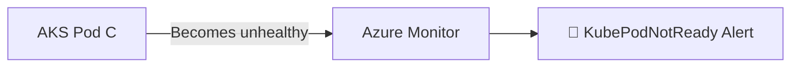

Think of Azure Monitor as the **smoke detector**. It notices the problem, but it isn't responsible for fixing it.

---

## 2. The alert triggers an Action Group

The alert is connected to an **Action Group**.

The Action Group determines what should happen when the alert fires. In this case, it sends an HTTP request to our Azure Function.

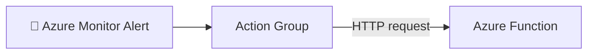

So the flow is basically:

> Something is wrong → Azure Monitor detects it → Action Group starts the response.

---

## 3. The Function figures out what happened

The Azure Function receives the **Common Alert Schema** payload.

The payload contains information such as:

```text
Alert Rule: KubePodNotReady
Cluster:    techhealth-aks
Namespace:  production
Pod:        payment-api-xyz
```

The Function parses this information so it knows exactly which resource needs attention.

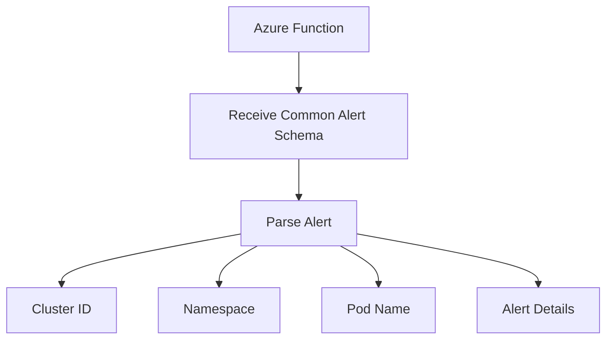

At this point, the Function knows:

> **The `payment-api-xyz` Pod in the `production` namespace needs remediation.**

---

# 4. The Function needs to prove who it is

Now the Function wants to interact with AKS.

But AKS needs to know:

> **Who is making this request?**

The Function uses a **Managed Identity**.

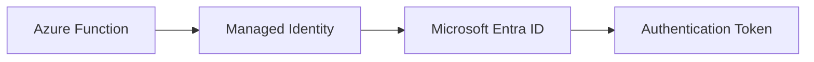

The important part is that we're not putting passwords or credentials inside the Function's code.

There is no:

```text
username = ...
password = ...
```

and no kubeconfig file sitting inside the Function.

The Function gets an identity from Azure and uses that identity to obtain a token.

---

# 5. Azure RBAC decides what it can do

Authentication answers:

> **Who are you?**

But we also need to answer:

> **What are you allowed to do?**

That's where **Azure RBAC** comes in.

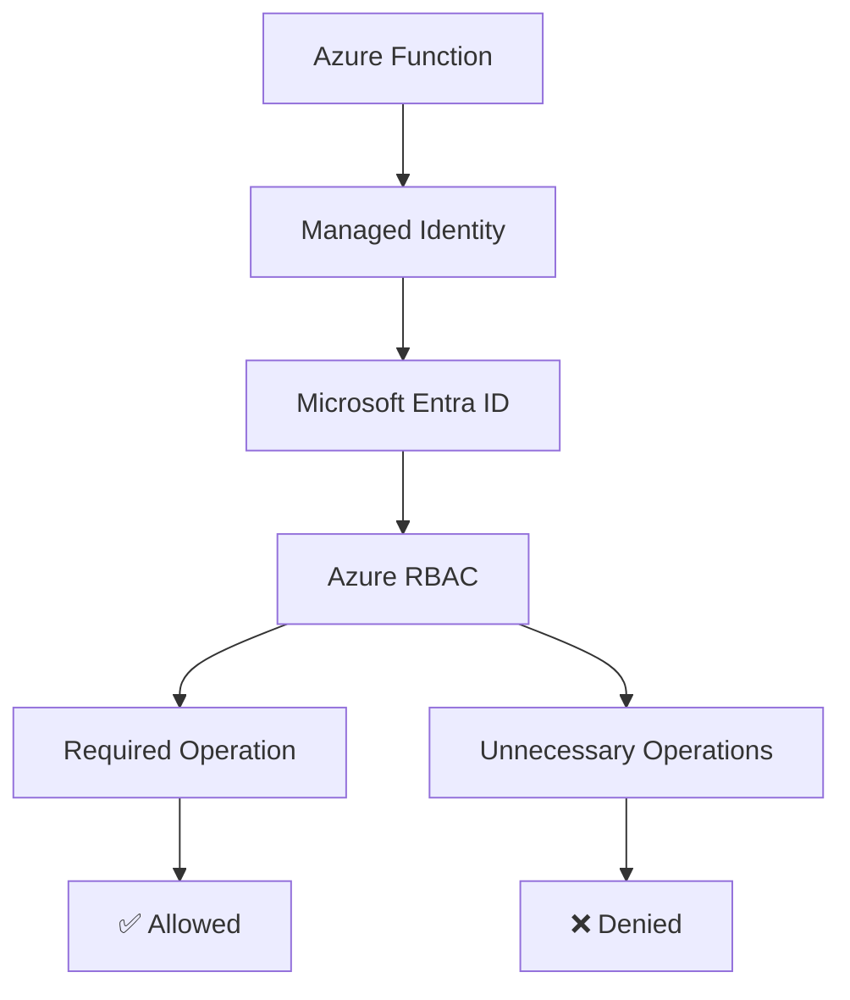

We don't want to give our remediation Function unlimited permissions.

We want to give it only what it needs to perform its job.

That's **Least Privilege**.

The thinking is:

> If this automation is ever compromised, I want its permissions to be as limited as possible.

---

# 6. The Function talks to the Kubernetes API

Now the Function has the identity and authorization it needs.

It can interact with the Kubernetes API.

The operation is conceptually similar to:

```bash
kubectl delete pod payment-api-xyz
```

The difference is that we're automating the operation.

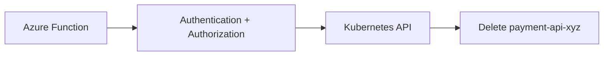

---

# 7. The unhealthy Pod is removed

Before remediation:

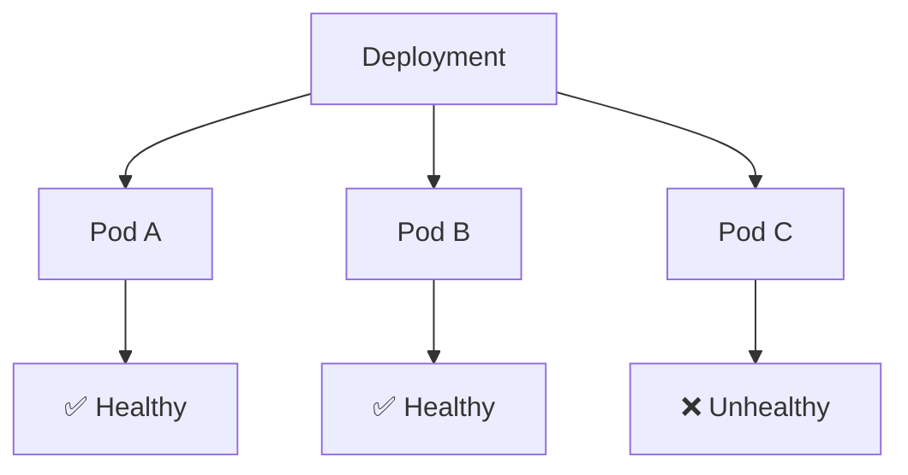

The Function deletes Pod C.

For a moment, only two Pods remain:

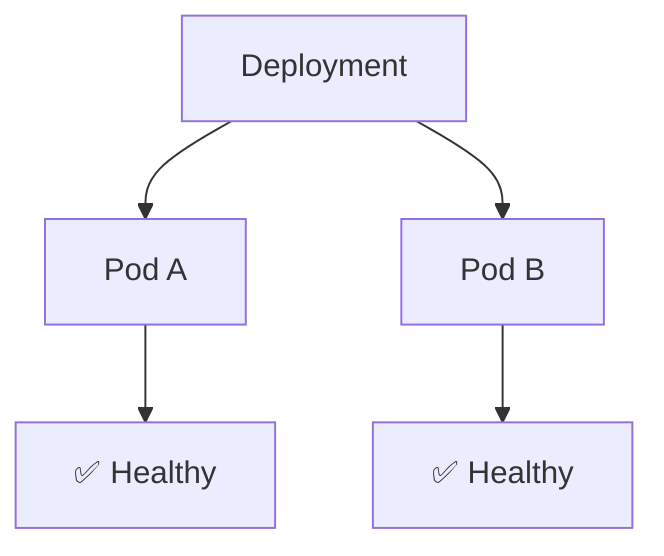

This might look like we've made the situation worse, but Kubernetes is designed around **desired state**.

---

# 8. Kubernetes creates a replacement

Suppose the Deployment specifies:

```yaml
replicas: 3
```

Kubernetes sees:

```text
Desired: 3
Current: 2
```

The Deployment and ReplicaSet work together to create another Pod.

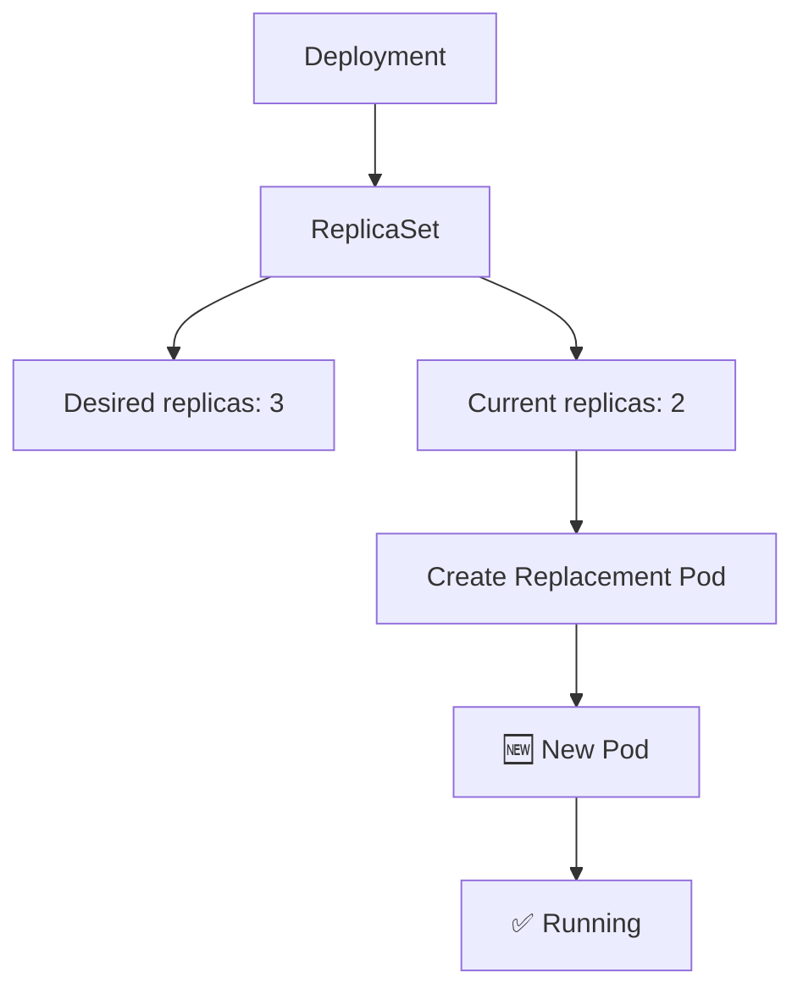

So we're not really restarting the Pod in the traditional VM sense.

We're doing this:

> **Delete the unhealthy Pod and let Kubernetes recreate it to restore the desired state.**

---

# 9. The complete incident

Now put everything together:

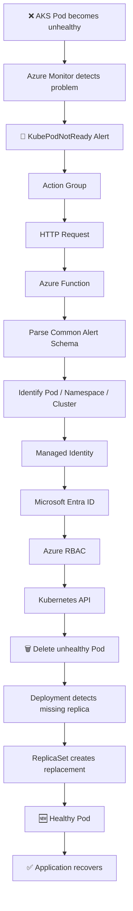

That's the entire automated remediation workflow.

---

# 10. But we also need an audit trail

We don't want the Function silently changing production infrastructure.

Every remediation should be recorded.

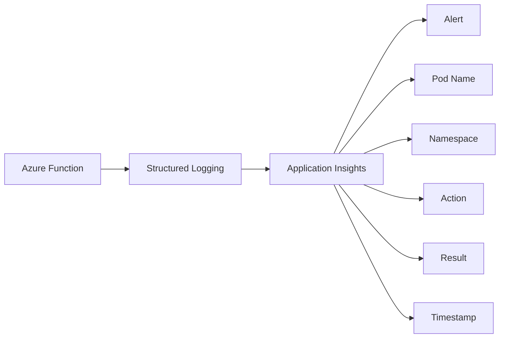

For example:

```text
Alert:       KubePodNotReady
Cluster:     techhealth-aks
Namespace:   production
Pod:         payment-api-xyz
Action:      Delete Pod
Result:      Success
Timestamp:   15:42:18
```

Later, if someone asks:

> "Why did this Pod disappear?"

we can look at the telemetry and see exactly what happened.

---

# 11. Optionally notify the engineer

Once remediation is complete, the Function can also notify the on-call engineer through a Teams workflow.

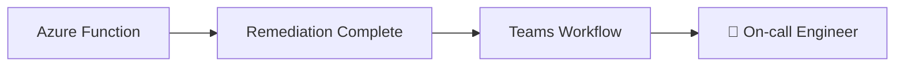

The message could contain:

```text
Automated Remediation

Pod: payment-api-xyz
Namespace: production

Problem:
KubePodNotReady

Action:
Unhealthy Pod deleted

Result:
Replacement Pod created

Status:
Recovered
```

The engineer still knows what happened, but they didn't have to manually run `kubectl`.

---

# ☁️ GCP Translation

Since you're coming from GCP, this is the part I'd keep as your mental map:

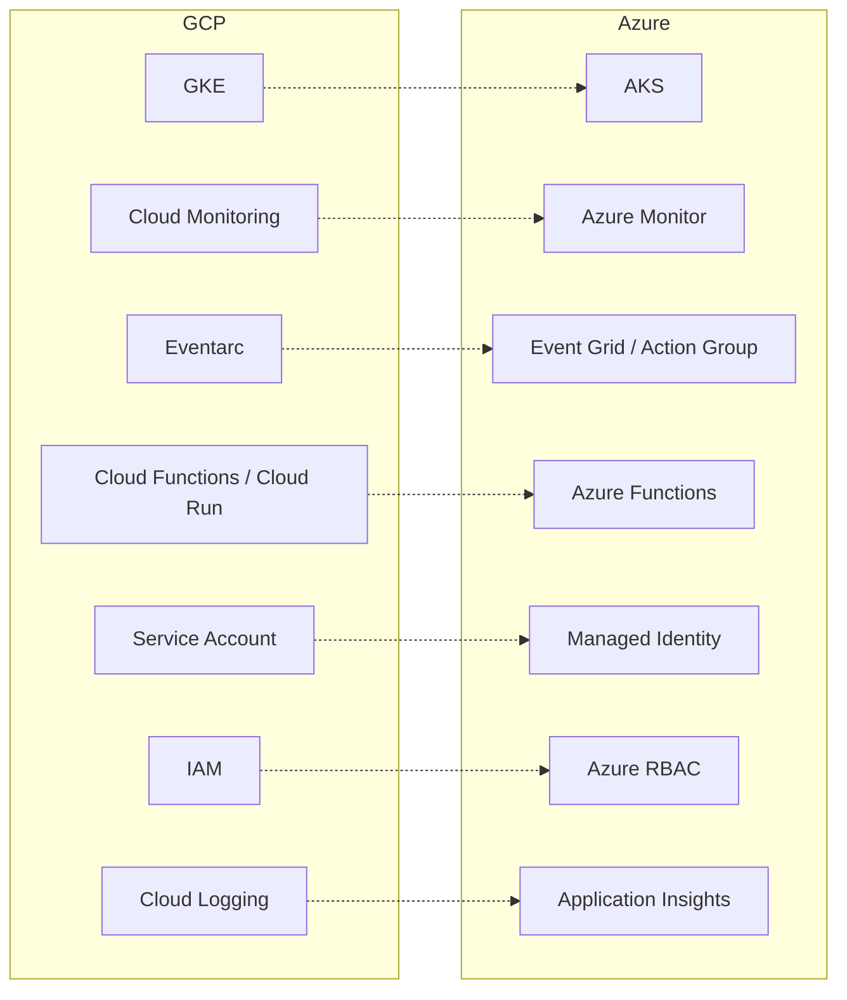

The mapping is **conceptual**, not always a strict 1:1 service replacement.

---

# 🧠 The real takeaway

The technology is Azure-specific, but the engineering pattern is universal:

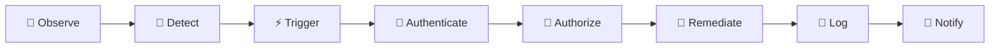

In plain English:

> **Something breaks. Monitoring notices it. An event starts the automation. The automation proves who it is and checks what it is allowed to do. It performs one controlled remediation. Kubernetes restores the desired state, and the whole action is logged.**

That's **event-driven automated remediation**.

And the nice part is that you can already recognize the same pattern from GKE:

**GKE + Cloud Monitoring + Service Account + IAM + Cloud Logging**

becomes:

**AKS + Azure Monitor + Managed Identity + Azure RBAC + Application Insights**.